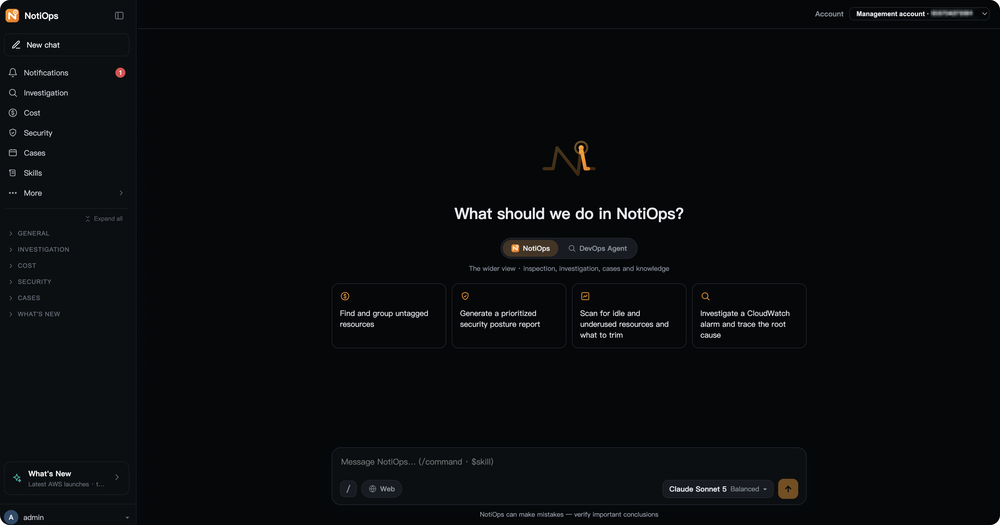

# NotiOps

> 🌐 **Language**: [English](README.md) · [中文](README.zh.md)

> ⚠️ **Disclaimer**: This is sample code, for non-production usage. You should
> work with your security and legal teams to meet your organizational security,
> regulatory, and compliance requirements before deployment. It is provided for
> educational/reference purposes and is not a production-ready product.



**NotiOps** is AWS sample code for a **read-only cloud operations console** — a
browser-based chat app where an engineer asks about their AWS environment in
plain language and gets back a near real-time, cited answer: incident
investigations with a root-cause narrative, cost/FinOps analysis, resource
health inspection, and full AWS Support case management — all without leaving
the web UI or touching the AWS Console.

The same assistant is also available **inside your team's chat tools (Slack /
Feishu)**: `@mention` the bot in an alert channel to run an investigation and
read the report where the alert already landed. On top of on-demand questions,
it does **proactive push** across 10 AWS signal sources (CloudWatch, AWS
Health, Backup, GuardDuty, Cost Anomaly, Trusted Advisor, EC2 Spot
interruption, Auto Scaling launch failure, RDS, Config), each independently
switchable.

All models are served through **Amazon Bedrock** (managed security, compliance,
and cost controls), with per-session model switching and automatic
English/Chinese localization. The **zero-change promise** rests on a read-only
IAM role as its hard boundary — both entry points reach your account through it,
and no write permission on your infrastructure is ever granted — with defense in depth layered on top,
differently per entry point: on the web, tool-level read-only enforcement plus a
command-level denylist (for actions that are technically reads but shouldn't be,
such as `get-secret-value`) plus a strictly read-only system prompt; on IM, a
direct call to the read-only AWS DevOps Agent with a strong-mutation-wording
regex as a second gate on the NotiOps side. The assistant reads and reasons, but
never mutates your cloud — safe to hand to on-call engineers without granting
write access.

---

## Quick links

| Doc | Purpose |
|---|---|
| 🚀 [One-click Deploy](docs/DEPLOYMENT_ONECLICK.en.md) | Browser only: upload one CloudFormation template, about 5 minutes to a running Web Chat (optionally plus one IM bot — Feishu/Lark or Slack) |
| 🛠 [Deployment Guide](docs/DEPLOYMENT.en.md) | Full install: step-by-step from `./setup.sh` to first smoke test (web console + optional IM) |
| 👤 [User Guide](docs/USER_GUIDE.en.md) | End-user manual + conversation samples + FAQ |
| 🏗 [Technical Design](docs/TECHNICAL_DESIGN.en.md) | Module boundaries / data flow / security / read-only defense in depth |
| 🧑‍💻 [CONTRIBUTING](CONTRIBUTING.md) | Conventions (i18n / security / PR process) |

---

## Features

- 🖥️ **Web console (read-only)**: a browser chat app for incident investigation,
  cost/FinOps analysis, resource-health inspection, and AWS Support case
  management — plain-language in, cited answers out
- 🔍 **Ad-hoc investigation**: ask a single sentence, get a complete report
  (markdown summary + HTML + trace) — typically ~1-3 minutes in internal testing
  (varies with query complexity, account size, and model)
- 🤝 **Two answerers**: a general chat opens with a **conversation-object** picker — the
  NotiOps agent (the wider view: inspection, investigation, cases, knowledge) or **the AWS
  DevOps Agent in your own account answering directly** (on the ground: live diagnostics).
  Pick the latter and it costs **0 NotiOps tokens** and needs **no model setup** (nothing to
  enable in Bedrock), with the same streaming experience as the DevOps Agent's own console.
  The Investigate topic also offers **deep investigation (Direct)**: the same deep
  investigation calling the API without an LLM, also token-free (trade-off: your wording is
  passed through as-is, with no smart rewrite)
- 🛎️ **Proactive observation**: 10 EventBridge sources (CloudWatch / Health /
  Cost Anomaly / Trusted Advisor / GuardDuty / Backup / EC2 Spot interruption /
  Auto Scaling launch failure / RDS / Config), each independently switchable —
  five are on by default
- 📋 **Full AWS Support case management**: create / list / view / reply /
  **smart-analyze** (LLM rollup of the case thread) / resolve
- 💬 **AWS concept Q&A**: Bedrock + Knowledge MCP for official-doc retrieval,
  answers carry 📚 source citations
- 🤖 **Multi-LLM switching**: an operator-managed model catalogue — pick which
  models your deployment offers, set the default, and choose the models used by
  backend tasks, all from the Admin console with no redeploy. Users keep a
  per-session model preference. Every model is served through **Amazon Bedrock**
  (managed security, compliance, and cost controls), on either IAM or a Bedrock
  API key
- 🌍 **Bilingual**: Chinese / English auto-detect + explicit switching
- 🛡 **Zero-Change Promise**: a read-only IAM role as the hard boundary, then
  defense in depth per entry point — web: tool-level read-only + command denylist
  + read-only system prompt; IM: the read-only DevOps Agent + a mutation-wording
  regex second gate — the assistant never mutates your cloud
- 💬 **IM channels**: Slack / Feishu full-feature — a card comes back **immediately** after you
  ask, and progress / thinking / the answer all refresh **in that same card** (the seconds in
  its title are the "still running" signal); when a deep investigation finishes, its report
  card is posted back to the conversation that started it

---

## Getting started

Two ways to deploy — pick one.

### Option A: one-click deploy — a browser is all you need

For environments where long-lived access keys aren't available, or where you
can't install the CDK locally: everything happens in the AWS Console, nothing is
installed on your machine.

1. Download `notiops-webchat.template.json` from
   [Releases](https://github.com/aws-samples/sample-notiops/releases/latest);
2. Open the CloudFormation console → **Create stack** → **Upload a template file**;
3. Enter an administrator email (the temporary password is mailed there), tick
   the IAM capabilities acknowledgement, and create — measured at about 5 minutes.
   The stack outputs include the Web Chat URL.

Three optional parameters are worth knowing about:

- **What to install** (`InstallOption`, default `web`) — a three-way dropdown: `web` /
  `web+feishu` / `web+slack`. **All three install Web Chat**; the latter two add **one** IM
  bot (@-mention it in a group, or DM it — after deploying you still fill in a request URL on
  the IM platform and put the credentials into Secrets Manager). You can update the stack to
  a different value later.
- **Deep investigation** (AWS DevOps Agent — on by default, free while idle, and silently
  skipped instead of failing the stack in Regions that don't have it).
- **Deployment mode** (single account by default; pick multi-account and supply your
  organization id to run read-only investigations across other accounts in the organization —
  requires deploying from the organization management account or a StackSets delegated
  administrator).

⚠️ One-click deploys **Web Chat plus at most one IM bot**. It does **not** include scheduled
inspections and proactive push, the data behind the inspection dashboard and its threshold
settings, or CUR/Athena FinOps, and one stack can only carry one IM platform — use Option B
for those. Prerequisites (region and Bedrock model access), a parameter-by-parameter
walkthrough, the resource and cost breakdown, upgrade/rollback, and one-click teardown are in
[docs/DEPLOYMENT_ONECLICK.en.md](docs/DEPLOYMENT_ONECLICK.en.md); the two IM setup steps are in
[docs/IM_WEBHOOK_SETUP.en.md](docs/IM_WEBHOOK_SETUP.en.md).

### Option B: `setup.sh` — the full install

```bash
# 1. Clone
git clone https://github.com/aws-samples/sample-notiops.git
cd sample-notiops

# 2. Deploy (CDK, one command; interactive on first run)
./setup.sh
# First run: confirm AWS account → pick region → pick IM platforms
# (Slack / Feishu, multi-select) → paste credentials for each (written
# straight to Secrets Manager, never to disk) → CDK bootstrap → synth →
# dependency Layer build (pip, no container) → cdk deploy --all. Re-runs
# only patch deltas.
```

Requires git, Node.js, Python, uv and the AWS CDK locally, plus credentials that
can deploy — **no container runtime needed**.

#### Deploy modes: single-account (default) vs multi-account

Decide before you run `setup.sh` — the mode is baked in at deploy time and
switching later requires a redeploy.

- **Single-account (default)** — `./setup.sh`. NotiOps operates in the deploy
  account only. Least privilege, fastest path to a working install; right for
  most trials and single-account users.
- **Multi-account** — `./setup.sh --multi-account`. Adds cross-member-account
  inspection / investigation / event forwarding across an AWS Organization. Run
  it in the **Organizations management account**, or in a member account
  registered as a **CloudFormation StackSets delegated administrator** (you do
  **not** have to be the management account). Member-account resources are
  rolled out automatically via StackSets.

For the full deployment walkthrough into your own AWS account — including the
mode comparison and how to switch — see
[docs/DEPLOYMENT.en.md](docs/DEPLOYMENT.en.md).

### Feature comparison

| Capability | Option A (one-click) | Option B (`setup.sh`) |
|---|:---:|:---:|
| **Prerequisites and timing** | | |
| Installed locally | nothing (browser only) | git / Node / Python / **uv** / CDK (**no container runtime**) |
| Long-lived access key required | no | yes, credentials that can deploy |
| Deploy time | about 5 minutes | 10–20 minutes (includes local builds) |
| One-click teardown | ✅ pick `KeepData` / `DeleteEverything` on delete | ✅ `./teardown.sh` (keeps data by default, `--delete-everything` for a full wipe) |
| **Chat and investigation** | | |
| Web Chat (read-only Q&A) | ✅ | ✅ |
| AWS concept Q&A (official-doc retrieval + citations) | ✅ | ✅ |
| Resource-health inspection (on demand) | ✅ | ✅ |
| Incident investigation (instant, read-only tools) | ✅ | ✅ |
| DevOps Agent deep investigation | ✅ see note ¹ | ✅ |
| Deep investigation (Direct — token-free) | ✅ see note ¹ | ✅ |
| DevOps Chat (your own DevOps Agent answers a general chat directly) | ✅ see note ¹ | ✅ |
| Web search (AgentCore Web Search) | ✅ see note ² | ✅ see note ² |
| Session memory (keeps context within one conversation) | ✅ see note ³ | ✅ see note ³ |
| Cross-session memory (carries preferences and facts into the next conversation) | ❌ see note ³ | ❌ see note ³ |
| **Cost / FinOps** | | |
| FinOps dashboard (Cost Explorer data) | ✅ deploy account only | ✅ cross-account |
| CUR + Athena billing-detail drill-down | ❌ | ✅ |
| Daily cost-anomaly scan (self-built baseline, runs 01:15 UTC every day) | ❌ the "Daily Anomaly Scan" card on the FinOps page is not rendered at all — you do not get an empty card | ✅ |
| Bring your own CUR data source (4 dashboard sheets + ask about that bill in chat) | ✅ optional, see note ⁵ | ✅ optional, see note ⁵ |
| **Cases and Skills** | | |
| Full AWS Support case management | ✅ | ✅ |
| 11 bundled Skills + your own | ✅ | ✅ |
| Publish a Skill to DevOps Agent | ✅ see note ¹ | ✅ |
| **Models** | | |
| Multi-LLM switching + model catalogue | ✅ | ✅ |
| Bedrock API key as the credential | ✅ | ✅ |
| **Proactive / IM** | | |
| IM channels (Slack / Feishu) | ✅ one platform per stack, see note ⁴ | ✅ both at once |
| Proactive push **to IM** (10 EventBridge sources) | ❌ | ✅ |
| Scheduled inspection (high load / idle & cost / structural risk) | ❌ | ✅ |
| Notification inbox (the same 10 sources, into the web inbox) | ✅ | ✅ |
| Inspection dashboard (overview / high load / idle & cost / structural risk / inspection scope / thresholds & schedule) | ❌ the tab is still there, but Option A has no inspection backend, so opening it fails to load | ✅ |
| **Scope** | | |
| Multi-account (across an AWS Organization) | ✅ set `DeployMode=MultiAccount` + your organization id | ✅ `--multi-account` |
| Upgrade | update the stack with the new template (~1 min) | re-run `./setup.sh` |

> ¹ **Every DevOps Agent capability (deep investigation, deep investigation Direct, DevOps
> Chat, and "publish a Skill to DevOps Agent") shares one Agent Space on Option A.** The
> stack creates it in the deploy account provided that
> `EnableDeepInvestigation=Yes` (the default) **and** the deploy Region is one where
> AWS DevOps Agent is available (`us-east-1`, `us-west-2`, `ca-central-1`, `sa-east-1`,
> `ap-south-1`, `ap-southeast-1`, `ap-southeast-2`, `ap-northeast-1`, `eu-central-1`,
> `eu-west-1`, `eu-west-2`). Other Regions still deploy successfully, just without the
> Agent Space — the related toggles are **greyed out with the reason shown**, and the
> `DeepInvestigationStatus` stack output says whether you turned it off or the Region
> doesn't support it.

> ² **Web search is us-east-1 only, on both paths.** It uses the AWS built-in
> AgentCore Web Search (no third-party API key, and search requests never leave AWS);
> both deployment paths provision that gateway for you, with nothing to configure.
> Deploying elsewhere still succeeds, just without web search — Option A's
> `WebSearchStatus` stack output says why, and Option B's `./setup.sh` says so in the
> deploy log. Note the toggle is **not** greyed out (the UI does no Region check):
> clicking it doesn't error, you just get no results.

> ³ **Memory is per conversation, not across conversations.** Within one conversation it
> remembers what you discussed (AgentCore Memory stores the raw messages per session,
> events expire after 30 days). **A new conversation starts from a clean page** — nothing
> you said in an earlier one is carried over. That is deliberate: less data retained, and
> more predictable behaviour ("why did it answer that?" never traces back to something you
> said days ago and forgot). Anything it should always know belongs in the current
> conversation, or in **explicit** configuration such as a Skill or the system prompt.
>
> Why the within-session layer cannot be dropped: each request carries only your latest
> message, and the model-side session object is rebuilt whenever you switch models, switch
> topics, or the container cold-starts — without it, switching models mid-conversation and
> asking a follow-up would lose all context. The memory resource carries **no retention
> policy**: deleting the stack deletes it and the session messages in it.
> ⚠️ Releases before 2026-09 (v1.0.18 / v1.0.19) did have **cross-session** memory, and its
> actor was one identity shared by the whole deployment (preferences extracted from any
> user were visible to every signed-in user). Upgrading to this release removes that layer;
> already-extracted records are deleted along with the strategies.

> ⁴ **On Option A the IM bot is a dropdown on the parameters page** (`InstallOption`: `web` /
> `web+feishu` / `web+slack`; the default installs web only). The bot and the web UI share the
> **same read-only backend**, so you can @-mention it in a group or DM it; anything that
> matches "look at resources / start an investigation / check progress / switch model / switch
> language" is deterministic routing and costs **no tokens**. Two differences: (1) one stack
> carries **one** platform (use Option B if you want both); (2) two steps stay with you after
> deploying — put the credentials into Secrets Manager and paste the request URL back into the
> IM platform, in that order (the `ImNextSteps` stack output reminds you), as described in
> [docs/IM_WEBHOOK_SETUP.en.md](docs/IM_WEBHOOK_SETUP.en.md). Note this is **request/response
> only**; pushing daily inspection reports and alerts into a group is still Option B.

> ⁵ **Bringing your own CUR data source is optional, and identical on both paths.** The
> "CUR + Athena billing-detail drill-down" row above is about **this deploy account's own**
> bill (Option B provisions it). This row is about **a different CUR table** — a customer
> you look after, or several payer accounts — reached through **a cost-agent MCP Lambda that
> you deploy yourself**; that Lambda is not in this repository. Once connected, the FinOps
> page gains 4 sheets (spend trend / credits / extended support / Savings Plans) and you can
> ask about that bill in chat. **How you supply it**: Option A takes the parameters
> `CostAgentMcpUrl` + `CostAgentFunctionArn`; Option B takes the environment variables
> `COST_AGENT_MCP_URL` + `COST_AGENT_FN_ARN`. **Both values must be supplied together**: a
> Function URL does not contain the function ARN, and invoke permission can only be granted
> per resource, so filling in just one gives you a data source that looks installed and 403s
> on every call — both paths therefore reject a half-configuration **before doing any work**
> (on Option A the stack is never created). **Leave them empty** and the entry points for
> those 4 sheets simply don't appear; nothing else is affected. **If it goes down after you
> connect it, the tool keeps working**: only those 4 sheets say "temporarily unavailable",
> and chat falls back to Cost Explorer, then to the read-only AWS APIs, **telling you it
> switched data source** (different basis of measurement — don't reconcile the numbers
> blindly). Steps for deploying that Lambda are in
> [docs/DEPLOYMENT.en.md §14](docs/DEPLOYMENT.en.md#14-customer-cur-dashboard--cost-agent-mcp-optional).

> 📋 **The AWS Support features (create / view / reply / resolve) require the
> account to be on a Business, Enterprise On-Ramp, or Enterprise support plan** —
> that is a requirement of the AWS Support API itself, independent of which
> deployment path you choose. On Basic / Developer the service list comes back empty.

**The two paths compose**: start with Option A to try it out, then run Option B when
you want IM push and scheduled inspections (both create an admin named `admin`, so
they don't collide).

### Upgrading to a new version / deleting the environment

The two options upgrade and uninstall **differently** — follow the one you actually used.

#### Option A (one-click)

**Upgrade to a new version** (measured at about 1 minute):

1. Download the new `notiops-webchat.template.json` from
   [Releases](https://github.com/aws-samples/sample-notiops/releases).
2. CloudFormation console → select your stack → **Update** → **Replace existing
   template** → upload the template you just downloaded.
3. Change **nothing** on the parameters page — pick **Use existing value** for
   everything, click through, then **Submit**.

An upgrade does **not**: resend the invitation email, change the admin email or
password, revert settings you changed in Admin, or wipe chat history. To roll back,
run the same update again with the **older** template.

**Delete the environment** — the stack has a `TeardownMode` parameter with two settings:

| | What survives |
|---|---|
| `KeepData` (default) | The config table, the chat-history table, and the data bucket (your Skills and reports); if you installed IM, its credential secrets too |
| `DeleteEverything` | Nothing — everything goes (**including the IM credential secrets, unrecoverably**) |

⚠️ **Two things to know:**

1. **For a clean delete, the order matters.** First run an **Update** that sets
   `TeardownMode` to `DeleteEverything` (~45 s), **then** **Delete stack** (~3 min).
   Changing the parameter in the delete dialog does **nothing**: CloudFormation uses the
   parameter values from the last successful deployment, so a straight delete behaves
   as `KeepData`.
2. **Both modes delete the Cognito user pool.** `KeepData` preserves your *data*, not
   your *accounts* — after reinstalling you have to invite users again.

Things that may be left behind afterwards (they cost nothing; delete by hand if you
want a clean account): the two DynamoDB tables and the data bucket that `KeepData`
preserved, and one log group named like
`/aws/vendedlogs/RUMService_<stack>-web-chat<hash>` (0 bytes, expires on its own after
30 days).

#### Option B (`setup.sh`)

- **Upgrade**: `git pull`, then **re-run `./setup.sh`** — it is incremental and only
  updates what changed. IM credentials you already put in Secrets Manager are not
  overwritten.
- **Delete**: run **`./teardown.sh`** from the repository root. It deletes what
  `setup.sh` created in reverse dependency order, including the non-CDK leftovers
  (the CUR report definition, the one-shot EventBridge schedule, the WebSearch
  gateway, and the 30-day recovery window on the secrets). Same two settings as
  Option A:

  ```bash
  ./teardown.sh --dry-run           # inventory only, deletes nothing (run this first)
  ./teardown.sh                     # keep data: delete the stacks, keep the three RETAIN'd tables
  ./teardown.sh --delete-everything  # also delete the tables, CUR report/bucket, Athena saved queries, leftover log groups
  ```

  You have to type the 12-digit account id to confirm (`--delete-everything` also asks
  you to type `DELETE EVERYTHING`).
  ⚠️ On this path the data bucket `notiops-data-<account>-<region>` is destroyed with
  the stack (your Skills and saved reports live there), so the script **syncs it to a
  local backup directory first** — pass `--no-backup` to skip that.
  If you have deployed **both** options into the same account and Region: they use the
  same resource names, so before emptying a bucket or deleting a table the script asks
  CloudFormation which stack owns it and **skips anything owned by the one-click stack**
  (delete that stack instead).
  Cross-account resources are **deliberately left alone**; the script prints the exact
  commands instead: the two member-account StackSets (deleted only with
  `--delete-member-stacksets`) and the PHD forwarder stack in each linked account
  (`./setup.sh --phd --remove`). CDK bootstrap resources (`CDKToolkit` and friends) are
  never touched.

---

## Architecture (high-level)

```
Web console (browser)        Customer IM (Slack / Feishu)
        │                              │
        └──────────────┬───────────────┘
                       ▼
        ┌────────────────────────────────────────┐
        │   NotiOps (this repo)                  │
        │   · intent classification              │
        │   · read-only defense in depth         │
        │   · case management · bilingual i18n   │
        │   · MCP doc retrieval · Bedrock routing│
        │                 │                      │
        │                 ▼                      │
        │   Lambdas (inspection × 4 / notifier / │
        │   cost / cur-finalizer) + report /     │
        │   push / PHD handlers                  │
        └──────┬────────────────────┬────────────┘
               ▼                    ▼
        AWS investigation     EventBridge × 10
        (via STS AssumeRole)  (CloudWatch / Health / Cost Anomaly / TA /
                               GuardDuty / Backup / EC2 Spot / ASG /
                               RDS / Config)
```

Full architecture in
[docs/architecture-diagram.md](docs/architecture-diagram.md).

---

## Contributing

Read [CONTRIBUTING.md](CONTRIBUTING.md) first. Highlights:

- **Every user-visible string must be bilingual** (zh + en) via
  `core/i18n.py`'s `i18n.t(key, locale)` API — CI enforces this
- **Don't bypass the zero-change promise**: the assistant is read-only; refuse
  any mutation request
- **Commit messages follow [Conventional Commits](https://www.conventionalcommits.org/)**

---

## License

This sample code is licensed under the MIT-0 License. See the [LICENSE](LICENSE) file.
