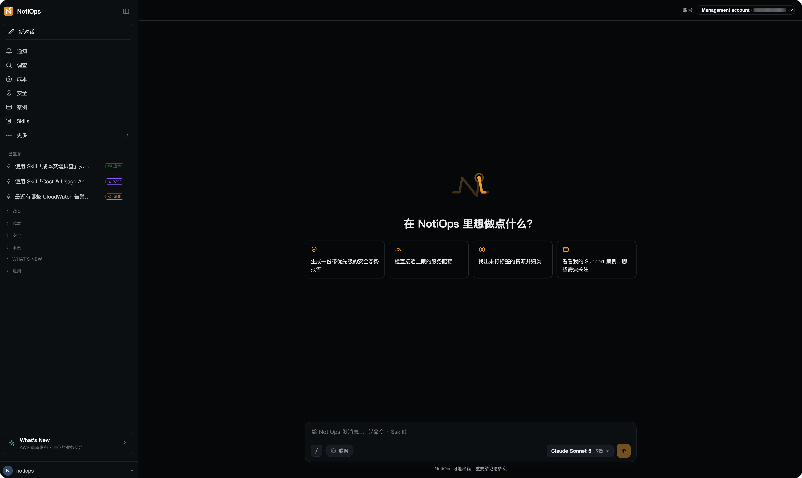

# NotiOps

> 🌐 **语言**: [English](README.md) · [中文](README.zh.md)

> ⚠️ **免责声明**:本项目为示例代码,面向非生产用途。部署前请与你自己的安全、法务
> 团队一起,确保满足你所在组织的安全、监管与合规要求。本项目仅用于教学 / 参考目的,
> 并非生产就绪产品。



**NotiOps** 是一套 AWS 示例代码,提供一个**只读的云运维控制台** —— 一个网页版聊天
应用:工程师用大白话询问自己的 AWS 环境,就能拿到近实时、带来源引用的回答:含根因
分析的事件调查、成本 / FinOps 分析、资源健康巡检,以及完整的 AWS Support 工单管理
—— 全程在网页里完成,无需切到 AWS 控制台。

同一个助手也能**接入团队已在用的聊天工具(Slack / 飞书)**:在告警群里 `@` 机器人
即可发起调查,并直接在告警落地的地方读报告。除了即时提问,它还能对 10 类 AWS 信号源
做**主动推送**(CloudWatch、AWS Health、Backup、GuardDuty、成本异常、Trusted Advisor、
EC2 Spot 中断预警、Auto Scaling 启动失败、RDS、Config),每类可独立开关。

所有模型都通过 **Amazon Bedrock** 接入(托管的安全、合规与成本管控),可按会话切换
模型,并自动做中英文本地化。**只读承诺**的硬边界是**只读 IAM 角色**(两条入口访问
你账号用的都是它,对你的基础设施从不授予写权限),之上再按入口做纵深防御:网页端是工具层只读
+ 命令级 denylist(拦 `get-secret-value` 这类「是只读但不该读」的动作)+ 严格只读的
system prompt;IM 端直连 AWS DevOps Agent 的只读 agent,NotiOps 侧再加一条强变更
措辞正则作二道门。助手只读取、只推理,绝不改动你的云环境 —— 因此可放心交给
on-call 工程师使用,而无需授予写权限。

---

## 快速链接

| 文档 | 用途 |
|---|---|
| 🚀 [一键部署](docs/DEPLOYMENT_ONECLICK.md) | 只要一个浏览器:上传一份 CloudFormation 模板,大约 5 分钟拿到 Web Chat(可选加装一个 IM 机器人:飞书/Lark 或 Slack) |
| 🛠 [部署指南](docs/DEPLOYMENT.md) | 完整版:从 `./setup.sh` 到首次冒烟测试的分步指南(Web 控制台 + 可选 IM) |
| 👤 [用户指南](docs/USER_GUIDE.md) | 终端用户手册 + 对话示例 + FAQ |
| 🏗 [技术设计](docs/TECHNICAL_DESIGN.md) | 模块边界 / 数据流 / 安全 / 只读纵深防线 |
| 🧑‍💻 [贡献指南](CONTRIBUTING.md) | 约定(i18n / 安全 / PR 流程) |

---

## 功能

- 🖥️ **网页控制台(只读)**:浏览器聊天应用,支持事件调查、成本 / FinOps 分析、
  资源健康巡检、AWS Support 工单管理 —— 大白话进,带引用的答案出
- 🔍 **即时调查**:一句话提问,拿到完整报告(markdown 摘要 + HTML + trace)——
  内部测试中通常约 1-3 分钟(随问题复杂度、账号规模与模型而变)
- 🤝 **两种"谁来回答"**:通用聊天开头可选**对话对象** —— NotiOps 自己的 agent(全局视角:巡检、
  调查、案例、知识库),或**你自己账号里的 AWS DevOps Agent 直答**(深入现场:实时排查)。
  选后者时 **NotiOps 侧 0 token**、**免模型配置**(不需要在 Bedrock 开通任何模型),流式输出
  体验与 DevOps Agent 自己的页面一致。调查主题另有 **深度调查(直连)**:同一个深度调查绕过
  大模型直连 API,同样不耗 token(代价:调查描述按你的原话透传,不做智能改写)
- 🛎️ **主动观测**:10 类 EventBridge 信号源(CloudWatch / Health / 成本异常 /
  Trusted Advisor / GuardDuty / Backup / EC2 Spot 中断预警 / Auto Scaling 启动失败 /
  RDS / Config),每类可独立开关 —— 其中 5 类默认开启
- 📋 **完整 AWS Support 工单管理**:创建 / 列表 / 查看 / 回复 /
  **智能分析**(对工单会话做 LLM 归纳) / 解决
- 💬 **AWS 概念问答**:Bedrock + Knowledge MCP 检索官方文档,答案带 📚 来源引用
- 🤖 **多模型切换**:由运维方管理的模型目录 —— 在 Admin 控制台里勾选本部署对外提供
  哪些模型、设默认模型、指定后端任务用哪个模型,改完即时生效无需重新部署;用户侧
  仍按会话保存自己的模型偏好。所有模型均通过 **Amazon Bedrock** 接入(托管的安全、
  合规与成本管控),凭证可用 IAM 或 Bedrock API Key
- 🌍 **双语**:中 / 英自动识别 + 显式切换
- 🛡 **只读承诺**:硬边界是只读 IAM 角色;之上按入口纵深防御 —— 网页端工具层只读 + 命令级 denylist + 只读 system prompt,IM 端 DevOps Agent 只读 agent + 强变更措辞正则二道门 —— 助手绝不改动你的云
- 💬 **IM 渠道**:Slack / 飞书 全功能 —— 提问后**立刻**回一张卡片,过程 / 思考 / 答案都刷在**同一张卡**上(标题里的秒数就是"还在跑"的信号);深度调查跑完后报告卡自动回贴到发起它的那个会话

---

## 快速开始

两种部署方式,选一种即可。

### 方式 A:一键部署 —— 只要一个浏览器

适合拿不到长期 access key,或不允许在本地装 CDK 的环境:全程在 AWS
控制台里完成,你自己的机器上什么都不用装。

1. 从 [Releases](https://github.com/aws-samples/sample-notiops/releases/latest)
   下载 `notiops-webchat.template.json`;
2. 打开 CloudFormation 控制台 → **Create stack** → **Upload a template file**;
3. 填管理员邮箱(临时密码会发到这个邮箱)、勾选 IAM 能力确认框、创建 —— 实测大约
   5 分钟完成,栈输出里就是 Web Chat 的访问地址。

开栈时有三个可选参数值得知道:

- **安装选项**(`InstallOption`,默认 `web`)—— 下拉三选一:`web` / `web+feishu` /
  `web+slack`。**三个都装 Web Chat**,后两个再加**一个** IM 机器人(群里 @ 它或私聊它;
  部署完还要在 IM 平台侧填一次请求地址、把凭证写进 Secrets Manager)。部署完也能 update
  栈换成另一个值。
- **深度调查**(AWS DevOps Agent,默认开,闲置不计费,区域不支持时自动跳过而不是让栈失败)。
- **部署模式**(默认单账号;选多账号并填组织 id,就能跨组织内其它账号做只读排查 ——
  需要从组织管理账号或 StackSets 委派管理员账号部署)。

⚠️ 一键部署装的是 **Web Chat + 可选一个 IM 机器人**,**不含**定时巡检与主动推送、
巡检看板里的数据与阈值配置、CUR/Athena FinOps,一个栈也只能装一个 IM 平台 ——
要这些请用下面的方式 B。
前提条件(区域与 Bedrock 模型开通)、参数逐条说明、资源与成本构成、升级 / 回滚、
一键删除,见 [docs/DEPLOYMENT_ONECLICK.md](docs/DEPLOYMENT_ONECLICK.md);IM 那两步配置见
[docs/IM_WEBHOOK_SETUP.md](docs/IM_WEBHOOK_SETUP.md)。

### 方式 B:`setup.sh` —— 完整版

```bash
# 1. 克隆
git clone https://github.com/aws-samples/sample-notiops.git
cd sample-notiops

# 2. 部署(CDK,一条命令;首次运行为交互式)
./setup.sh
# 首次运行:确认 AWS 账号 → 选区域 → 选 IM 平台(Slack / 飞书,可多选)→
# 逐个粘贴凭证(直接写入 Secrets Manager,绝不落盘)→ CDK bootstrap → synth →
# 构建依赖 Layer(pip,无需容器)→ cdk deploy --all。重复运行只增量更新。
```

需要本地有 git / Node.js / Python / uv / AWS CDK,以及一份能部署的 AWS 凭证 —— **不需要容器运行时**。

#### 部署模式:单账号(默认) vs 多账号

在跑 `setup.sh` 前先定 —— 模式在部署时写死,之后切换需要重新部署。

- **单账号(默认)** —— `./setup.sh`。NotiOps 只在部署账号内运行。最小权限、
  最快跑通,适合绝大多数试用与单账号用户。
- **多账号** —— `./setup.sh --multi-account`。在 AWS Organizations 内增加跨成员
  账号的巡检 / 调查 / 事件转发。在**组织管理账号**,或已注册为
  **CloudFormation StackSets 委派管理员**的成员账号上运行即可(**不必**是管理
  账号)。成员账号资源经 StackSets 自动下发。

完整的部署到你自己 AWS 账号的步骤(含模式对比与如何切换)见
[docs/DEPLOYMENT.md](docs/DEPLOYMENT.md)。

### 两种方式的功能对比

| 能力 | 方式 A(一键部署) | 方式 B(`setup.sh`) |
|---|:---:|:---:|
| **前提与耗时** | | |
| 本地要装的东西 | 无(只要浏览器) | git / Node / Python / **uv** / CDK(**不需要容器运行时**) |
| 需要长期 access key | 不需要 | 需要一份能部署的凭证 |
| 部署耗时 | 大约 5 分钟 | 十几分钟(含本地构建) |
| 一键删除整个环境 | ✅ 删栈时选 `KeepData` / `DeleteEverything` | ✅ `./teardown.sh`(默认保数据 / `--delete-everything` 全删) |
| **聊天与调查** | | |
| 网页 Web Chat(只读问答) | ✅ | ✅ |
| AWS 概念问答(官方文档检索 + 引用) | ✅ | ✅ |
| 资源健康巡检(按需提问) | ✅ | ✅ |
| 故障调查(即时,只读工具) | ✅ | ✅ |
| DevOps Agent 深度调查 | ✅ 见下方注 ¹ | ✅ |
| 深度调查(直连,不耗 token) | ✅ 见下方注 ¹ | ✅ |
| DevOps 对话(通用聊天里让你自己的 DevOps Agent 直答) | ✅ 见下方注 ¹ | ✅ |
| 联网搜索(AgentCore Web Search) | ✅ 见下方注 ² | ✅ 见下方注 ² |
| 会话记忆(同一会话内接得上上文) | ✅ 见下方注 ³ | ✅ 见下方注 ³ |
| 跨会话记忆(把偏好与事实带到下一个会话) | ❌ 见下方注 ³ | ❌ 见下方注 ³ |
| **成本 / FinOps** | | |
| FinOps 仪表盘(Cost Explorer 口径) | ✅ 仅部署账号 | ✅ 可跨账号 |
| CUR + Athena 账单明细下钻 | ❌ | ✅ |
| 每日成本异常扫描(自建基线,每天 01:15 UTC 跑) | ❌ FinOps 页那张「每日异常扫描」卡整个不出现,不是一张空卡 | ✅ |
| 接自己的 CUR 数据源(4 个仪表盘 sheet + 聊天里问那份账单) | ✅ 可选,见下方注 ⁵ | ✅ 可选,见下方注 ⁵ |
| **工单与 Skills** | | |
| AWS Support 工单全生命周期 | ✅ | ✅ |
| 11 个预置 Skill + 客户自建 | ✅ | ✅ |
| 把 Skill 发布到 DevOps Agent | ✅ 见下方注 ¹ | ✅ |
| **模型** | | |
| 多模型切换 + 模型目录管理 | ✅ | ✅ |
| 用 Bedrock API Key 作为凭证 | ✅ | ✅ |
| **主动化 / IM** | | |
| IM 渠道(Slack / 飞书) | ✅ 一个栈一个平台,见下方注 ⁴ | ✅ 两个可同时开 |
| 主动推送**到 IM**(10 类 EventBridge 信号源) | ❌ | ✅ |
| 定时自动巡检(高负载 / 闲置与成本 / 结构性风险) | ❌ | ✅ |
| 通知收件箱(同样这 10 类信号源,进 Web 收件箱) | ✅ | ✅ |
| 巡检看板(巡检总览 / 高负载 / 闲置与成本 / 结构性风险 / 巡检范围 / 阈值与定时) | ❌ 入口还在,但方式 A 没有巡检后端,点进去是加载失败 | ✅ |
| **范围** | | |
| 多账号(AWS Organizations 跨账号) | ✅ 开栈时选 `DeployMode=MultiAccount` + 填组织 id | ✅ `--multi-account` |
| 升级 | 换新版模板 update 栈(~1 分钟) | 重跑 `./setup.sh` |

> ¹ **所有 DevOps Agent 相关能力(深度调查、深度调查(直连)、DevOps 对话、把 Skill 发布到
> DevOps Agent)在方式 A 里依赖同一个 Agent Space**:
> 栈会在部署账号里建它,前提是参数 `EnableDeepInvestigation=Yes`(默认值)**且**部署区域
> 在 AWS DevOps Agent 已开服的区域内(`us-east-1` / `us-west-2` / `ca-central-1` /
> `sa-east-1` / `ap-south-1` / `ap-southeast-1` / `ap-southeast-2` / `ap-northeast-1` /
> `eu-central-1` / `eu-west-1` / `eu-west-2`)。别的区域照样开栈成功,只是没有 Agent Space
> —— 界面上相关开关会**置灰并写清原因**,栈输出 `DeepInvestigationStatus` 会说明是你自己
> 关的还是该区域不支持。

> ² **联网搜索只有 `us-east-1`,两条路径都一样。** 用的是 AWS 内建的 AgentCore Web
> Search(不需要任何第三方 API key,搜索请求不出 AWS),两种部署方式都会自动建好那个
> Gateway,你不用配任何东西。部署在别的区域照样成功,只是没有联网搜索 —— 方式 A 的栈
> 输出 `WebSearchStatus` 会写明原因,方式 B 的 `./setup.sh` 会在部署日志里说一句。
> 注意这个开关**不会置灰**(界面不做区域判断),点了不报错,只是搜不到东西。

> ³ **记忆只在会话内,不跨会话。** 同一个会话里它记得前面聊过什么(用 AgentCore Memory
> 按会话存原始消息,事件保留 30 天);**换一个新会话就是干净的一页** —— 你上个会话说过的
> 偏好和事实不会被带过来。这是有意的设计:少一份跨会话的数据留存,行为也更可预期
> (「它为什么突然这么答」不会来自你早就忘了的某句话)。想让它记住的,请在当前会话里说,
> 或者写进 Skill / 系统提示这类**显式**配置里。
>
> 为什么会话内这一层不能省:每一轮请求只带你这一句话,而模型侧的会话对象会因为换模型、
> 换主题、容器冷启动而重建 —— 少了它,你在同一个会话里换个模型再追问一句,上文就没了。
> 记忆资源**没有保留策略**:删栈会把它和里面的会话消息一起删掉。
> ⚠️ 早于 2026-09 的版本(v1.0.18 / v1.0.19)带**跨会话**记忆,而且当时的 actor 是整个部署
> 共用的一个身份(任何用户抽出的偏好所有登录用户都看得到)。升级到本版之后这层就没有了;
> 已经抽取出来的记录会随 strategy 一起删除。

> ⁴ **方式 A 的 IM 是开栈时的一个下拉选项**(`InstallOption`:`web` / `web+feishu` /
> `web+slack`,默认只装 web)。装出来的机器人和网页用的是**同一个只读后端**,群里 @ 它、
> 或者私聊它就能问;命中「查资源 / 发起调查 / 看进度 / 切模型 / 切语言」这些是确定性路由,
> **不花 token**。两处差别:① 一个栈只能装**一个**平台(两个都要走方式 B);② 部署完还有
> 两步在你手上 —— 凭证写进 Secrets Manager、请求地址填回 IM 平台(顺序不能反,栈输出
> `ImNextSteps` 会提醒你),步骤见 [docs/IM_WEBHOOK_SETUP.md](docs/IM_WEBHOOK_SETUP.md)。
> 注意这只是**问答**;把每日巡检报告和告警**主动推**到群里那一路仍然只有方式 B 有。

> ⁵ **接自己的 CUR 数据源是可选的,两条路径一样。** 上面那行「CUR + Athena 账单明细下钻」
> 说的是**本部署账号自己的**账单(方式 B 自动建);这一行说的是**另一份 CUR 表**(比如你负责的
> 客户、或多个付款账号),数据经**你自己部署的一个 cost-agent MCP Lambda** 来 —— 它不在这个
> 仓库里。接上之后 FinOps 页多出 4 张表(费用趋势 / Credit / 扩展支持 / Savings Plans),
> 聊天里也能直接问那份账单。**怎么给**:方式 A 填参数 `CostAgentMcpUrl` + `CostAgentFunctionArn`,
> 方式 B 传环境变量 `COST_AGENT_MCP_URL` + `COST_AGENT_FN_ARN`。**两个值必须一起给**:Function URL
> 里不含函数 ARN,而调用授权只能按资源给,只填一半会得到一个"看起来装好了、每次调用 403"的
> 数据源 —— 所以两条路径都会在**动手之前**拒掉半配置(方式 A 的栈根本不会创建)。**不填**:那 4 张
> 表的入口直接不出现,其余功能不受影响。**填了之后它挂掉也不会拖垮工具**:仪表盘只有那 4 张表
> 写「暂时不可用」,聊天会自动退到 Cost Explorer、再退到 AWS 只读 API,并**明确告诉你换了数据源**
> (口径不同,别直接拿去对账)。部署那个 Lambda 的步骤见
> [docs/DEPLOYMENT.md §14](docs/DEPLOYMENT.md#14-客户-cur-仪表盘--cost-agent-mcp可选)。

> 📋 **AWS Support 相关功能(建案 / 查案 / 回复 / 解决)需要账号开通 Business、
> Enterprise On-Ramp 或 Enterprise 支持计划** —— 这是 AWS Support API 本身的要求,
> 与用哪种部署方式无关。Basic / Developer 计划下服务列表会是空的。

**两条路径可以先后走**:先用方式 A 试用,之后想要 IM 推送和自动巡检,再跑方式 B
(两边建的管理员用户名都是 `admin`,不会打架)。

### 升级到新版本 / 删除整个环境

两种方式的升级和卸载步骤**不一样**,请照着你实际用的那一种做。

#### 方式 A(一键部署)

**升级到新版本**(实测约 1 分钟):

1. 从 [Releases](https://github.com/aws-samples/sample-notiops/releases) 下新版本的
   `notiops-webchat.template.json`。
2. CloudFormation 控制台 → 选中你的栈 → **Update** → **Replace existing template** →
   上传刚下的模板。
3. 参数页**什么都不用改**,一路选 **Use existing value** → 下一步到底 → **Submit**。

升级**不会**动这些:不重发邀请邮件、管理员邮箱和密码不变、你在 Admin 里改过的配置不变、
聊天历史不清空。想回退就用**旧版本的模板**再 update 一次。

**删除整个环境** —— 栈有一个 `TeardownMode` 参数,两档:

| | 保留什么 |
|---|---|
| `KeepData`(默认) | 保留配置表、聊天记录表、数据桶(里面有你的 Skill 和报告);装过 IM 的话,IM 凭证 secret 也留着 |
| `DeleteEverything` | 全删,不留东西(**含 IM 凭证 secret,不可恢复**) |

⚠️ **两个必须注意的点:**

1. **要删干净,顺序不能错** —— 先做一次 **Update**,把 `TeardownMode` 改成
   `DeleteEverything`(约 45 秒),**然后**再 **Delete stack**(约 3 分钟)。
   在删除对话框里改这个参数是**没有用的**:CloudFormation 用的是最后一次成功部署时的参数值。
   如果直接删,就是按 `KeepData` 删的。
2. **两种模式都会删掉 Cognito 用户池** —— `KeepData` 保的是**数据**,不是**账号**。
   重新装完之后,用户需要重新邀请。

删完之后可能还剩下(不产生费用,想清就手工删):`KeepData` 模式保下来的两张 DynamoDB 表和
数据桶;一个名字像 `/aws/vendedlogs/RUMService_<栈名>-web-chat<随机串>` 的日志组
(0 字节,30 天自动过期)。

#### 方式 B(`setup.sh`)

- **升级**:`git pull` 拉最新代码,**重跑 `./setup.sh`** —— 它是增量的,只更新有变化的部分。
  你之前填进 Secrets Manager 的 IM 凭据不会被覆盖。
- **删除**:跑仓库根目录的 **`./teardown.sh`**,它按依赖倒序把 `setup.sh` 建的东西删干净
  (含 CDK 之外的收尾:CUR 报告定义、一次性 EventBridge Scheduler、WebSearch Gateway、
  Secrets 的 30 天恢复期)。和方式 A 一样是两档语义:

  ```bash
  ./teardown.sh --dry-run          # 先看清单,什么都不删(强烈建议先跑这个)
  ./teardown.sh                    # 保数据:删栈与运行时,保留三张 RETAIN 表
  ./teardown.sh --delete-everything # 全删:连表、CUR 报告 / CUR 桶、Athena 保存查询、残留日志组
  ```

  删除需要输入 12 位账号号码确认(`--delete-everything` 还要再输一次 `DELETE EVERYTHING`)。
  ⚠️ 数据桶 `notiops-data-<账号>-<区域>` 在这条路径上是随栈删除的(Skill 与长报告都在里面),
  所以脚本**默认先把它同步到本地备份目录**,不想备份加 `--no-backup`。
  如果同一个账号+区域里**两种方式都装过**:两边用的是同一套资源名,所以脚本在清空桶 /
  删表前会先问 CloudFormation "这资源属于哪个栈",属于一键部署那个栈的会**自动跳过**
  (要删它请去删那个栈)。
  跨账号的东西脚本**故意不动**,只打印命令让你自己确认:成员账号的两个 StackSet
  (加 `--delete-member-stacksets` 才删)、以及各 linked 账号里的 PHD 转发栈
  (`./setup.sh --phd --remove`)。CDK bootstrap 相关资源(`CDKToolkit` 等)一律不碰。

---

## 架构(高层)

```
网页控制台(浏览器)          客户 IM(Slack / 飞书)
        │                            │
        └──────────────┬─────────────┘
                       ▼
        ┌────────────────────────────────────────┐
        │   NotiOps(本仓库)                      │
        │   · 意图分类                           │
        │   · 只读纵深防线                       │
        │   · 工单管理 · 双语 i18n               │
        │   · MCP 文档检索 · Bedrock 路由        │
        │                 │                      │
        │                 ▼                      │
        │   Lambdas(inspection × 4 / notifier /  │
        │   cost / cur-finalizer)+ report /      │
        │   push / PHD handlers                  │
        └──────┬────────────────────┬────────────┘
               ▼                    ▼
        AWS 调查              EventBridge × 10
        (via STS AssumeRole)  (CloudWatch / Health / Cost Anomaly / TA /
                               GuardDuty / Backup / EC2 Spot / ASG /
                               RDS / Config)
```

完整架构见
[docs/architecture-diagram.md](docs/architecture-diagram.md)。

---

## 贡献

请先读 [CONTRIBUTING.md](CONTRIBUTING.md)。要点:

- **所有用户可见字符串必须双语**(中 + 英),经由 `core/i18n.py` 的
  `i18n.t(key, locale)` API —— CI 强制检查
- **不要绕过只读承诺**:助手是只读的;拒绝任何变更请求
- **提交信息遵循 [Conventional Commits](https://www.conventionalcommits.org/)**

---

## 许可

本项目采用 MIT-0 许可。详见 [LICENSE](LICENSE) 文件。
