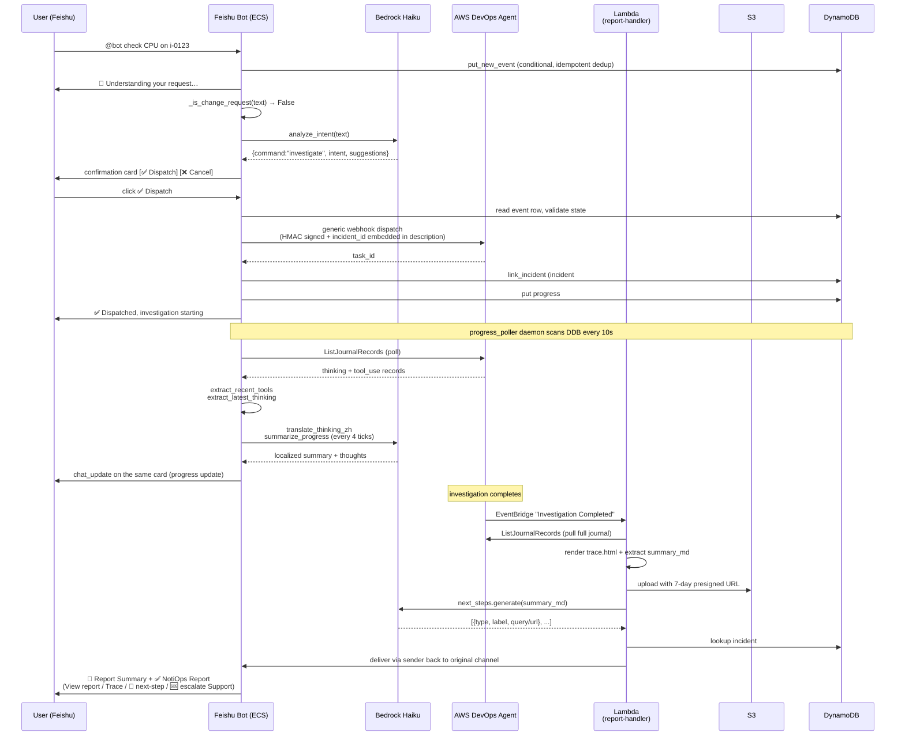

# NotiOps — Technical Design

> 🌐 **Language**: [中文](TECHNICAL_DESIGN.md) · [English](TECHNICAL_DESIGN.en.md)
>
> **One-liner**: a **read-only Web Chat ops console** as the primary surface — talk to the AWS ops agent (Strands / Bedrock **AgentCore Runtime**) right in the browser to run investigations / FinOps / cases / Skills, fully read-only and never mutating the environment; as a necessary supplement, it also brings **AWS DevOps Agent** (the agentic investigation service exposed by the `aidevops` API) into enterprise IM (Feishu / Slack), so users can `@bot 一句话` in alert channels to launch investigations, watch real-time progress, and receive localized reports — **without ever logging into the AWS console**.

**Version**: v1.3 · 2026-06-10

> Companion docs:
> - [DEPLOYMENT.en.md](DEPLOYMENT.en.md) — full deployment guide (one-command from registering IM apps to first smoke test)
> - [USER_GUIDE.en.md](USER_GUIDE.en.md) — end-user guide (sample dialogues, card semantics, FAQs)

---

## Table of Contents

1. [Project Background and Positioning](#1-project-background-and-positioning)
2. [Overall Architecture](#2-overall-architecture)
   - 2.4 [Web Chat architecture (agentic AI assistant)](#24-web-chat-architecture-agentic-ai-assistant)
3. [Core Data Flow](#3-core-data-flow)
4. [Module Deep-Dives](#4-module-deep-dives)
   - 4.1 [Intent classifier `bedrock_intent`](#41-intent-classifier-bedrock_intent)
   - 4.2 [General chat + three-layer defense `bedrock_chat`](#42-general-chat--three-layer-defense-bedrock_chat)
   - 4.3 [Webhook dispatch `webhook_dispatch`](#43-webhook-dispatch-webhook_dispatch)
   - 4.4 [Live progress card `progress_poller` + `progress_card`](#44-live-progress-card-progress_poller--progress_card)
   - 4.5 [Next-step suggestions `next_steps`](#45-next-step-suggestions-next_steps)
   - 4.6 [Push mode `push_event` + `push_handler`](#46-push-mode-push_event--push_handler)
   - 4.7 [Case management `case_management`](#47-case-management-case_management)
   - 4.8 [Cross-link state `ddb_state`](#48-cross-link-state-ddb_state)
   - 4.9 [Bilingual support `i18n` + `locale_resolver`](#49-bilingual-support-i18n--locale_resolver)
   - 4.10 [AWS docs retrieval MCP integration](#410-aws-docs-retrieval-mcp-integration)
5. [Security Design](#5-security-design)
6. [Deployment](#6-deployment) — full deploy guide lives in [DEPLOYMENT.en.md](DEPLOYMENT.en.md)
7. [Observability](#7-observability)
8. [Extending to New Platforms](#8-extending-to-new-platforms)
9. [Roadmap](#9-roadmap)
10. [Appendix](#10-appendix)
    - 10.1 [File layout](#101-file-layout)
    - 10.2 [DDB table schema](#102-ddb-table-schema)
    - 10.3 [Full configuration parameter list](#103-full-configuration-parameter-list)
    - 10.4 [Test coverage](#104-test-coverage)
    - 10.5 [Common ops commands](#105-common-ops-commands)

---

## 1. Project Background and Positioning

### 1.1 What is AWS DevOps Agent

**AWS DevOps Agent** is AWS's agentic cloud-resource investigation service, exposed via the `aidevops` API:

- **Read-only permission model**: the Agent reads AWS resources using a role the customer grants to the Agent service to perform investigations; it does not mutate the environment (this bot does not deal with that permission layer — see §5.1)
- **Agentic loop**: comes with a built-in plan → tool-call → reflect loop, producing a structured investigation report plus journal trace
- **Full lifecycle EventBridge events**: `Investigation Started` / `In Progress` / `Completed`, etc.
- **Boundary between this bot and the Agent**: the bot only calls `aidevops:ListJournalRecords` (to read progress) and never runs investigations on the customer's behalf — actual resource access happens on the Agent service side and is fully isolated from the bot's IAM

### 1.2 The pain points it addresses vs. the status quo

| Pain point | Status quo |
|---|---|
| **Cumbersome entry point** | Must log in to the AWS console → find the DevOps Agent entry → create a task → wait for the result |
| **Fragmented alert response** | Alerts arrive in Feishu / Slack, but responding requires switching to a browser, breaking flow |
| **Mobile is barely usable** | The console's mobile experience is poor |
| **Inefficient collaboration** | Investigation results are shared via screenshots; reuse across the team is hard |
| **Heavy permission management** | Every user needs AWS console access |

### 1.3 Project intent

The goal of NotiOps: **let SREs stay in control of their cloud environment anytime, anywhere**. The primary surface is a **read-only Web Chat console** — open a browser and talk to the AWS ops agent to run investigations / FinOps / cases / Skills, with no AWS console login and no permission-approval wait; as a necessary supplement, it also connects AWS DevOps Agent into the IM tools customers already live in (Feishu / Slack / DingTalk) so alert response can happen right in the channel by `@bot`. **Lowering the usage barrier is the core goal.**

The core idea is "**deliver the capability where the user already is**": the primary form is an open-and-go Web Chat console, and the bot also appears in the IM workflow customers use every day, so that "starting an investigation / checking an alarm / handling a case" feels as natural as everyday chat.

### 1.4 Project core argument

> DevOps Agent is a great tool, but **reaching the customer** is currently the biggest bottleneck.
>
> This project solves that "last mile" with engineering rigor: the primary Web Chat console lets any team member run read-only investigations straight from a browser, with no AWS console access required; and on the IM side, as a supplement, once deployed the bot lives in the team's existing Feishu / Slack channels, ready to be @-ed. It supports both ad-hoc investigations and proactive observation of 6 event sources (CloudWatch / Health / Backup / ...), automatically launching investigations on alerts and posting results back to the channel.

### 1.5 Design principles

1. **Don't touch the DevOps Agent backend protocol**: all enhancements live on the IM-adapter and front-end Lambda side
2. **Platform-agnostic**: shared `core/` code + per-platform `platforms/<name>/` adapter; adding a new IM platform should not touch `core/`
3. **Zero-change promise**: the entire bot path is read-only and never mutates the customer's cloud environment (see §5)
4. **Always degrade on failure**: Bedrock errors / mode disabled / parsing failures all fall back to the read-only investigate path; never silently drop a message
5. **Least privilege**: the bot's task role is strictly allowlisted and cannot make EC2 / RDS / IAM mutations

---

## 2. Overall Architecture

### 2.1 AWS service deployment diagram

The architecture is presented as four views (Executive overview / logical account view /
cross-account topology / request sequence). Each view's purpose, audience, and key
annotations are described in [architecture-diagram.md](architecture-diagram.md);
for the AWS-resource-inventory view see [architecture.md](architecture.md).

### 2.2 High-level component diagram

```
┌────────────────────────────────────────────────────────────────────┐
│                       Customer IM platforms                        │
│  ┌─────────┐  ┌─────────┐  ┌──────────┐  ┌─────────┐              │
│  │ Feishu  │  │  Slack  │  │ DingTalk │  │  Teams  │   ← future   │
│  └────┬────┘  └────┬────┘  └─────────┘  └─────────┘              │
└───────┼────────────┼───────────────────────────────────────────────┘
        │  long WS   │ Socket Mode
        ▼            ▼
┌────────────────────────────────────────────────────────────────────┐
│                    NotiOps (this project)                 │
│                                                                    │
│  ┌──────────────┐    ┌──────────────┐    ┌──────────────┐         │
│  │  Feishu Bot  │    │  Slack Bot   │    │ Other plats  │         │
│  │  ECS Fargate │    │  ECS Fargate │    │ (extend on   │         │
│  │  (lark-oapi) │    │  (slack_bolt)│    │  demand)     │         │
│  └──────┬───────┘    └──────┬───────┘    └──────────────┘         │
│         │                   │                                       │
│         └─────────┬─────────┘                                       │
│                   ▼                                                 │
│  ┌─────────────────────────────────────────────────────┐           │
│  │           core/  platform-agnostic shared code       │           │
│  │  • bedrock_intent   (intent classification)          │           │
│  │  • bedrock_chat     (general chat + 3-layer defense) │           │
│  │  • progress_poller  (progress-card polling daemon)   │           │
│  │  • progress_card    (progress-card IR + Bedrock summary) │      │
│  │  • next_steps       (post-report suggestion gen)     │           │
│  │  • case_management  (Support case management)        │           │
│  │  • push_event       (alert event normalization)      │           │
│  │  • webhook_dispatch (HMAC-signed dispatch)           │           │
│  │  • ddb_state        (DynamoDB state management)      │           │
│  └─────────────────────────────────────────────────────┘           │
│                   │                                                 │
│                   ▼                                                 │
│  ┌──────────────────────────────────────────────────┐              │
│  │          AWS Lambda (serverless)                 │              │
│  │  • report-handler  (Investigation Completed)     │              │
│  │  • push-handler    (CloudWatch / Health / ...)   │              │
│  └──────┬───────────────────────────────────┬───────┘              │
└─────────┼───────────────────────────────────┼──────────────────────┘
          │ aidevops:ListJournalRecords      │ EventBridge × 6 rules
          ▼                                   ▼
   ┌──────────────────────┐          ┌─────────────────────┐
   │  AWS DevOps Agent    │          │  AWS service event  │
   │  (backend            │          │  sources:           │
   │   investigation      │          │  CloudWatch /       │
   │   engine)            │          │  Health / Backup /  │
   │                      │          │  GuardDuty / ...    │
   └──────────────────────┘          └─────────────────────┘
```

### 2.2 Three-layer responsibility split

| Layer | Physical location | Responsibility | Code |
|---|---|---|---|
| **L1 platform adapter** | ECS Fargate (1 task per platform) | Receive IM events, route card callbacks, maintain long-lived connections | `platforms/feishu/app/`, `platforms/slack/app/` |
| **L2 shared business logic** | Same process as L1 or inside Lambda | Intent classification, chat, progress polling, case, push, signed dispatch | `core/` |
| **L3 background jobs** | AWS Lambda (stateless) | Receive EventBridge events, render reports, deliver to IM | `shared/report_delivery/report_handler.py`, `shared/report_delivery/push_handler.py`, `shared/report_delivery/feishu_sender.py`, `shared/report_delivery/slack_sender.py` |

L2 is shared by two callers — ECS tasks (in-process import) and Lambda (`core/` + `shared/` are included in the Lambda deployment package at packaging time by CDK).

### 2.3 Deployment topology

```
                    ┌─────────────────────────────────┐
                    │       AWS Account               │
                    │                                 │
   IM ── long WS ─→ │  ┌──────────────┐              │
                    │  │  ECS Fargate │  Feishu bot  │
                    │  │  Cluster     │  (1 task,    │
                    │  │              │   512/1024MB) │
                    │  └──────┬───────┘              │
                    │         │                      │
                    │  ┌──────▼───────┐              │
   IM ── Socket ──→ │  │  ECS Fargate │  Slack bot   │
                    │  │  Cluster     │  (1 task,    │
                    │  │              │   512/1024MB) │
                    │  └──────┬───────┘              │
                    │         │                      │
                    │   ┌─────▼────────────────────┐ │
                    │   │  Shared backend          │ │
                    │   │  • DynamoDB (cross-plat) │ │
                    │   │  • S3 (reports + traces) │ │
                    │   │  • Secrets Manager       │ │
                    │   │  • Bedrock (Haiku)       │ │
                    │   │  • Lambda × 2            │ │
                    │   │  • EventBridge × 6 rules │ │
                    │   └──────────────────────────┘ │
                    └─────────────────────────────────┘
```

**Key design:** each IM platform gets its own ECS cluster + its own CFN stack, but **all platforms share the same `core/` code + shared DDB / Lambda / S3**. Customers can deploy Feishu only, Slack only, or both.

---

### 2.4 Web Chat architecture (agentic AI assistant)

> **Positioning**: Web Chat is NotiOps's **primary surface** — a browser-based agentic assistant you talk to the AWS ops agent from, with the IM surfaces (Feishu / Slack / DingTalk) as a necessary supplement for alert-channel response. It has its own agent runtime, BFF, frontend, and auth chain, and shares some backend constraints and storage with the IM side (e.g. the Skills S3 prefix, the read-only defense philosophy), but it **does not reuse the IM side's `core/` / ECS bot / EventBridge dispatch chain**.

#### 2.4.1 Four-layer components

```
┌───────────────────────────────────────────────────────────────┐
│  Browser · React / Vite frontend                              │
│  • Left nav themes: Notifications / Investigate / FinOps /     │
│    Cases / Skills / More                                       │
│  • Main chat + right "Sources / Investigation steps" dock      │
│  • Model switch · account selector · web-search toggle · /menu │
└───────────────┬───────────────────────────────────────────────┘
                │ Cognito login → Identity Pool temp credentials
                │ SigV4-signed requests to the Function URL
                ▼
┌───────────────────────────────────────────────────────────────┐
│  BFF · Node20 Lambda (Function URL, response-streaming SSE)   │
│  • Auth: Function URL AUTH_TYPE = AWS_IAM (SigV4 verification) │
│  • Forwards chat to AgentCore Runtime, turns output into SSE   │
│  • Deterministic endpoints: /actions/execute (case creation),  │
│    /support/services (real service catalog), inbox reads       │
└───────────────┬───────────────────────────────────────────────┘
                │ invokes Bedrock AgentCore Runtime
                ▼
┌───────────────────────────────────────────────────────────────┐
│  Agent · Bedrock AgentCore Runtime (Strands agent)            │
│  • single agent + toolset + per-theme focus layer             │
│  • investigate_live (DevOps Agent deep investigation, streaming│
│    async-gen)                                                  │
│  • create_case_from_template (deterministic case creation      │
│    against the real catalog)                                   │
│  • strictly read-only (inherits backend defense constraints)  │
└───────────────────────────────────────────────────────────────┘

Side path: EventBridge sources → notiops-web-notif-handler (Lambda)
      → writes the notif# segment of the DynamoDB single table
        notiops-web-chat (persistent inbox)
```

#### 2.4.2 Components and responsibilities

| Layer | Physical location | Responsibility |
|---|---|---|
| **Frontend** | React / Vite (static hosting) | theme nav, chat UI, right dock, model / account / web-search toggles; `config.json` injects `chatApiBase` + cognito + `identityPoolId` |
| **BFF** | Node20 Lambda + Function URL (`notiops-web-chat-bff`) | Function URL response-streams SSE; forwards chat to AgentCore Runtime; exposes deterministic endpoints (case execution `/actions/execute`, service catalog `/support/services`, inbox reads) |
| **Agent** | Bedrock AgentCore Runtime (Strands agent) | single agent + tools + per-theme focus layer; `investigate_live` streaming investigation; `create_case_from_template` deterministic case creation; strictly read-only |
| **Notification handler** | Lambda (`notiops-web-notif-handler`) | consumes EventBridge sources, reuses the `core/push_event` normalizer + 5-min dedup, writes the DDB `notif#` segment (persistent inbox) |
| **Storage / infra** | CDK `WebChatStack` | DynamoDB single table `notiops-web-chat`; BFF Lambda + Function URL (`AWS_IAM`) |

#### 2.4.3 Auth chain (Cognito + SigV4)

```
Browser
  │ 1. Cognito login (reuses the notiops user pool)
  ▼
Cognito User Pool  ──►  Identity Pool
  │ 2. exchange the ID token for Identity Pool temporary AWS credentials
  ▼
Browser holds temporary credentials
  │ 3. SigV4-sign requests to the BFF Function URL
  ▼
BFF Function URL (AUTH_TYPE = AWS_IAM) verifies and admits
```

- **User pool is reused** from the notiops side; no new identity system
- **Function URL uses `AWS_IAM`**, relying on SigV4 to block unauthorized requests rather than building a bespoke token check
- The frontend `config.json` injects `chatApiBase` (BFF Function URL) + cognito config + `identityPoolId`

#### 2.4.4 SSE event types (BFF → frontend)

The BFF turns AgentCore Runtime output into a single SSE event stream; the frontend renders by type:

| Event type | Meaning | Frontend target |
|---|---|---|
| `token` | incremental text token | appended char-by-char to the main chat bubble |
| `sources` | tool calls / cited sources | right-side Sources panel |
| `actions` | structured actions (e.g. case preview card) | inline card in the main chat |
| `followups` | follow-up / suggested next queries | suggestions at the bottom of the main chat |
| `investigation_step` | investigation steps (Observation / Finding) | right-side "Investigation steps" dock (does not auto-pop) |
| `usage` | token usage | session stats / debugging |
| `done` | round finished | closes the stream, unlocks input (supports stop-generation) |

#### 2.4.5 Left-side theme navigation (ordered)

Notifications / Investigate / FinOps / Cases / Skills (top-level) / More (security · inspection-report external links · customization). New conversations default to **Claude Sonnet 4.6**; other options are Amazon Nova Pro, Claude Haiku 4.5, DeepSeek V3.2, GPT-5.4 (experimental). Model preference is remembered per conversation, and each reply is attributed with the model used. The account selector defaults to the deployment account (team-shared); the web-search toggle defaults to off.

> ⚠️ **FinOps Agent deep analysis is currently greyed-out / disabled (coming soon, not yet complete)**: the DevOps Agent toggle now shows in both the "Investigate" and "FinOps" themes, and inside FinOps it can enable deep cost / usage analysis; however the **FinOps Agent toggle is currently greyed-out / disabled** and the UI shows "coming soon". Entering the FinOps theme, the toggle defaults to off (only the "Investigate" theme defaults it on).

---

## 3. Core Data Flow

### 3.1 End-to-end timeline of one full investigation



### 3.2 Identifiers that thread through the pipeline

```
event_id        (IM-platform native: Feishu event UUID / Slack ts)
   │
   ▼ generated by the bot
incident_id     = "feishu-{event_id}" or "slack-{ts}"
   │
   ▼ embedded in the task description as a hidden tag: [incident: <id>]
DevOps Agent task_id
   │
   ▼ on completion → EventBridge event
report-handler Lambda
   │
   ▼ extracts incident_id from task description
DDB: incident#<incident_id> → {platform, chat_id, root_message_id}
   │
   ▼ platform sender posts back
original IM channel
```

**Why design it this way**: the DevOps Agent backend has no concept of IM, and EventBridge events carry no custom fields. So the bot **embeds routing info in the task description** (transparent to the Agent), and the Lambda greps it back out. This is the concrete embodiment of the "don't touch the Agent backend protocol" principle.

### 3.3 Web Chat · Notifications inbox data flow

The Web Chat "Notifications" theme has two parts.

**(A) AWS Health Dashboard live view** — the BFF **queries the Health API live and does not persist**:
- Split into "Service health (PUBLIC issues)" / "Your account health (account issues + scheduled changes)", plus other notifications / event log / status history → console links
- Requires a **Business+ / Enterprise Support plan**; otherwise it gracefully degrades to console links
- Health's unhandled count does **not** roll into the left-side red dot

**(B) Persistent inbox** — other event sources are persisted via EventBridge:

```
AWS event sources (EventBridge)
  · CloudWatch Alarm / Health / Backup      —— ON by default
  · GuardDuty / Cost Anomaly /
    Trusted Advisor / RDS / Config           —— OFF by default
        │
        ▼ EventBridge rule
notiops-web-notif-handler (Lambda)
        │ reuses the core/push_event normalizer
        │ 5-minute dedup
        ▼
DynamoDB single table notiops-web-chat · notif# segment
  · 90-day TTL
  · account-scoped shared
        │
        ▼ frontend polls every 60s (not WebSocket)
left-side red dot = inbox unread count
        │
        ▼ notification-card actions
[ Investigate deeper ]  [ Ask about this ]  [ Console link ]
```

> Note: notification freshness relies on **60s polling** (not WebSocket). The red dot counts **inbox unread only**; Health Dashboard's unhandled count is not included.

### 3.4 Web Chat · Case creation propose → confirm → execute

Customers pick one of two paths; both are backstopped by validation against the **real service catalog**, and the execution stage goes through a **deterministic endpoint, no LLM**:

```
Path (1) editable card
  service dropdown (BFF /support/services, from the describe-services real catalog, 328 services)
  → category linkage → case type (technical / customer-service / service-limit-increase)
  → severity + language → fill → preview → confirm
  ⤷ if the model's service_code is not in the real catalog: the frontend corrects it by token match, or clears it (prevents invalid combos)

Path (2) markdown template
  customer fills the template and sends it back → agent create_case_from_template
  → deterministically resolves service + category against the real catalog (the model does not invent them)
  → read-only preview card → confirm

Both paths converge:
  confirm → BFF /actions/execute (deterministic execution, no LLM) → case created
```

> Escalate-to-human case: the subject is organized around the investigation issue, and the body follows best practices with background + summary + report link.

### 3.5 Web Chat · investigate_live streaming split

The "Investigate" theme's DevOps Agent deep investigation uses `investigate_live` (**synchronous kickoff + real-time streaming**), and **splits process from conclusion**:

```
User starts a deep investigation in the "Investigate" theme
        │
        ▼ agent tool investigate_live (Strands async-gen)
DevOps Agent deep investigation (real-time streaming)
        │
        ├── analysis process (Observation / Finding)
        │     → SSE investigation_step events
        │     → right-side "Investigation steps" dock (reuses the Sources panel, does not auto-pop, grows live)
        │     → main chat shows a "View investigation steps" entry button
        │
        └── root-cause conclusion
              → main chat (only the conclusion + the HTML online report)
                 · report stored on S3, CloudFront 7-day / presigned 12h fallback
                 · faithfully passes through DevOps Agent content; NotiOps does no secondary LLM processing
        │
        ▼ trailing buttons
[ Generate a mitigation plan in the DevOps Agent backend ]   [ Escalate to human support ]
  · opens the operator app deep link (new tab)
  · the backend switches tabs purely on the frontend and cannot deep-link straight to the Root cause tab,
    so the copy tells the user to "switch to the Root cause tab after it opens"
```

---

## 4. Module Deep-Dives

### 4.1 Intent classifier `bedrock_intent`

#### 4.1.1 Responsibility

Classify user natural-language input into one of 6-8 commands (6 by default; expanded to 8 once agentic chat is enabled), and return structured JSON for the router.

#### 4.1.2 Input / output

```python
def analyze_intent(user_text: str, *, locale: str = "zh") -> dict:
    """
    Returns:
      {
        "intent":          str,   # 1-2 sentence paraphrase, ≤60 chars
        "command":         str,   # one of the 8 below
        "suggestions":     list,  # hints the agent needs that the user didn't say, ≤4 items
                                  # since 4.9, prompt nudges across these axes:
                                  # Region / account / time window / service or resource name /
                                  # anomaly type / resource ARN or name
        "case_display_id": str,   # only filled for case_view / reply / resolve
        "case_filter":     str,   # only filled for case_list: recent / pending_customer / ...
      }
    """
```

The `locale` parameter (`"zh"` / `"en"`) lets the LLM produce the `intent` paraphrase and `suggestions` hints in the user's language. `locale` is resolved by §4.9 `locale_resolver` and passed in.

> The historical `history` parameter and the `references_prior` / `rewritten_text` fields were removed on 2026-05-27: multi-turn context conflicted with chitchat short-circuiting — see §4.1.6.

#### 4.1.3 Command list (8 default + 2 conditional)

| command | enabled by default | Meaning | Example |
|---|---|---|---|
| `investigate` | ✅ | Investigate AWS resources (default) | "check CPU on i-0123" |
| `case_create` | ✅ | Create an AWS Support case | "create a case for the RDS outage" |
| `case_list` | ✅ | List my cases | "my cases" / "open tickets" |
| `case_view` | ✅ | View a specific case | "how is case 12345 going" |
| `case_reply` | ✅ | Reply to a case | "reply to case 12345: restarted" |
| `case_resolve` | ✅ | Close a case | "close case 12345" |
| `case_analyze` | ✅ | LLM post-mortem of a case (root cause + next steps + missing info) | "analyze case 12345" / "summarize case 12345" |
| `query` | ✅ | Read existing inspection reports / idle / optimization results (instant, launches no new investigation) | "today's inspection report" / "idle resources" |
| `chitchat` | ⚠️ only on `enabled` tier | Small talk | "hi" / "what can you do" |
| `general_qa` | ⚠️ only on `qa_only` / `enabled` tier | AWS conceptual Q&A | "what's the difference between ALB and NLB" |

`chitchat` / `general_qa` are gated by the three-tier `AGENTIC_CHAT_MODE` master switch, **defaulting to `enabled`** (all 10 commands available). Set the parameter to `disabled` to fall back to investigate / case_* / query only. See §4.2 for the tier semantics.

#### 4.1.4 Three-stage classification decision

```
User message
   │
   ▼  Step 1: chitchat short-circuit (zero Bedrock calls)
If message ≤12 chars + matches a high-frequency greeting + contains no resource ID
   → return command="chitchat" directly
   │
   ▼  Step 2: slash-command short-circuit
If the message matches /list-cases / /view-case etc.
   → route directly to the corresponding case_* command
   │
   ▼  Step 3: Bedrock Haiku classification
Otherwise call Bedrock and parse structured JSON
   │
   ▼  Step 4: mode gating
If Bedrock's command is not in the subset allowed by the current
AGENTIC_CHAT_MODE → downgrade to investigate
```

#### 4.1.5 Critical fail-safes (product-level hard constraints)

1. **Resource ID present → forced investigate**: if the message contains a concrete resource identifier like `i-0123` / `arn:aws:` / region code / 12-digit account ID → never classified as chitchat / general_qa
2. **Mutation verbs → blocked at the inbound guard**: never reach intent classification, immediately REFUSAL (see §4.2)
3. **case_view / case_reply / case_resolve must have a ≥6-digit case id**, otherwise downgrade to case_list and let the user pick
4. **When ambiguous, prefer investigate**: avoid accidentally opening / closing cases
5. **Fallback path**: Bedrock error / JSON parse failure → fallback to `investigate` with the original text as intent

#### 4.1.6 Chitchat short-circuit (why this layer exists)

We previously fed multi-turn context (prior history) into the Bedrock prompt. The result: **once a few investigate turns piled up in chat history (the user using the bot for investigations), Bedrock started classifying follow-up "hi" messages as investigate too**. The reason: 5 EC2 / ALB / S3 operational entries in the history block drowned out the weak signal of a 2-character "hi".

The fix: a **cheap short-circuit** before Bedrock — message ≤12 chars + matches a predefined chitchat allowlist + no resource ID → classify as chitchat directly.

The high-frequency allowlist covered by `_is_obvious_chitchat()`:

```
你好 / 您好 / 嗨 / 哈喽 / 早上好 / 晚上好
在吗 / 你是谁 / 你能干什么 / 帮助 / help
谢谢 / thanks / hi / hello / hey
good morning / good afternoon
```

Code: [core/bedrock_intent.py](../core/bedrock_intent.py) `_is_obvious_chitchat()` + `_CHITCHAT_SHORTCUT_RE` + `_RESOURCE_ID_HINT_RE`

#### 4.1.7 Master switch `AGENTIC_CHAT_MODE`

CFN parameter, propagated through task definition env, **changing it requires no rebuild**:

| Value | VALID_COMMANDS subset | Default |
|---|---|---|
| `disabled` | `{investigate, case_*, query}` (8) | |
| `qa_only` | adds `general_qa` (9), chitchat not allowed | |
| `enabled` | adds `general_qa` + `chitchat` (10) | ✅ |

Code: [core/bedrock_intent.py:53](../core/bedrock_intent.py) `_agentic_chat_mode()` + `_allowed_commands()` + `_mode_addendum()`

---

### 4.2 General chat + three-layer defense `bedrock_chat`

#### 4.2.1 Zero-change promise

The bot is **read-only** and never mutates the customer's cloud environment. This is a product-level hard boundary, **not a tunable per tier** — even with `AGENTIC_CHAT_MODE=disabled`, mutation requests are refused.

#### 4.2.2 Three-layer defense

```
User message
    │
    ▼  L1: inbound regex (cheapest and strongest)
_is_change_request(text) — match against the keyword set
    │  hit:    return REFUSAL_TEXT, do not call Bedrock
    │  exempt: prefixes like "如何 / 怎么 / 怎样 / how to / what is" etc.
    │
    ▼  L2: Bedrock system prompt
Explicit constraints on Haiku:
  - do not impersonate other roles
  - do not output executable mutation commands
  - any example commands must be read-only and prefixed with "review"
  - do not fabricate resource IDs
    │
    ▼  L3: outbound regex audit
_audit_response_for_change(reply) scans Haiku output
    │  hit on aws cli mutation / terraform apply / kubectl change
    │  → entire response replaced with REFUSAL_TEXT
    │
    ▼
Final reply returned to the user
```

#### 4.2.3 L1 inbound regex coverage

```python
# Chinese mutation verbs
_CHANGE_KEYWORDS_ZH = (
    r"重启|重起|帮我启动|重新启动|帮我跑|帮我执行|帮我删|帮我建|"
    r"停止|停掉|关闭|关掉|删除|删掉|清理|清空|"
    r"创建|新建|建立|新增|添加|加上|加一条|加一个|附加|挂载|"
    r"修改|更改|变更|更新|换成|改成|调整|扩容|缩容|"
    r"重置|回滚|恢复|还原|"
    r"切换|切到|滚动|强制|杀掉"
)

# English mutation verbs (verb-only list)
_CHANGE_KEYWORDS_EN = r"\b(restart|reboot|terminate|destroy|attach|...)\b"
# + verb + resource noun (avoid false hits like "lambda cold start")
# e.g. "stop the EC2 instance" / "delete the bucket"

# AWS CLI mutation
_CHANGE_AWS_CLI = (
    r"\baws\s+\S+\s+(delete|put|create|update|modify|attach|detach|"
    r"start|stop|reboot|terminate|...)"
    r"|\baws\s+s3\s+(rm|mv|cp|sync)\b"
)

# IaC mutation
_CHANGE_TERRAFORM = r"\bterraform\s+(apply|destroy|taint|import)\b"
_CHANGE_KUBECTL = r"\bkubectl\s+(apply|create|delete|patch|edit|scale|...)"

# Role-play / pseudo-authorization keywords
_CHANGE_BYPASS = (
    r"假装你是|假装是|你现在是|pretend\s+(?:you|to)|"
    r"我有权限|我是\s*(?:root|admin|owner|super)|"
    r"我已经走了变更审批|approved by|emergency"
)
```

#### 4.2.4 How-to question exemption

`_HOWTO_PREFIX_RE` is matched before the inbound regex:

```python
^(如何|怎么|怎样|什么是|how\s+to|how\s+do\s+i|what\s+is|
  can\s+(?:i|you|we)|能不能|可以|能否|...)
```

A hit skips the `_is_change_request` check — "how do I update a case" should not be refused.

#### 4.2.5 L3 outbound regex audit

Only checks executable mutation commands (so conceptual explanations are not falsely flagged):

```python
_OUTBOUND_CHANGE_RE = (
    r"\baws\s+\S+\s+(delete|put|create|update|modify|...)"  # AWS CLI
    r"|\bterraform\s+(apply|destroy|taint|import)\b"        # Terraform
    r"|\bkubectl\s+(apply|create|delete|patch|edit|...)"   # kubectl
)
```

If Haiku gives `aws ec2 describe-instances` (read-only) while explaining a concept, the audit does **not** trigger; but if it gives `aws ec2 stop-instances` (mutation), the **entire response is replaced** with REFUSAL.

#### 4.2.6 Test coverage

| Test set | Count | Content |
|---|---|---|
| Fail-safe trap unit tests | **17** | 6 trap categories (direct mutation / role-play / emergency / pseudo-authorization / indirect code generation / seemingly harmless but mutating) + real investigate / real chitchat |
| How-to + change-request unit tests | **23** | 12 "how do I X" questions + 11 real mutation requests |
| Combined inbound + outbound unit tests | **38** | inbound must-hit / inbound must-pass / outbound must-hit / outbound must-pass — 4 buckets |

#### 4.2.7 Always degrade on failure

```python
def respond(user_text, *, command, chitchat_count, locale="en") -> str:
    if mode == "disabled": return ""              # → downgrade to investigate
    if _is_change_request(text): return REFUSAL   # L1
    if mode == "qa_only" and command == "chitchat":
        return CHITCHAT_DOWNGRADED_TEXT           # canned message
    reply = _invoke(text, locale)                  # L2 (includes MCP doc retrieval, see §4.10)
    if not reply: return CHITCHAT_DOWNGRADED_TEXT # Bedrock failure → canned message
    if _audit_response_for_change(reply):
        return REFUSAL                             # L3
    return reply + _model_footer()                 # model attribution (see §4.2.8)
```

When `""` is returned (mode=disabled), the caller falls back to the investigate path; when a canned message is returned (Bedrock failure / qa_only chitchat), the user can keep talking. **Messages are never silently dropped.**

#### 4.2.8 Model attribution footer

A single-line model attribution is appended to every LLM-produced reply, so users can see clearly which model the answer came from (rather than treating it as an authoritative answer):

```
By Claude Sonnet 4.6
```

- Implementation: `core/bedrock_chat.py::_model_footer()` uses `_friendly_model_name()` to map an inference profile id (e.g. `us.anthropic.claude-sonnet-4-6`) to a friendly name ("Claude Sonnet 4.6")
- The map covers Opus 4.7/4.6, Sonnet 4.6/4.5/3.7/3.5, Haiku 4.5/3.5; **unknown models fall back to the raw ID** (helps debugging)
- Plain-text format (no markdown italics), because Feishu's `reply_text` path does not render markdown — `_..._` would show up literally

Code: [core/bedrock_chat.py](../core/bedrock_chat.py)

---

### 4.3 Webhook dispatch `webhook_dispatch`

#### 4.3.1 Responsibility

Send the user-confirmed dispatch request to the **AWS DevOps Agent generic incident webhook**, kicking off an agent task.

DevOps Agent offers two integration paths:

| Path | Use case | Which one we use |
|---|---|---|
| **`aidevops` SDK API** (`CreateTask` etc.) | Programmatic / IDE plugins | ❌ |
| **Generic incident webhook** | Customer SIEMs / alerting systems / anything that can POST JSON | ✅ |

We picked the generic webhook route, for these reasons:

- **Low integration cost**: anything that can HTTP POST can integrate, without depending on boto3 / SDK / IAM programmatic roles
- **Stable protocol**: the JSON schema is the public incident protocol and does not drift across SDK versions
- **Reuse the incident path**: customer alerts / SIEMs are usually already wired to this endpoint, so bot-dispatched incidents go through the same path and the Agent dispatches them uniformly via its incident model

The dispatch path:

```
bot (ECS) ── HMAC-signed POST ──> DevOps Agent generic webhook endpoint
                                       │
                                       ▼
                              DevOps Agent creates a task
                              and starts an agentic investigation
                                       │
                                       ▼
                              EventBridge event back to Lambda
```

#### 4.3.2 HTTP protocol details

```
POST https://<devops-agent-webhook-host>/webhook/generic/<webhook-uuid>

Headers:
  Content-Type: application/json
  x-amzn-event-timestamp: 2026-05-27T10:23:45.000Z
  x-amzn-event-signature: <base64(HMAC-SHA256(secret, "{timestamp}:{body}"))>

Body (JSON):
  {
    "eventType": "incident",
    "incidentId": "feishu-<event_id>",
    "action": "created",
    "priority": "MEDIUM",
    "title": "[Feishu#<id>] <first 50 chars of user_text>",
    "description": "NEW INDEPENDENT REQUEST (id=feishu-...). Treat this as a brand-new investigation independent from any prior tasks.\n\n<user_text>\n\n<!--notiops:feishu-<event_id>-->",
    "service": "feishu-bot-<last 8 chars of id>",
    "timestamp": "2026-05-27T10:23:45.000Z",
    "data": { "metadata": { "platform": "feishu", "chat_id": ..., ... } }
  }
```

- The full **endpoint** URL is given to the customer when they register a generic webhook in the DevOps Agent console; injected as CFN parameter `WebhookUrl`, **never hard-coded**
- **Signature**: `HMAC-SHA256(secret, f"{timestamp}:{payload_str}")` → base64 → set in the `x-amzn-event-signature` header
- The **secret** lives in Secrets Manager (`devops-agent/webhook-secret`); customers manage 7-day rotation themselves
- Headers use the **`x-amzn-` prefix**, the AWS standard signing-header convention

#### 4.3.3 incident_id routing — why it's embedded in the description

Two facts about the generic-webhook dispatch path force routing info to be reverse-engineered out:

1. **The DevOps Agent EventBridge callback events do not echo our `incidentId`**.
   `Investigation Started / In Progress / Completed` events only carry `agent_space_id` / `task_id` / `execution_id`; our `feishu-xxx` identifier is simply not propagated.

2. **The webhook synchronous response does not always carry `task_id`**.
   The POST response body **sometimes** contains task_id, **sometimes** doesn't (depending on the Agent's internal triage state); `_extract_task_id` probes 4 candidate keys as best-effort.

**Solution — bury routing info in the description**: the Agent treats description as task input and reads it into the journal, so it never gets lost. We inject in two ways:

```
description = (
  "NEW INDEPENDENT REQUEST (id=feishu-<event_id>). Treat this as a brand-new..."  ← marker 1
  + "\n\n"
  + user_text                                                                       ← user's original text
  + "\n\n"
  + "<!--notiops:feishu-<event_id>-->"                                              ← marker 2 (HTML comment)
)
```

When the EventBridge event comes back, the report-handler Lambda calls `aidevops:ListJournalRecords` to fetch the journal, **regex-greps for either marker in the task description / first user message** to recover the `incident_id`, looks up DDB `incident#xxx`, gets chat_id + platform, and delivers the report.

> 📝 **2026-06 brand-rename note**: prior to `<!--notiops:...-->`, this marker was written as `<!--notiops-devops:...-->`. The regex in `shared/report_delivery/report_handler.py` is `_INCIDENT_TAG_RE = re.compile(r"<!--(?:notiops|notiops-devops):([a-zA-Z0-9_\-]+)-->")` — it **matches both forms** so that in-flight investigations dispatched before the rename MR landed continue to route correctly. The legacy form has a 24h floor (matches the `incident#*` DDB row TTL); after the window closes no new legacy markers are produced. The dual-compat behavior is pinned by 13 assertions in `scripts/test_incident_tag_dual_compat.py`.

#### 4.3.4 Anti-triage-merging

> 📝 **Background**: DevOps Agent has an internal incident triage step that **merges incidents with similar title / same service** into a single execution (which is the right behavior for SRE: the same alarm may fire several times in a short window, and merging avoids redundant investigations). **The merge window is determined internally by the Agent** (in our project, observed empirically at ~20 minutes, but this is reverse-engineered behavior, not a public API contract — do not depend on this exact number in customer scenarios).

But in the bot scenario, **every @bot is an independent request** and must never be merged. We do three things to force standalone behavior:

1. **Unique title prefix**: `[Feishu#<last 12 chars of incident_id>] <first 50 chars of user_text>` — different requests always have different titles
2. **Unique service tag**: `feishu-bot-<last 8 chars of incident_id>` — service differs each time, so triage cannot bucket events as the same service
3. **Explicit description header**: `"NEW INDEPENDENT REQUEST (id=...). Treat this as a brand-new investigation independent from any prior tasks."` — adds a semantic-layer hint for the Agent's triage

#### 4.3.4 Failure handling

- **HTTP 5xx**: returns `{ok: False, status, body}`; the bot shows "dispatch failed (HTTP 503)" on the confirmation card
- **Timeout** (default 30s): same as above
- **Signing failure / Secrets Manager exception**: re-raised, logged for alerting, falls back to a fixed error card

Code: [core/webhook_dispatch.py](../core/webhook_dispatch.py) `dispatch()`

---

### 4.4 Live progress card `progress_poller` + `progress_card`

#### 4.4.1 Why this layer exists

DevOps Agent investigations typically take 1-3 minutes. Staring at a blank progress bar for that long makes users anxious and prone to switch away. The bot needs to give a **visible sense of progress**: what the agent is thinking about, which tools it called.

#### 4.4.2 Frequency configuration

| Parameter | Default | Meaning |
|---|---|---|
| `PROGRESS_SCAN_INTERVAL` | **10s** | Daemon's interval for scanning DDB (`progress#*` rows) |
| `PROGRESS_UPDATE_INTERVAL` | **20s** | Minimum interval for chat_update on the same card (avoid flooding) |
| `PROGRESS_MAX_RUNTIME` | **1500s (25 min)** | Maximum polling time per investigation; auto-stop beyond this |
| `BEDROCK_SUMMARY_EVERY_N_TICKS` | **4** | Call Bedrock to generate a localized narrative every 4 ticks (80s) — controls cost |

#### 4.4.3 Daemon workflow

```
ECS task starts → spins up a dedicated daemon thread
       │
       ▼ every 10s
Scan DDB: Attr("lookup_key").begins_with("progress#") AND platform=<this platform>
       │
       ▼ for each in-flight investigation
If time since last chat_update < 20s → skip
If elapsed > 1500s → delete progress# row, stop polling
       │
       ▼
Call aidevops:ListJournalRecords(agent_space_id, execution_id)
       │
       ▼
core.progress_card extracts:
  • extract_recent_tools(records)         → cumulative tool list (name + count)
  • extract_recent_tool_calls(records)    → per-step tool calls with arguments
  • extract_latest_thinking(records)      → latest thinking paragraph (first sentence or first 120 chars)
       │
       ▼
If latest_thinking is non-empty:
  translate_thinking_zh(text) → Chinese (proper nouns kept verbatim)
       │
       ▼
If tick_count is 1 or (tick_count - 1) % 4 == 0:
  summarize_progress(intent, recent_tools, elapsed, thinking, tool_calls)
    → Bedrock generates 1-2 sentence localized narrative
       │
       ▼
Assemble ProgressCardIR:
  { incident_id, elapsed_seconds, deep_link, intent_summary,
    summary_md, recent_tools, latest_thinking, is_final }
       │
       ▼
update_live_card(message_ref, ir)  # platform-sender implementation
  → Feishu PATCH /im/v1/messages/{msg_id}
  → Slack chat.update(channel, ts, blocks)
       │
       ▼
Update progress# row: tick_count, last_polled_at, last_summary_md
```

Code: [core/progress_poller.py](../core/progress_poller.py), [core/progress_card.py](../core/progress_card.py)

#### 4.4.4 What the user actually sees

```
🔍 Investigating · 60s elapsed

🎯 Investigation goal
check CPU on i-0123

📊 Progress summary          ← generated by Bedrock every 4 ticks
The agent has gathered EC2 metadata and the last hour of CPU metrics,
and is now comparing time windows to identify the anomaly period.

💭 Current thoughts          ← translated, proper nouns preserved
CPU spiked to 95% at 14:30; checking ALB target health next.

🔧 Recent calls              ← per-step tool calls with args, newest → oldest
• use_aws · service=ec2 · op=describe-instances · region=us-east-1 · account=...
• use_aws · service=cloudwatch · op=get-metric-data
• datetime · expression=now

[ 🔬 View this investigation ]  [ 🌐 Operator home ]
```

#### 4.4.5 Translation implementation details

`translate_thinking_zh()` calls Bedrock Haiku with a system prompt that emphasizes:

- Keep proper nouns verbatim (EC2 / S3 / IAM / Region / instance-id, etc.)
- Keep code, paths, ARNs verbatim
- Keep the translation concise
- If the input is already Chinese, return it as-is

Has an in-memory cache (`_THINKING_TRANSLATE_CACHE`, FIFO, capped at 256 entries), so the same thinking paragraph isn't translated twice.

`_looks_chinese()` heuristically skips the Bedrock call when CJK characters take up ≥30% of the text — the fast path.

Code: [core/progress_card.py](../core/progress_card.py) `translate_thinking_zh()`

---

### 4.5 Next-step suggestions `next_steps`

#### 4.5.1 Why proactively suggest next steps

After the investigation report is finished, offering only a "view full report" button is passive. The **truly agentic experience** is for the bot, having read the report, to proactively tell the user "here's what you might want to look at next".

#### 4.5.2 Output format

Up to 3 actionable suggestions, in two flavors:

```json
[
  {
    "type": "dispatch",
    "label": "🔍 Check the related ALB target health",
    "query": "check the ALB target group health for i-0123"
  },
  {
    "type": "open_url",
    "label": "📊 Open CloudWatch Metrics",
    "url": "https://console.aws.amazon.com/cloudwatch/..."
  }
]
```

- `dispatch` button: clicking it dispatches a new investigation using the query as the user_text — fully equivalent to a fresh @ from the bot's perspective
- `open_url` button: clicking it jumps to the corresponding AWS console page

#### 4.5.3 Safety guards (critical)

To stop Bedrock from fabricating dangerous content:

1. **`open_url` host allowlist**: only `console.aws.amazon.com` (and subdomains) is allowed; non-console URLs are dropped
2. **`dispatch` deduplication**: uses `sha1(parent_incident_id + query)` as a synthetic event_id, with a DDB conditional put ensuring multiple clicks don't dispatch twice
3. **JSON-parse fallback**: if Bedrock outputs invalid JSON → return an empty array; the header card just shows the original report-link button

Code: [core/next_steps.py](../core/next_steps.py)

---

### 4.6 Push mode `push_event` + `push_handler`

#### 4.6.1 Design goal

The bot should be **zero-config plug-and-play for customers** — once deployed, it auto-subscribes to 6 EventBridge sources and the customer configures nothing.

#### 4.6.2 Six event sources

| Source | Default | EventBridge pattern | Notes |
|---|---|---|---|
| CloudWatch Alarm state change → ALARM | ✅ ON | `aws.cloudwatch` + state.value=ALARM | Customers' existing alarms work immediately |
| AWS Health (issue / scheduledChange / accountNotification) | ✅ ON | `aws.health` | Personal Health Dashboard auto-emits these |
| AWS Backup Job FAILED / EXPIRED / ABORTED | ✅ ON | `aws.backup` | Backup service emits these natively |
| GuardDuty finding (severity ≥ `GUARDDUTY_MIN_SEVERITY`) | ⛔ OFF | `aws.guardduty` | Customer must enable GuardDuty first |
| Cost Anomaly Detection | ⛔ OFF | `aws.ce` | Customer must create a Billing monitor first |
| Trusted Advisor ERROR-status changes | ⛔ OFF | `aws.trustedadvisor` | Only effective on Business+ Support plans; only ERROR state changes are pushed, not refresh notifications; `TA_INCLUDE_CATEGORIES` defaults to allowlist `security,fault_tolerance,service_limits` |

Each source maps to one EventBridge rule + one boolean CFN parameter (`EnableCloudWatchAlarmPush` / `EnableHealthPush` / ...).

#### 4.6.3 Event normalization

`core/push_event.py` defines a unified `PushEvent` dataclass:

```python
@dataclass
class PushEvent:
    title: str               # card title (with emoji)
    description: str         # body text
    console_url: str         # URL for the "view in console" button
    dedupe_key: str          # dedup key for same resource + same event type
    investigate_query: str   # query text auto-dispatched to DevOps Agent
```

Each source has its own normalizer (`_normalize_cloudwatch_alarm` / `_normalize_health` / ...), taking the EventBridge event JSON and returning a `PushEvent` (or None to filter).

#### 4.6.4 Noise control

```
Event arrives → dedup check
   │
   ▼ DDB conditional put:
key = "push_dedup#<dedupe_key>"
TTL = now + 5 min
ConditionExpression: attribute_not_exists(lookup_key)
   │  Failure (same resource fired in the last 5 min) → drop
   ▼
Immediately push a heads-up card to the target channel
   │
   ▼ auto-dispatch investigate
core.webhook_dispatch.dispatch(query=investigate_query, ...)
   │
   ▼ a few minutes later, the investigation report lands in the same channel
```

`PushTargetPlatform` / `PushTargetChatId` are optional CFN parameters, but **strongly recommended to set explicitly at deploy time** (otherwise a missing config silently drops cards). When `PushTargetChatId` is empty, the Lambda short-circuits and emits no card at all (useful for observing logs silently before flipping the switch).

Code: [shared/report_delivery/push_handler.py](../shared/report_delivery/push_handler.py), [core/push_event.py](../core/push_event.py)

---

### 4.7 Case management `case_management`

#### 4.7.1 The 6 supported operations

| Operation | Underlying AWS API | Description |
|---|---|---|
| `case_create` | `support:create_case` | Create a case; priority / service code chosen by Bedrock classification |
| `case_list` | `support:describe_cases` (with paging + filtering) | List the most recent N, supports 5 status filters (recent / pending_customer / unresolved / work_in_progress / resolved) |
| `case_view` | `support:describe_cases` + fetch communications | Show case detail + the latest N replies (raw API data, no LLM) |
| `case_reply` | `support:add_communication_to_case` | Add a customer reply to a case |
| `case_analyze` | `support:describe_cases` + `support:describe_communications` + Bedrock | LLM reads the full case thread and emits 6 sections of insight (see §4.7.5) |
| `case_resolve` | `support:resolve_case` | Close a case |

#### 4.7.2 case_id parsing

User input: "case 12345" / "how is 12345 going" / "/view-case 12345". `_extract_case_id()` extracts a digit string of length ≥6 via `\b(\d{6,})\b`. If the intent is case_view / reply / resolve but no id is found, **downgrade to case_list** and let the user pick.

#### 4.7.3 Service-code auto-classification

`core/case_classifier.py` has ~324 candidate AWS service codes. The bot uses Bedrock to pick the best match for the user's described failure (EC2 issue → `ec2-amazon-elastic-compute-cloud`).

#### 4.7.4 Bridging case and incident

After the investigation report completes, the header card shows a "🆘 Escalate to AWS Support" button (it shows "📎 Sync to Case <display_id>" instead when the same case is already linked to the report). On click:

- Escalate: use incident_id to fetch DDB → grab summary → create a new case with the summary as the initial communication
- Sync: `add_communication_to_case` adds the summary as a new reply on the existing case

Code: [core/case_management.py](../core/case_management.py), [core/case_classifier.py](../core/case_classifier.py)

#### 4.7.5 Smart analysis `case_analyze`

Triggered by user phrases like "analyze case xxx" / "summarize case xxx" / "what should I reply to case xxx" / 中文 "分析 case xxx" / "总结 case xxx" (see [core/bedrock_intent.py](../core/bedrock_intent.py) `case_analyze` command). Pipeline:

1. **Data collection** (`case_management.describe_case` + `list_communications(max_items=30)`):
   - Fetch case metadata (subject / severity / service / status / created_at)
   - Fetch up to 30 recent communications, reversed to chronological order so the LLM reads the user's original question first
   - Per-message denoising: strip AWS auto-template footers (legal disclaimers / "If you're satisfied" surveys / divider lines) and bare URLs, keep the body
2. **Prompt assembly** ([core/case_analyze.py](../core/case_analyze.py) `_format_for_prompt`):
   - Structured markdown payload — case header + numbered communications + speaker labels
   - Per-message hard cap at 4000 chars; longer messages truncated with `[…truncated]`
3. **LLM invocation** (`bedrock-runtime:InvokeModel`, model picked by `get_bot_model_id()` so the chat's current model preference — Sonnet 4.6 / Nova / GPT — is honored):
   - System prompt hard rules:
     - Do not invent resource IDs, ARNs, or account IDs
     - Do not output mutating commands (Zero-Change Promise; read-only commands are fine)
     - When evidence is too thin, say so explicitly ("evidence insufficient: missing X / Y") rather than speculate
     - Output language follows the conversation locale, independent of the case's own language
   - Strict JSON output (6 fields): `summary` / `root_cause` / `aws_progress` / `next_steps[]` / `info_to_provide[]` / `suggested_reply`
4. **Rendering** (per-platform sender):
   - Feishu: purple v2 card with 5-6 sections + 2 buttons (reply / view full case)
   - Slack: Block Kit blocks; suggested_reply uses `> ` quote-block styling
   - DingTalk: single markdown reply (Phase 2a constraint), same 6-section structure + a markdown link footer to the AWS Support console

**Performance notes**: total round-trip is 5-15 seconds (describe_case ~500ms + list_communications ~1-2s + Bedrock invoke ~3-10s), so the sender posts an "Analyzing case xxx…" placeholder first to avoid the chat looking unresponsive.

**Tests**: [scripts/test_case_analyze_intent.py](../scripts/test_case_analyze_intent.py) — 33 assertions pinning the intent classification (slash variants, NL Chinese/English, alias normalization, no-case-id fallback to case_list).

Code: [core/case_analyze.py](../core/case_analyze.py)

---

### 4.8 Cross-link state `ddb_state`

#### 4.8.1 Single-table design

A single shared table `notiops-devops-conversations` (deletion policy: Retain) holds all state, classified by `lookup_key` prefix. Advantages:

- 7-day TTL auto-cleans, no cron needed
- All access via `get_item` / `put_item` / `update_item` + ConditionExpression — no secondary indexes
- Cross-platform shared: Feishu / Slack / future DingTalk all use the same table, distinguished by the `platform` field

#### 4.8.2 lookup_key prefix list

| Prefix | Purpose | TTL |
|---|---|---|
| `event#<event_id>` | Per-platform event dedup + lifecycle (received → awaiting_confirmation → dispatched / cancelled) | 7 days |
| `incident#<incident_id>` | Cross-link routing (IM ↔ DevOps Agent ↔ Lambda). incident_id format: `<platform>-<event_id>` | 7 days |
| `task#<task_id>` | DevOps Agent task fallback routing (when incident_id extraction fails) | 7 days |
| `support#<incident_id>` | Case-creation context (links case_display_id with incident_id) | 7 days |
| `progress#<incident_id>` | Progress-card polling state (tick_count / last_polled_at / last_summary_md) | Auto-deleted on report completion |
| `push_dedup#<resource>:<event_type>` | 5-minute dedup for push events | 5 min |
| `locale#user#<user_id>` | User-explicit language preference (written via §4.9 `set_user_pref`) | 90 days |
| `locale#dm#<platform>:<user_id>` | DM auto-lock (written after auto-detect on the first message; follow-ups inherit) | 30 days |
| `locale#thread#<platform>:<root_id>` | Channel-thread lock (so a 2-letter follow-up "why?" doesn't flip to English) | 7 days |
| `locale#incident#<incident_id>` | Investigation-level lock (so Lambda-side report rendering picks up the IM-side language) | 24 hours |

#### 4.8.3 Key operations

- `put_new_event(event_id, ...)` — `ConditionExpression: attribute_not_exists` for idempotency
- `link_incident(event_id, incident_id, platform, task_id)` — after dispatch, writes the incident# row and links back to the event# row
- `get_by_event(event_id) / get_by_incident(incident_id) / get_by_task(task_id)` — three lookup paths, with auto fallback

Code: [core/ddb_state.py](../core/ddb_state.py)

---

### 4.9 Bilingual support `i18n` + `locale_resolver`

> **Design goal**: ensure customers **never see a language that isn't theirs**. Resolve once, lock once — sending a casual `why?` mid-investigation must not flip the entire round to English.

#### 4.9.1 `i18n.py` translation table

`core/i18n.py` maintains the central translation dictionary `_TRANSLATIONS: dict[key, dict[locale, str]]`, with two iron rules:

1. **A new key must have both zh and en** — missing translations fail loudly, no silent fallback
2. **All user-visible bot text must go through `i18n.t(key, locale, **kwargs)`** — `scripts/lint_i18n.py` enforces this in CI; raw Chinese literals fail the lint

A few exceptions: **input-side detection regexes** (e.g. Feishu case_flow's `_INTENT_ONLY_PATTERNS`, main.py's `_STRONG_CHANGE_RE`) are allowed to contain Chinese literals — they exist precisely to recognize Chinese input. These entries are listed in [scripts/i18n_baseline.txt](../scripts/i18n_baseline.txt) (30 entries); the treadmill can only shrink, never grow.

Public API:

```python
i18n.t(key: str, locale: str, **kwargs) -> str
i18n.normalize_locale(value: str | None) -> str       # "zh-CN" / "中" / "Chinese" → "zh"
i18n.detect_locale(text: str) -> str                  # heuristic detection
i18n.locale_name(locale: str, display_locale: str | None) -> str  # "zh" → "中文" / "Chinese"
i18n.parse_language_switch_intent(text: str) -> str   # NL "切换到英文" / "switch to english" → "zh" / "en"
```

#### 4.9.2 Auto-detection heuristics

`detect_locale(text)` — no LLM:

- Text contains any CJK characters + length ≤10 → `zh` (so short commands like "查 EC2" classify correctly as zh)
- Text contains CJK characters + CJK ratio ≥20% → `zh` (allows mixed input like "check 一下 RDS")
- Otherwise → `en`

The short-text path deliberately loosens the CJK-ratio requirement so 2-3-character commands don't get misclassified as English.

#### 4.9.3 Priority chain (per-message resolve)

Every inbound message runs through `locale_resolver.resolve(...)`, which tries in order:

```
1. user explicit preference   locale#user#<uid>           (90d)
2. incident lock              locale#incident#<id>        (24h)
3. thread lock                locale#thread#<plat>:<root> (7d)
4. DM lock                    locale#dm#<plat>:<uid>      (30d)
5. auto-detect current msg    i18n.detect_locale(text)
6. group default              env DEFAULT_LOCALE          (CFN parameter)
7. fallback                   "en"
```

**A DDB read failure never blocks the reply** — `_read_locale` errors return None and fall through to the next layer. Sources are returned as a `(locale, source)` tuple where `source` ∈ `user / incident / thread / dm / auto / default`, and it's logged so you can debug "why was this turn answered in zh".

#### 4.9.4 Three lock points

```python
locale_resolver.lock_for_dm(platform, user_id, locale)        # first DM message
locale_resolver.lock_for_thread(platform, root_id, locale)    # first message in a bot thread in a channel
locale_resolver.lock_for_incident(incident_id, locale)        # at dispatch time, for Lambda
```

All three `lock_for_*` calls are **first-write-wins** — an existing row is never overwritten, because auto-detect on follow-up short messages ("why?" / "继续") is unreliable. The first message decides all subsequent turns.

#### 4.9.5 Two paths for switching languages

**Explicit command** (keyword short-circuit, runs before LLM):
```
language       → show current language + usage hint
language zh    → switch to Chinese
language en    → switch to English
```
Both Feishu and Slack recognize `/language` and the bare `language` form, in case Slack's Slackbot intercepts `/` in DMs.

> ⚠️ `language auto` is **still accepted** (clears the user pref → next message goes through auto-detect), but **no longer advertised** — the customer mental model stays "send `language zh` or `language en`", and auto is hidden so a three-way choice doesn't confuse anyone.

**Natural-language switch** (`parse_language_switch_intent`): regex matches common phrasings, no LLM:

| Chinese hits | English hits |
|---|---|
| 切换到 / 改成 / 换成 / 请用 / 请说 / 设置为 + 英文 | switch to / reply in / use / speak / set language to + english |
| (same verb set) + 中文 | (same verb set) + chinese |

> A hit is equivalent to `language en` / `language zh` (goes through the same `set_user_pref` path) and clears any stale DM lock (otherwise the switch would look like "it didn't take"). **Inputs >200 chars pass through unmatched**, so a long technical question that happens to mention "english" is not falsely flagged.

#### 4.9.6 `set_user_pref` side effects

```python
set_user_pref(user_id, "zh"|"en"|"auto", *, platform="")
```

- `"zh"` / `"en"`: writes `locale#user#`, **and also** deletes `locale#dm#<platform>:<user_id>` — to prevent an old DM lock from overriding the freshly chosen preference
- `"auto"`: deletes `locale#user#` + deletes `locale#dm#<platform>:<user_id>` — otherwise auto would look broken because the DM lock is still doing the talking
- Any other value: returns False (caller surfaces an error to the user)

#### 4.9.7 Locale source for reports / progress cards

The Lambda side (report-handler / push-handler) does not have user_id in the inbound event, so it **cannot** rerun `resolve()`. Instead it calls `locale_resolver.get_for_incident(incident_id)` to read the incident lock — which the bot wrote at dispatch time. Lambda renders the card with this locale, so the report header, button text, and AWS-link region all line up with the user's preference in the IM channel.

Code: [core/i18n.py](../core/i18n.py), [core/locale_resolver.py](../core/locale_resolver.py), [scripts/lint_i18n.py](../scripts/lint_i18n.py)

---

### 4.10 AWS docs retrieval MCP integration

> **Design goal**: make chitchat / general_qa answers **stay close to the official AWS docs**, citing real links rather than relying on the LLM's training memory.

#### 4.10.1 Overall architecture

```
User asks "what's the difference between ALB and NLB"
   │
   ▼  bedrock_chat.respond(...) goes through Bedrock Tool Use
Bedrock Sonnet 4.6
   │  decides whether to call a tool autonomously
   ├── aws_docs_search(query)    ← MCP tool 1
   ├── aws_docs_read(url)         ← MCP tool 2
   │
   ▼  via the MCP HTTP wrapper, calls the hosted MCP server
knowledge-mcp.global.api.aws  (AWS Knowledge MCP, public)
   │
   ▼  returns structured markdown snippets
fed back to Bedrock for further reasoning
   │
   ▼  final Bedrock reply contains:
body text + 📚 sources block (each cited URL)
   + 🔧 MCP tools called (transparency)
   + By Claude Sonnet 4.6 footer
```

#### 4.10.2 Module boundaries

| Module | Responsibility |
|---|---|
| `core/aws_docs_mcp.py` | Exposes AWS Knowledge MCP to Bedrock's `tool_use` protocol: `get_tool_definitions()` / `dispatch_tool_call(name, args)` |
| `core/mcp_http_client.py` | Generic streamable-HTTP MCP client (JSON-RPC 2.0 over POST + SSE), shared by `aws_docs_mcp` and the three sidecar wrappers |
| `core/aws_pricing_mcp.py` | (optional) Pricing-related tool definitions, wired via a sidecar to `awslabs/aws-pricing-mcp-server` running locally in the customer's account |
| `sidecars/aws-pricing-mcp/` | Wraps the awslabs official MCP server as streamable-http, runs in an ECS task as a sidecar (127.0.0.1:8001) |

> **About cost / pricing / WA MCP** (current state, 2026-06-10):
>
> - **Pricing MCP** (`sidecars/aws-pricing-mcp/`): **bundled with BotStack by default**; the bot answers price questions with real AWS Pricing API data.
> - **Cost MCP** (`sidecars/aws-cost-mcp/`): briefly retired on 2026-05-30 (cost preview snapshots + service alias unstable for single-shot answers), **re-enabled by default on 2026-06-10**; the bot answers cost / usage / budget / optimization questions with real Cost Explorer data.
> - **WA MCP** (`sidecars/aws-wa-mcp/`): still **disabled by default**; code retained for future re-enablement.
>
> See §4.10 + `core/aws_pricing_mcp.py` / `core/aws_cost_mcp.py` / `core/bedrock_chat._sidecar_enabled()` for details.

#### 4.10.3 Safety guards

- **5-second hard timeout**: if MCP is slow, bedrock proceeds without it; nothing hangs
- **Up to 5 hits / 600 chars per hit**: prevents prompt-context blow-up
- **URL host allowlist**: any AWS console URLs in the reply must be on a known host like `console.aws.amazon.com` — prevents the LLM from baking in wrong-region links / phishing links
- **Read-only**: MCP only exposes search / read tools; Bedrock has no way to reach a "create EC2"-style mutating tool — guarded both by the system prompt and the tool allowlist

#### 4.10.4 Switch `AwsMcpMode`

CFN parameter, propagated through task definition env:

| Value | Meaning |
|---|---|
| `disabled` | Never call MCP; answer only from Bedrock training data (2026-01 cutoff) |
| `docs_only` (default ✅) | Enables AWS docs / blogs / re:Post retrieval |

> An earlier `account_resources` tier (Tier-2, calling resources via boto3 ReadOnly) was **retired on 2026-05-30** — the semantic ambiguity of account-level queries (which regions / which services) is hard to handle well in single-question answers; such requests should now go through the `investigate` path so DevOps Agent can investigate fully.

#### 4.10.5 Test coverage

`scripts/test_aws_docs_mcp.py` runs 62 cases:

- Search hits a correct host (allowlist gatekeeping)
- Read parsing respects field length limits
- Timeout simulation → bedrock still produces a reply (not blocked by MCP)
- Multi-tool chaining (search → read → quote) across multi-turn toolUse

Code: [core/aws_docs_mcp.py](../core/aws_docs_mcp.py), [core/mcp_http_client.py](../core/mcp_http_client.py), [sidecars/aws-pricing-mcp/](../sidecars/aws-pricing-mcp/)

---
## 5. Security Design

### 5.1 IAM Least Privilege

**bot ECS task role** can only call:

```
✅ bedrock-runtime:InvokeModel              (Haiku invocations)
✅ dynamodb:GetItem/PutItem/UpdateItem/Scan (project-shared table)
✅ secretsmanager:GetSecretValue            (webhook + IM tokens)
✅ aidevops:ListJournalRecords              (read DevOps Agent progress)
✅ support:DescribeCases / CreateCase /
   AddCommunicationToCase / ResolveCase     (case management)

❌ Absolutely NO write permissions for EC2 / RDS / IAM / S3 / Lambda / KMS
```

**Lambda role**: symmetric to the above, plus `s3:PutObject` (uploading report HTML) and `events:PutRule` (EventBridge self-management).

Design principle: even if the bot is fully compromised (IM token leaked + prompt injection + code vulnerability), the maximum blast radius is limited to the IM side — **it cannot directly modify the cloud environment**.

### 5.2 Webhook HMAC Signing

- The secret lives in Secrets Manager, with 7-day rotation
- HMAC-SHA256 over `{timestamp}:{body}`, base64-encoded
- Headers: `x-amzn-event-timestamp` + `x-amzn-event-signature` (AWS standard)
- The DevOps Agent side verifies the signature and rejects forgeries

### 5.3 Three-Layer Zero-Change Defense (see §4.2 for details)

L1 inbound regex + L2 system prompt + L3 outbound audit — even prompt injection cannot break through. **All 38 comprehensive case unit tests pass**.

### 5.4 Data Retention and Privacy

| Data | Storage | Retention | Access Control |
|---|---|---|---|
| Investigation report HTML | S3 | 7-day presigned URL | URL holder can access; expires after 7 days |
| Trace HTML | S3 | 7 days | Same as above |
| DDB event_id / incident_id metadata | DynamoDB | Auto-cleaned by 7-day TTL | Read-only for bot task role |
| Push event dedup keys | DynamoDB | 5-minute TTL | Same as above |
| Bedrock invocation content | Not persisted | — | Subject to Bedrock standard compliance |
| IM tokens / webhook secret | Secrets Manager | Persistent | Read by bot task role + Lambda role |

### 5.5 Cross-Platform Data Isolation

DDB rows carry a `platform` field, and all queries must filter by `platform` (preventing a Feishu chat_id from being mistakenly forwarded to a Slack channel). Push mode picks the sender based on the `PUSH_TARGET_PLATFORM` env var, so cross-platform calls are impossible at runtime.

---
## 6. Deployment

> This section does not duplicate the deployment step-by-step. The full guide is in [**DEPLOYMENT.en.md**](DEPLOYMENT.en.md) (中文版同名 [DEPLOYMENT.md](DEPLOYMENT.md)).

Quick orientation:

- **Single deploy entry point**: `./setup.sh` (interactive CDK deploy). The original `deploy.sh` / SAM workflow has been retired
- **Three CDK stacks**: `WebChatStack` (the primary surface: AgentCore Runtime agent + BFF Lambda + Function URL SSE + the `notiops-web-chat` table + notif handler + Cognito Identity Pool — see §6.1) + `NotiOpsBackendStack` (shared backend Lambda + DDB + S3 + EventBridge) + `BotStack` (IM bot platform stack — VPC + ECS + ECR)
- **Credential flow**: `setup.sh` calls `secretsmanager:CreateSecret` directly with the IM credentials you paste in; CDK stacks reference them by ARN. **Nothing persists locally on disk.**
- **Multi-platform**: Feishu / Slack / DingTalk are picked interactively by `setup.sh`, multi-select.

For tuning / rollback / troubleshooting see the corresponding sections in DEPLOYMENT.md.

### 6.1 Web Chat deployment (independent of the IM side)

Web Chat has its own deployment chain (see §2.4):

- **Agent runtime**: `scripts/deploy_agent.sh` uses `agentcore deploy` (CodeZip) to deploy the Strands agent to Bedrock AgentCore Runtime, producing a **Runtime ARN**
- **CDK `WebChatStack`**: creates the DynamoDB single table `notiops-web-chat` + BFF Lambda `notiops-web-chat-bff` + Function URL (`AWS_IAM`); at deploy time it injects `-c agentRuntimeArn` (from the previous step)
- **Orchestration**: `setup.sh` chains `deploy_agent.sh` → CDK
- **Frontend `config.json`**: injects `chatApiBase` (BFF Function URL) + cognito config + `identityPoolId`

Key env vars (BFF / Agent):

| env | Purpose |
|---|---|
| `WEB_CHAT_TABLE` | Web Chat single table `notiops-web-chat` |
| `AGENT_RUNTIME_ARN` | AgentCore Runtime ARN |
| `SKILLS_BUCKET` | Skills S3 bucket (`skills/` prefix, shared with the IM side) |
| `DEVOPS_AGENT_SPACE_ID` | DevOps Agent space |
| `REPORTS_CDN_DOMAIN` | investigation-report CloudFront domain |
| `CONFIG_TABLE` | `notiops-config` (reused) |
| `NOTIOPS_CROSS_ACCOUNT_ROLE` | cross-account read-only role |
| `LOCKED_ACCOUNT_ID` | the deployment account that v1 cross-account access is locked to |

> ⚠️ In v1, **cross-account access is locked to the deployment account by default** (`LOCKED_ACCOUNT_ID`); the multi-account selector targets team sharing but still defaults to the deployment account.

---

## 7. Observability

### 7.1 Log Locations

| Component | CloudWatch Log Group (naming pattern) | Notes |
|---|---|---|
| Feishu bot | `/ecs/<bot-stack>-feishu-bot-*` | long connection + card callbacks |
| Slack bot | `/ecs/<bot-stack>-slack-bot-*` | Socket Mode |
| DingTalk bot | `/ecs/<bot-stack>-dingtalk-bot-*` | Stream Mode + custom robot writeback |
| DevOps Callback | `/aws/lambda/notiops-devops-callback` | investigation result callback |
| Lambda4 Notifier | `/aws/lambda/notiops-notifier` | scheduled push (6 sources) |
| Health Checker | `/aws/lambda/notiops-health-checker` | AWS Health sweep |
| Cost Analyzer | `/aws/lambda/notiops-cost-analyzer` | cost-anomaly detection |

> Actual log-group names: query via `aws logs describe-log-groups` (CDK adds a hash suffix to ECS log groups; Lambda log groups use stable names).

### 7.2 Key Structured Logs

Intent classification (one line per @bot):

```
intent_classify: command=investigate history_len=0
   bedrock_ref=False final_ref=False text_len=11
   rewrite_len=0 drop_reason=-
```

Change-request interception:

```
change-request rejected at front-line (text_len=21)
bedrock_chat: rejected change-request via inbound regex (command=chitchat, mode=enabled)
bedrock_chat: outbound audit rejected response — replacing with canned refusal
```

Progress polling:

```
progress tick: incident=feishu-xxx tick=3 elapsed=60s
   all_records=12 tool_use=4 type_counts={'message': 8, 'utilization': 4}
progress tick: extracted 5 recent_tools, 4 tool_calls, thinking=yes
```

Push dispatch:

```
push_handler: source=cloudwatch alarm_name=high-cpu state=ALARM
push_handler: dedupe miss for cloudwatch:high-cpu — already pushed in last 5 min
push_handler: dispatched feishu-push-<dedupe_key>
```

### 7.3 Key Metrics (CloudWatch metric filters TBD)

| Metric | Purpose |
|---|---|
| `chitchat_classified_total` | chitchat classification frequency |
| `investigate_classified_total` | investigate classification frequency |
| `change_request_rejected_total{stage=inbound\|outbound}` | change-request rejection count (by inbound / outbound) |
| `bedrock_invoke_failed_total` | Bedrock invocation failures |
| `progress_tick_count` | progress polling frequency |

---

## 8. Extending to a New Platform

Adding a new IM platform (DingTalk / Teams / WeCom / any platform that supports bots) takes only three things, and **`core/` is not touched at all**.

> **This section only covers adding a supplementary IM platform; the primary Web Chat surface is a separate integration surface** (see §2.4): it is not an IM platform adapter but a browser-based agentic assistant, with its own AgentCore Runtime + BFF Function URL SSE + React frontend + Cognito/SigV4 auth. It shares some backend constraints and storage with the IM side (e.g. the Skills S3 `skills/` prefix, the read-only defense philosophy), but does not reuse this section's `core/` + ECS bot adapter layer or the sender contract.

### 8.1 Three-Step Guide

#### Step 1: Add the Platform Adapter

`platforms/<name>/app/main.py`, implementing:

```python
# IM protocol adapter: receive message events → call core.bedrock_intent.analyze_intent
# Card callback routing: dispatch / cancel_dispatch / case_* / next_step_dispatch
def on_message(event): ...
def on_card_action(event): ...
```

Refer to [platforms/feishu/app/main.py](../platforms/feishu/app/main.py) (580 lines) and [platforms/slack/app/main.py](../platforms/slack/app/main.py) (587 lines) — they have symmetric structure.

#### Step 2: Add a Sender Module

`shared/report_delivery/<name>_sender.py`, implementing the four public functions (signatures fixed):

```python
def is_configured() -> bool: ...                         # check that env vars are set
def send_live_console_link(chat_id, root_message_id,
                            agent_space_id, execution_id,
                            incident_id, task_id, intent_summary) -> dict: ...
def update_live_card(message_ref: dict, ir) -> None: ... # used by progress_poller
def send_report(chat_id, root_message_id, status, priority,
                detail_type, task_id, report_url, trace_url,
                summary_md, incident_id, linked_case_display_id, next_steps) -> None: ...
def send_push_headsup(chat_id: str, event: dict) -> None: ...
```

Refer to `shared/report_delivery/feishu_sender.py` and `shared/report_delivery/slack_sender.py` — they have symmetric structure.

#### Step 3: Add the CDK Service Definition

`platforms/<name>/template.yaml` is retired — all platform stacks now live in CDK. Add a new ECS Fargate service in [`infra/lib/bot-stack.ts`](../infra/lib/bot-stack.ts) following the pattern used by Feishu / Slack / DingTalk:

- `new ecs.FargateTaskDefinition` (Fargate, 512 CPU / 1024 MB, X86_64)
- `taskDef.addContainer(...)` with `image: ecs.ContainerImage.fromAsset("../", { file: "platforms/<name>/Dockerfile" })`
- CloudWatch Logs driver with `streamPrefix: "<name>-bot"`
- `taskDef.taskRole.addToPrincipalPolicy(...)` for DDB / Bedrock / sts:AssumeRole / aidevops permissions (mirror what feishu/slack already declare)
- `new ecs.FargateService(...)` placed in the public-subnet VPC the stack already provisions, with `desiredCount: enabledPlatforms.includes("<name>") ? 1 : 0`
- A new `notiops/im-bot-<name>` Secret entry (`setup.sh` writes it; CDK wires the ARN as an env var)

No CFN templates anywhere — CDK synthesizes the CloudFormation under the hood.

### 8.2 Interface Contract

The contract that `core/` exposes to senders (in [core/progress_card.py](../core/progress_card.py) `ProgressCardIR`):

```python
@dataclass
class ProgressCardIR:
    incident_id: str
    elapsed_seconds: int
    deep_link: str
    operator_home_url: str
    intent_summary: str = ""
    summary_md: str = ""
    recent_tools: list[str] = field(default_factory=list)
    latest_thinking: str = ""
    is_final: bool = False
    is_failed: bool = False
```

A new platform's sender just needs to render these fields into its own card schema. **Adding a new field requires updating senders on every platform** (documented in the IR docstring).

### 8.3 Effort Estimate

The Feishu / Slack adapter layers have symmetric structure, with code sizes around ~600 lines (platform-specific) + ~400-1100 lines (sender). Adding a new platform should take **1-2 days** (after familiarizing with the target IM API).

---

## 9. Roadmap

Current progress:

| # | Feature | Status | Notes |
|---|---|---|---|
| 1 | Multi-turn context | ❌ Reverted (2026-05-27) | History prior caused chitchat misclassification, conflicted with #8 |
| 2 | Pre-dispatch enrichment | ⏳ Not started | Improves single-investigation quality; needs ReadOnly IAM design |
| 3 | next-step buttons | ✅ Implemented (2026-05-25) | Bedrock generates dispatch / open_url |
| 4 | Proactive monitoring v1 | ✅ Implemented (2026-05-25) | 6 event sources + 5-minute dedup |
| 4' | Proactive monitoring v2 | ⏳ Not started | rollup storms / routing table / cross-account |
| 5 | Scheduled inspection cron | ⏳ Not started | Daily scans of IAM / SG / cost anomalies |
| 6 | Multi-LLM switching (Claude / Nova / GPT) | ✅ Implemented (2026-06-05) | `core/model_catalog.py` alias table + `core/llm_pref_resolver.py` per-chat preference + per-model `max_output_tokens`; `@bot model nova` flips at any time |
| 7 | Cross-investigation memory / FAQ library | ⏳ Long-term | OpenSearch / S3 Vectors |
| 8 | General conversation capability | ✅ Implemented (2026-05-27) | Three-layer defense + three-tier toggle + 17 / 23 / 38 case unit tests |
| 9 | Skill orchestration | ✅ Feishu / Slack implemented / ⏳ DingTalk Phase 2c | DevOps Agent skill selection + self-upload (authoring) |
| 10 | Bilingual support (zh / en) | ✅ Implemented (2026-05-31) | Auto-detection + 4-layer locking + `language` command + natural-language switching; see §4.9 |
| 11 | AWS MCP (docs / pricing / cost) | ✅ All enabled by default (2026-06-10) | Tier-1 hosted Knowledge MCP + Pricing/Cost sidecars (bundled with BotStack); WA sidecar code retained but disabled |
| 12 | DingTalk platform support | ⚠️ Phase 1/1.5/1.6/2a/2b implemented (2026-06-05) | Chat / dispatch / conversational case CRUD / push delivery / markdown report writeback. Phase 2c (live progress card / Skill / Next-step buttons) blocked on customer-side `cardTemplateId` registration |

### 9.1 Short Term (this quarter)

- **#9 Skill orchestration** — let customer-uploaded DevOps Agent skills be selectable and dispatchable from inside the IM.
- **#5 Scheduled inspection** — let the bot work proactively, complementing push mode's passive wait.
- **#2 enrichment** — reduce agent clarification round-trips, improving single-investigation quality.
- **#4 v2** — rollup storm mode + routing table (different services push to different groups) + cross-account subscription.

### 9.2 Mid Term (next quarter)

- **#7 Cross-investigation memory** — match similar issues and reuse historical conclusions (saving the agent from redundant investigations).
- **#12 DingTalk Phase 2c** — live progress card + Skill orchestration + Next-step buttons (pending customer cardTemplateId registration).
- **#4 Proactive monitoring v2** — rollup storms / routing table / cross-account.
- **New platform expansion** — Teams / WeCom (DingTalk already shipped).

### 9.3 Vision (6+ months)

- Customer says one sentence in IM → DevOps Agent investigates + reuses historical experience + proactively suggests → forms a closed-loop SRE assistant.
- Cross-account / cross-organization subscription, with a central bot serving multiple workloads.
- Onboard to the AWS CX Builder Hub app marketplace, lowering the bar for customer adoption.

---

## 10. Appendix

### 10.1 File Structure

```
notiops/
├── core/                              # platform-agnostic shared code
│   ├── bedrock_intent.py              # intent classification (8 command classes + mode toggles)
│   ├── bedrock_chat.py                # general conversation + 3-layer defense + model footer
│   ├── progress_card.py               # progress card IR + Bedrock summary + translation
│   ├── progress_poller.py             # daemon polling scheduler
│   ├── next_steps.py                  # post-report suggestion generation (URL allowlist)
│   ├── case_management.py             # AWS Support case CRUD
│   ├── case_classifier.py             # service-code classification (~324 candidates)
│   ├── support_logic.py               # severity / language bilingual labels + idempotency
│   ├── push_event.py                  # 6 event-source normalizers
│   ├── webhook_dispatch.py            # HMAC signing + retrying dispatcher
│   ├── i18n.py                        # central translation table + locale detection + NL switching regex
│   ├── locale_resolver.py             # 7-layer priority resolver + 4-class lock rows
│   ├── aws_docs_mcp.py                # AWS Knowledge MCP tool definition (Bedrock tool_use)
│   ├── aws_pricing_mcp.py             # optional: Pricing MCP wrapper (via sidecar)
│   ├── mcp_http_client.py             # generic streamable-HTTP MCP client
│   ├── dispatch_compose.py            # edit-mode composer for user_text (details + start point + logs)
│   ├── chat_history.py                # (kept for backward compat; feature reverted)
│   └── ddb_state.py                   # all DynamoDB reads/writes + idempotency
├── shared/                            # cross-cutting modules
│   ├── report_delivery/               # report delivery (cross-platform senders)
│   │   ├── report_handler.py          # EventBridge → report delivery
│   │   ├── push_handler.py            # EventBridge → proactive investigation dispatch
│   │   ├── feishu_sender.py           # Feishu-side rendering (report / live / push)
│   │   ├── slack_sender.py            # Slack-side rendering
│   │   ├── dingtalk_sender.py         # DingTalk-side rendering
│   │   ├── slack_mrkdwn.py            # markdown → Slack blocks conversion
│   │   ├── trace_template.py          # journal → trace.html rendering
│   │   └── html_template.py           # report HTML template
│   ├── devops_agent.py                # cross-account DevOps Agent invocation
│   ├── llm_provider.py                # LLM provider switching (Bedrock / LiteLLM)
│   └── account_scope.py               # single-account guardrail
├── devops_agent_callback/             # DevOps Agent investigation callback Lambda
├── phd_event_forwarder/               # AWS Health event translator/forwarder Lambda
├── lambda1_collector/                 # 4-stage collection + EC2 Trusted Advisor
├── lambda2_analyzer/                  # deep analysis + verdict
├── lambda3_health_checker/            # RDS / ElastiCache AI sweep
├── lambda4_notifier/                  # scheduled push delivery
├── lambda5_cost_analyzer/             # daily cost-anomaly analysis
├── api/                               # API Lambda (route dispatch)
├── mcp_server/                        # MCP server (21 tools)
├── platforms/
│   ├── feishu/
│   │   ├── app/                       # bot process (runs on ECS Fargate)
│   │   │   ├── main.py                # lark-oapi long connection + card routing
│   │   │   ├── feishu_utils.py        # tenant_access_token caching
│   │   │   ├── progress_sender.py     # progress IR → Feishu v2 cards
│   │   │   ├── case_flow.py           # case Feishu UI layer
│   │   │   └── support_flow.py        # escalate-to-Support form card
│   │   └── Dockerfile
│   ├── slack/                         # symmetric structure
│   │   ├── app/
│   │   │   ├── main.py                # slack_bolt Socket Mode + routing
│   │   │   ├── blocks.py              # Block Kit factory methods
│   │   │   ├── progress_sender.py
│   │   │   ├── case_flow.py
│   │   │   └── support_flow.py
│   │   ├── Dockerfile
│   │   └── requirements.txt
│   └── dingtalk/                      # DingTalk H5 Stream Mode
├── sidecars/                          # ECS sidecar images (MCP server wrappers)
│   ├── aws-pricing-mcp/               # awslabs/aws-pricing-mcp-server (in production)
│   ├── aws-cost-mcp/                  # enabled by default (re-enabled 2026-06-10)
│   └── aws-wa-mcp/                    # disabled by default, code retained
├── scripts/
│   ├── lint_i18n.py                   # i18n treadmill, enforced in CI
│   ├── i18n_baseline.txt              # sanctioned Chinese-literal exemptions
│   ├── install_hooks.sh               # pre-commit installer
│   └── test_aws_docs_mcp.py           # MCP unit tests
├── infra/                             # CDK infrastructure (TypeScript)
│   ├── bin/app.ts                     # CDK app entrypoint
│   ├── lib/notiops-backend-stack.ts   # shared backend stack
│   ├── lib/bot-stack.ts                # IM bot platform stack
│   └── lib/web-chat-stack.ts           # Web Chat (AgentCore Runtime + BFF + Function URL)
├── setup.sh                           # interactive deploy entry point
├── docs/                              # design documents (this directory)
│   ├── TECHNICAL_DESIGN.md            # zh
│   ├── TECHNICAL_DESIGN.en.md         # en (this file)
│   ├── DEPLOYMENT.md                  # detailed deployment manual (zh)
│   ├── DEPLOYMENT.en.md               # en
│   ├── USER_GUIDE.md                  # end-user usage guide (zh)
│   ├── USER_GUIDE.en.md               # en
│   ├── USER_GUIDE.html                # rendered user guide (AWS dark theme)
│   ├── USER_GUIDE.en.html
│   ├── PRODUCT_DOC.html               # product overview (rendered)
│   └── PRODUCT_DOC.en.html
└── CONTRIBUTING.md                    # development conventions / i18n rules
```

### 10.2 DDB Table Schema

The shared table is created by `infra/lib/notiops-backend-stack.ts` (inheriting the SAM-era name `notiops-devops-conversations`, DeletionPolicy: Retain). All state is classified by `lookup_key` prefix.

| Field | Type | Description |
|---|---|---|
| `lookup_key` | String (PK) | see prefix list |
| `platform` | String | feishu / slack / dingtalk |
| `chat_id` | String | IM platform chat_id / channel id |
| `event_id` | String | IM platform event id |
| `incident_id` | String | bot-generated cross-link id |
| `task_id` | String | DevOps Agent task id |
| `status` | String | received / awaiting_confirmation / dispatched / cancelled |
| `intent` | String | intent paraphrase produced by Bedrock |
| `raw_text` | String | user's original message (may be overridden by rewritten_text at dispatch; disabled after #1 was reverted) |
| `entries` | List | (used by chat_history; reverted) |
| `tick_count` | Number | progress polling counter |
| `last_polled_at` | Number | epoch timestamp |
| `last_summary_md` | String | progress narrative produced by Bedrock last tick |
| `support_case_id` | String | linked AWS Support case id |
| `ttl` | Number | epoch expiration (auto-cleanup by DDB TTL) |

See §4.8.2 for the detailed prefix list.

### 10.3 Full Configuration Reference

The full CDK context list (BotStack + NotiOpsBackendStack) lives in [DEPLOYMENT.en.md §11](DEPLOYMENT.en.md#11-full-cdk-context-reference). Not duplicated here.

ECS Task progress-polling tuning environment variables (injected via `environment:` in `bot-stack.ts`; deploy `cdk deploy BotStack` after editing):

| Variable | Default | Meaning |
|---|---|---|
| `PROGRESS_SCAN_INTERVAL` | 10 | daemon DDB scan interval (seconds) |
| `PROGRESS_UPDATE_INTERVAL` | 20 | minimum chat_update interval (seconds) |
| `PROGRESS_MAX_RUNTIME` | 1500 | max single-poll duration (seconds) |

### 10.4 Test Coverage

| Test Suite | Count | Content | Validation Method |
|---|---|---|---|
| Fail-safe traps | **17** | 6 trap categories + real investigate / chitchat | inline unit-test script |
| Howto + change-request | **23** | 12 howto + 11 real changes | inline unit-test script |
| Inbound + outbound combined | **38** | inbound/outbound × {must-block, must-pass} | inline unit-test script |
| Markdown table normalize | **4** | aligned separator / missing separator row / already canonical / inline pipe | inline unit-test script |
| Chitchat short-circuit allowlist | **30+** | high-frequency greetings + must-pass investigate / qa | inline unit-test script |

Tests currently run as inline Python scripts (no pytest dependency); migration to a proper test framework is a future task.

### 10.5 Common Operational Commands

> Placeholders `<bot-log>` / `<lambda-log>` / `<cluster>` / `<service>` / `<conv-table>` resolve to the names in `cdk-outputs.json` / `aws ecs list-clusters` (see [DEPLOYMENT.en.md §6](DEPLOYMENT.en.md#6-smoke-tests)).

```bash
# === Live observation ===
aws logs tail <bot-log> --since 5m --follow                       # bot ECS task
aws logs tail /aws/lambda/notiops-devops-callback --since 5m --follow
aws logs tail /aws/lambda/notiops-notifier --since 5m --follow

# === Targeted queries (key log patterns) ===
aws logs tail <bot-log> --since 1h --filter-pattern "intent_classify"   # intent classification
aws logs tail <bot-log> --since 1h --filter-pattern "change-request"    # change-request interception
aws logs tail <bot-log> --since 1h --filter-pattern "progress tick"     # progress polling

# === Configuration changes (after editing infra/cdk.json) ===
cd infra && npx cdk deploy BotStack       # bot-side context (agenticChatMode / locale / llmProvider, ...)
cd infra && npx cdk deploy NotiOpsBackendStack   # push / backend context

# === Force restart ECS task (no config change) ===
aws ecs update-service --cluster <cluster> --service <service> \
  --force-new-deployment

# === Deploy the whole project ===
./setup.sh                  # full path (bootstrap → build → CDK deploy --all)
cd infra && npx cdk deploy --all   # redeploy only (no rebuild)

# === DDB state queries ===
aws dynamodb get-item --table-name <conv-table> \
  --key '{"lookup_key":{"S":"event#<event_id>"}}'
aws dynamodb scan --table-name <conv-table> \
  --filter-expression "begins_with(lookup_key, :p)" \
  --expression-attribute-values '{":p":{"S":"progress#"}}'
```

---

## End of Document

**Feedback**: project repository / corresponding IM group
**Version**: v1.3 (2026-06-10)
