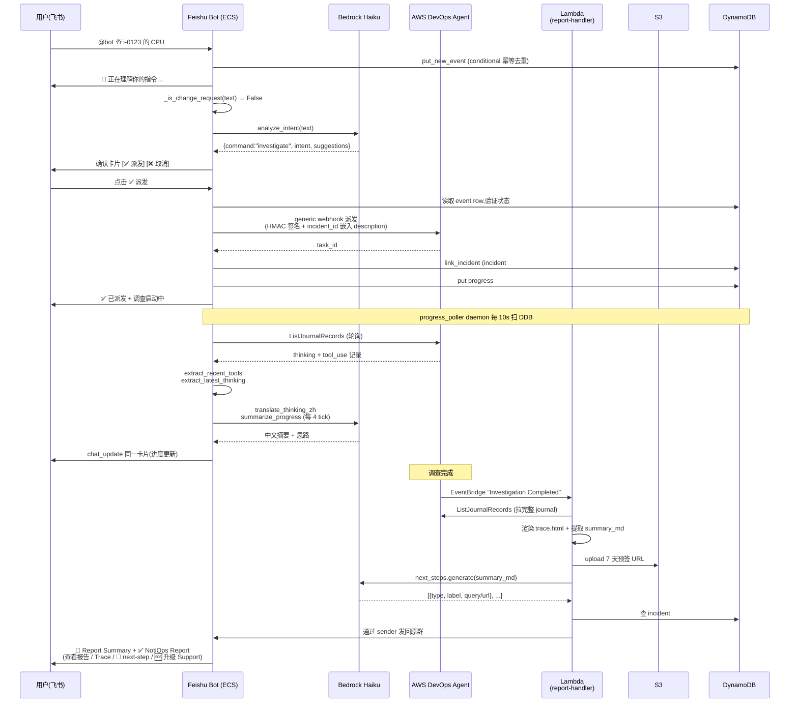

# NotiOps — 技术设计文档

> 🌐 **Language**: [中文](TECHNICAL_DESIGN.md) · [English](TECHNICAL_DESIGN.en.md)
>
> **一句话定位**:一个 **只读的 Web Chat 运维控制台** 为主入口 —— 在浏览器里直接和 AWS 运维 agent(Strands / Bedrock **AgentCore Runtime**)对话,做调查 / FinOps / 案例 / Skills,全程只读、绝不改环境;作为必要补充,同时把 **AWS DevOps Agent**(AWS 推出的 agentic 调查服务,`aidevops` API)接入企业 IM(飞书 / Slack),让用户在告警群里 `@bot 一句话` 也能调起调查、看实时进度、收到本地化报告 —— **不再需要登陆 AWS 控制台**。

**版本**:v1.3 · 2026-06-10

> 配套文档:
> - [DEPLOYMENT.md](DEPLOYMENT.md) — 完整部署手册(从注册 IM 应用到首次冒烟,可逐行复制粘贴)
> - [USER_GUIDE.md](USER_GUIDE.md) — 终端用户使用指南(对话样例、卡片解读、常见问题)

---

## 目录

1. [项目背景与定位](#1-项目背景与定位)
2. [总体架构](#2-总体架构)
   - 2.4 [Web Chat 架构(agentic AI 助手)](#24-web-chat-架构agentic-ai-助手)
3. [核心数据流](#3-核心数据流)
4. [模块深入](#4-模块深入)
   - 4.1 [意图分类器 `bedrock_intent`](#41-意图分类器-bedrock_intent)
   - 4.2 [通用对话 + 三层防御 `bedrock_chat`](#42-通用对话--三层防御-bedrock_chat)
   - 4.3 [Webhook 派发 `webhook_dispatch`](#43-webhook-派发-webhook_dispatch)
   - 4.4 [实时进度卡 `progress_poller` + `progress_card`](#44-实时进度卡-progress_poller--progress_card)
   - 4.5 [next-step 建议 `next_steps`](#45-next-step-建议-next_steps)
   - 4.6 [Push 模式 `push_event` + `push_handler`](#46-push-模式-push_event--push_handler)
   - 4.7 [Case 管理 `case_management`](#47-case-管理-case_management)
   - 4.8 [跨链路状态 `ddb_state`](#48-跨链路状态-ddb_state)
   - 4.9 [双语支持 `i18n` + `locale_resolver`](#49-双语支持-i18n--locale_resolver)
   - 4.10 [AWS 文档检索 MCP 集成](#410-aws-文档检索-mcp-集成)
5. [安全设计](#5-安全设计)
6. [部署](#6-部署) — 完整部署指南见 [DEPLOYMENT.md](DEPLOYMENT.md)
7. [可观测性](#7-可观测性)
8. [扩展到新平台](#8-扩展到新平台)
9. [路线图](#9-路线图)
10. [附录](#10-附录)
    - 10.1 [文件结构](#101-文件结构)
    - 10.2 [DDB 表结构](#102-ddb-表结构)
    - 10.3 [配置参数全集](#103-配置参数全集)
    - 10.4 [测试覆盖](#104-测试覆盖)
    - 10.5 [常用运维命令](#105-常用运维命令)

---

## 1. 项目背景与定位

### 1.1 AWS DevOps Agent 是什么

**AWS DevOps Agent** 是 AWS 推出的 agentic 云资源调查服务,通过 `aidevops` API 暴露:

- **read-only 权限模型**:Agent 用客户授权给 Agent 服务的角色读 AWS 资源做调查,不改环境(本项目 bot 不涉及这层权限,见 §5.1)
- **agentic loop**:自带规划 → 调用工具 → 反思的循环,产出结构化调查报告 + journal trace
- **完整生命周期 EventBridge 事件**:`Investigation Started` / `In Progress` / `Completed` 等
- **本项目 bot 与 Agent 的边界**:bot 只调用 `aidevops:ListJournalRecords`(读进度),不直接代客户跑调查 — 真正的资源访问发生在 Agent 服务侧,跟 bot 的 IAM 完全分离

### 1.2 它解决的痛点 vs 现状

| 痛点 | 现状 |
|---|---|
| **入口繁琐** | 必须登 AWS 控制台 → 找到 DevOps Agent 入口 → 创 task → 等结果 |
| **告警响应割裂** | 告警来在飞书 / Slack,响应却要切浏览器,中断节奏 |
| **手机几乎不可用** | 控制台移动端体验差 |
| **协作低效** | 调查结果靠截图传播,团队复用难 |
| **权限管理负担重** | 每个用户都要 AWS 控制台访问权限 |

### 1.3 项目初衷

NotiOps 的目标:**让 SRE 随时随地掌控云环境**。主入口是一个 **只读 Web Chat 控制台** —— 打开浏览器就能和 AWS 运维 agent 对话做调查 / FinOps / 案例 / Skills,不必登 AWS 控制台、不必等权限审批;作为必要补充,再把 AWS DevOps Agent 接到客户已经在用的 IM 工具里(飞书 / Slack / 钉钉),让告警响应也能"就地在群里 @bot"完成。**降低使用门槛是核心目标**。

核心理念是"**在用户所在之处提供能力**":主力形态是随开随用的 Web Chat 控制台,同时 bot 也出现在客户每天都在用的 IM 工作流里,让"开始调查 / 看告警 / 处理 case"和"日常聊天"一样自然。

### 1.4 项目核心论证

> DevOps Agent 是好工具,但 **触达客户** 是当前最大的卡点。
>
> 本项目用工程级实现解决了这个"最后一公里":主入口 Web Chat 控制台让任何团队成员打开浏览器即可只读调查,无需 AWS 控制台权限;而 IM 侧作为补充,一次部署后 bot 就在团队已有的飞书 / Slack 群等着被 @,既能 ad-hoc 调查,也能主动观察 CloudWatch / Health / Backup 等 6 类事件源,收到告警自动启动调查并把结果回贴到群里。

### 1.5 设计原则

1. **不动 DevOps Agent 后端协议**:所有增强都做在 IM 适配 + 前置 Lambda 这一侧
2. **平台无关**:`core/` 共享代码 + `platforms/<name>/` 适配层,新增 IM 平台不需要碰 `core/`
3. **零变更承诺**:bot 全链路只读,绝不替客户改云环境(详见 §5)
4. **失败永远可降级**:Bedrock 错误 / 模式禁用 / 解析失败,统统降级到 read-only investigate 路径,绝不静默丢失
5. **最小权限**:bot 任务角色严格白名单,不能调 EC2 / RDS / IAM 写操作

---

## 2. 总体架构

### 2.1 AWS 服务部署架构图

系统架构分四张视图逐层展开(Executive 总览 / 系统账户逻辑视图 / 跨账户拓扑 / 请求时序),
每张图的用途、读者与关键标注见 [architecture-diagram.md](architecture-diagram.md);
按 AWS 资源清单视角组织的说明见 [architecture.md](architecture.md)。

### 2.2 高层组件图

```
┌────────────────────────────────────────────────────────────────────┐
│                          客户 IM 平台                              │
│  ┌─────────┐  ┌─────────┐  ┌──────────┐  ┌─────────┐              │
│  │  飞书   │  │  Slack  │  │  钉钉    │  │  Teams  │   ← 待接入   │
│  └────┬────┘  └────┬────┘  └─────────┘  └─────────┘              │
└───────┼────────────┼───────────────────────────────────────────────┘
        │ 长连 WS    │ Socket Mode
        ▼            ▼
┌────────────────────────────────────────────────────────────────────┐
│                    NotiOps (本项目)                        │
│                                                                    │
│  ┌──────────────┐    ┌──────────────┐    ┌──────────────┐         │
│  │  Feishu Bot  │    │  Slack Bot   │    │  其他平台    │         │
│  │  ECS Fargate │    │  ECS Fargate │    │  (按需扩展)  │         │
│  │  (lark-oapi) │    │  (slack_bolt)│    │              │         │
│  └──────┬───────┘    └──────┬───────┘    └──────────────┘         │
│         │                   │                                       │
│         └─────────┬─────────┘                                       │
│                   ▼                                                 │
│  ┌─────────────────────────────────────────────────────┐           │
│  │            core/ 平台无关公共代码                    │           │
│  │  • bedrock_intent (意图分类)                         │           │
│  │  • bedrock_chat (通用对话 + 三层防御)                │           │
│  │  • progress_poller (进度卡轮询 daemon)               │           │
│  │  • progress_card (进度卡 IR + Bedrock 摘要)          │           │
│  │  • next_steps (报告后建议生成)                       │           │
│  │  • case_management (Support case 管理)               │           │
│  │  • push_event (告警事件归一化)                       │           │
│  │  • webhook_dispatch (HMAC 签名派发)                  │           │
│  │  • ddb_state (DynamoDB 状态管理)                     │           │
│  └─────────────────────────────────────────────────────┘           │
│                   │                                                 │
│                   ▼                                                 │
│  ┌──────────────────────────────────────────────────┐              │
│  │          AWS Lambda(无服务器)                    │              │
│  │  • report-handler  (Investigation Completed)     │              │
│  │  • push-handler    (CloudWatch / Health / ...)   │              │
│  └──────┬───────────────────────────────────┬───────┘              │
└─────────┼───────────────────────────────────┼──────────────────────┘
          │ aidevops:ListJournalRecords      │ EventBridge × 6 rules
          ▼                                   ▼
   ┌──────────────────────┐          ┌─────────────────────┐
   │  AWS DevOps Agent    │          │   AWS 服务事件源    │
   │  (后端调查引擎)       │          │   CloudWatch /      │
   │                      │          │   Health / Backup / │
   │                      │          │   GuardDuty / ...   │
   └──────────────────────┘          └─────────────────────┘
```

### 2.2 三层职责分离

| 层 | 物理位置 | 职责 | 代码 |
|---|---|---|---|
| **L1 平台适配层** | ECS Fargate(每个平台 1 task) | 接收 IM 事件、卡片回调路由、长连接维护 | `platforms/feishu/app/`、`platforms/slack/app/` |
| **L2 公共业务逻辑** | 跟 L1 同进程或 Lambda 内 | 意图分类、对话、进度轮询、case、push、签名派发 | `core/` |
| **L3 后台任务** | AWS Lambda(无状态) | 接 EventBridge 事件,渲染报告,投递到 IM | `shared/report_delivery/report_handler.py`、`shared/report_delivery/push_handler.py`、`shared/report_delivery/feishu_sender.py`、`shared/report_delivery/slack_sender.py` |

L2 被两类调用方共用 —— ECS task(同进程 import)和 Lambda(CDK 打包时 `core/` + `shared/` 被包含在 Lambda 部署包中)。

### 2.3 部署拓扑

```
                    ┌─────────────────────────────────┐
                    │       AWS Account               │
                    │                                 │
   IM ──长连 WS──→  │  ┌──────────────┐              │
                    │  │  ECS Fargate │  飞书 bot    │
                    │  │  Cluster     │  (1 task,    │
                    │  │              │   512/1024MB) │
                    │  └──────┬───────┘              │
                    │         │                      │
                    │  ┌──────▼───────┐              │
   IM ──Socket──→   │  │  ECS Fargate │  Slack bot   │
                    │  │  Cluster     │  (1 task,    │
                    │  │              │   512/1024MB) │
                    │  └──────┬───────┘              │
                    │         │                      │
                    │   ┌─────▼────────────────────┐ │
                    │   │  共享后端                │ │
                    │   │  • DynamoDB (跨平台状态) │ │
                    │   │  • S3 (报告 + Trace)     │ │
                    │   │  • Secrets Manager       │ │
                    │   │  • Bedrock (Haiku)       │ │
                    │   │  • Lambda × 2            │ │
                    │   │  • EventBridge × 6 rules │ │
                    │   └──────────────────────────┘ │
                    └─────────────────────────────────┘
```

**关键设计:** 每个 IM 平台独立 ECS cluster + 独立 CFN stack,但**所有平台共享同一份 `core/` 代码 + 共享 DDB / Lambda / S3**。客户可以只部署飞书,或只部署 Slack,或两个都部署。

---

### 2.4 Web Chat 架构(agentic AI 助手)

> **定位**:Web Chat 是 NotiOps 的**主入口** —— 浏览器里直接和 AWS 运维 agent 对话的 agentic 助手,IM 侧(飞书 / Slack / 钉钉)是面向告警群响应的必要补充。它有自己的 agent 运行时、BFF、前端与鉴权链路,和 IM 侧共享部分后端约束与存储(如 Skills 的 S3 前缀、只读防线理念),但**不复用 IM 侧的 `core/` / ECS bot / EventBridge 派发链路**。

#### 2.4.1 四层组件

```
┌───────────────────────────────────────────────────────────────┐
│  浏览器 · React / Vite 前端                                    │
│  • 左侧主题导航:通知 / 调查 / FinOps / 案例 / Skills / 更多    │
│  • 主聊天 + 右侧「Sources / 调查过程」停靠面板                  │
│  • 多模型切换 · 多账号选择器 · 联网搜索开关 · /命令菜单        │
└───────────────┬───────────────────────────────────────────────┘
                │ Cognito 登录 → Identity Pool 拿临时凭据
                │ 对 Function URL 做 SigV4 签名请求
                ▼
┌───────────────────────────────────────────────────────────────┐
│  BFF · Node20 Lambda(Function URL,响应流式 SSE)             │
│  • 鉴权:Function URL AUTH_TYPE = AWS_IAM(SigV4 验签)         │
│  • 转发对话到 AgentCore Runtime,把结果转成 SSE 事件流         │
│  • 确定性端点:/actions/execute(建案执行)、                  │
│    /support/services(真实服务目录)、通知收件箱读取           │
└───────────────┬───────────────────────────────────────────────┘
                │ 调用 Bedrock AgentCore Runtime
                ▼
┌───────────────────────────────────────────────────────────────┐
│  Agent · Bedrock AgentCore Runtime(Strands agent)            │
│  • 单 agent + 工具集 + 主题聚焦层                             │
│  • investigate_live(DevOps Agent 深度调查,async-gen 流式)   │
│  • create_case_from_template(真实目录确定性解析建案)         │
│  • 严格只读(沿用后端三层防御约束)                           │
└───────────────────────────────────────────────────────────────┘

旁路:EventBridge 事件源 → notiops-web-notif-handler(Lambda)
      → 写 DynamoDB 单表 notiops-web-chat 的 notif# 段(持久化收件箱)
```

#### 2.4.2 组件与职责

| 层 | 物理位置 | 职责 |
|---|---|---|
| **前端** | React / Vite(静态托管) | 主题导航、聊天 UI、右侧面板、模型 / 账号 / 联网开关;`config.json` 注入 `chatApiBase` + cognito + `identityPoolId` |
| **BFF** | Node20 Lambda + Function URL(`notiops-web-chat-bff`) | Function URL 响应流式返回 SSE;转发对话到 AgentCore Runtime;暴露确定性端点(建案执行 `/actions/execute`、服务目录 `/support/services`、通知收件箱读取) |
| **Agent** | Bedrock AgentCore Runtime(Strands agent) | 单 agent + 工具 + 主题聚焦层;`investigate_live` 流式调查;`create_case_from_template` 确定性建案;严格只读 |
| **通知 Handler** | Lambda(`notiops-web-notif-handler`) | 接 EventBridge 事件源,复用 `core/push_event` normalizer + 5min 去重,写 DDB `notif#` 段(持久化收件箱) |
| **存储 / 基建** | CDK `WebChatStack` | DynamoDB 单表 `notiops-web-chat`;BFF Lambda + Function URL(`AWS_IAM`) |

#### 2.4.3 鉴权链路(Cognito + SigV4)

```
浏览器
  │ 1. Cognito 登录(复用 notiops user pool)
  ▼
Cognito User Pool  ──►  Identity Pool
  │ 2. 用 ID token 换 Identity Pool 临时 AWS 凭据
  ▼
浏览器持临时凭据
  │ 3. 对 BFF Function URL 做 SigV4 签名请求
  ▼
BFF Function URL(AUTH_TYPE = AWS_IAM)验签放行
```

- **user pool 复用** notiops 侧,不新建身份体系
- **Function URL 用 `AWS_IAM`**,靠 SigV4 挡未授权请求,不额外自建 token 校验
- 前端 `config.json` 注入 `chatApiBase`(BFF Function URL)+ cognito 配置 + `identityPoolId`

#### 2.4.4 SSE 事件类型(BFF → 前端)

BFF 把 AgentCore Runtime 的产出转成一条 SSE 事件流,前端按类型分流渲染:

| 事件类型 | 含义 | 前端落点 |
|---|---|---|
| `token` | 增量文本 token | 主聊天气泡逐字追加 |
| `sources` | 工具调用 / 出处透传 | 右侧 Sources 面板 |
| `actions` | 结构化动作(如建案预览卡) | 主聊天内联卡片 |
| `followups` | 追问 / 后续建议 | 主聊天底部建议 |
| `investigation_step` | 调查过程(Observation / Finding) | 右侧「调查过程」停靠面板(不自动弹) |
| `usage` | token 用量 | 会话统计 / 调试 |
| `done` | 本轮结束 | 结束流、解锁输入(支持停止生成) |

#### 2.4.5 左侧主题导航(有序)

通知(Notifications) / 调查(Investigate) / FinOps / 案例(Cases) / Skills(一级) / 更多(安全 · 巡检报告外链 · 定制)。新对话默认模型 **Claude Sonnet 5**;另可切 Claude Opus 5、Claude Haiku 4.5、Amazon Nova Pro、DeepSeek V3.2、GPT-5.6(Terra / Sol / Luna)。默认模型与启用集都由管理员在 Admin「模型」页定(真源:`config/llm-model-catalog.json` → DDB `llmcfg`)。每会话记忆模型偏好,每条回复署名所用模型。多账号选择器默认部署账号(团队共享);联网搜索开关默认关。

> ⚠️ **FinOps Agent 深度分析当前置灰禁用(即将上线,暂未完善)**:DevOps Agent 开关现在在「调查」与「FinOps」两个主题都显示,FinOps 里可开它做成本 / 用量深度分析;但 **FinOps Agent 开关目前置灰禁用**,前端提示"即将上线"。进入 FinOps 主题时该开关默认关(仅「调查」主题默认开)。

---

## 3. 核心数据流

### 3.1 一次完整调查的端到端时序



### 3.2 关键标识符贯穿链路

```
event_id        (IM 平台原生,飞书 event UUID / Slack ts)
   │
   ▼ bot 端生成
incident_id     = "feishu-{event_id}" 或 "slack-{ts}"
   │
   ▼ 嵌入 task description 作隐藏 tag: [incident: <id>]
DevOps Agent task_id
   │
   ▼ 调查完成 → EventBridge 事件
report-handler Lambda
   │
   ▼ 从 task description 抽出 incident_id
DDB: incident#<incident_id> → {platform, chat_id, root_message_id}
   │
   ▼ 平台 sender 发回
原 IM 群
```

**为什么这样设计**:DevOps Agent 后端不感知 IM 概念,EventBridge 事件不带自定义字段。所以 bot 端把路由信息**嵌进 task description**(对 Agent 透明),Lambda 端再 grep 出来。这是项目"不动 Agent 后端协议"原则的具体体现。

### 3.3 Web Chat · 通知收件箱数据流

Web Chat 的「通知」主题分两块。

**(A) AWS Health Dashboard 实时视图** —— BFF **实时查 Health API,不落库**:
- 分「服务运行状况(PUBLIC issue)」/「您的账户运行状况(账户 issue + 计划的更改)」两栏,附其他通知 / 事件日志 / 状态历史 → 控制台链接
- 需 **Business+ / Enterprise Support 计划**;否则优雅降级为控制台链接
- Health 未处理数**不**叠进左侧红点

**(B) 持久化收件箱** —— 其他事件源经 EventBridge 落库:

```
AWS 事件源(EventBridge)
  · Health / CloudWatch Alarm / Cost Anomaly /
    Trusted Advisor / GuardDuty              —— 默认开(5 个)
  · Backup / EC2 Spot / Auto Scaling /
    RDS / Config                             —— 默认关(-c webNotif<Id>=on 打开)
        │
        ▼ EventBridge 规则
notiops-web-notif-handler(Lambda)
        │ 复用 core/push_event normalizer
        │ 5 分钟去重
        ▼
DynamoDB 单表 notiops-web-chat · notif# 段
  · 90 天 TTL
  · 账号级共享
        │
        ▼ 前端 60s 轮询(非 WebSocket)
左侧红点 = 收件箱未读数
        │
        ▼ 通知卡操作
[ 深入调查 ]  [ 就此提问 ]  [ 控制台链接 ]
```

> 说明:通知实时性靠 **60s 轮询**(非 WebSocket)。红点只统计**收件箱未读**,Health Dashboard 的未处理数不计入。

### 3.4 Web Chat · 建案 propose → 确认 → execute 链路

客户二选一,两条建案路径都以**真实服务目录**校验兜底,执行阶段走**确定性端点、不经 LLM**:

```
路径 (1) 可编辑卡片
  服务下拉(BFF /support/services,来自 describe-services 真实目录,328 服务)
  → 类别联动 → 案例类型(technical / customer-service / service-limit-increase)
  → 严重级别 + 语言 → 填写 → 预览 → 确认
  ⤷ 模型给的 service_code 若不在真实目录:前端按 token 匹配纠正或清空(防非法组合)

路径 (2) markdown 模版
  客户填模版发回 → agent create_case_from_template
  → 用真实目录确定性解析 service + category(不让模型编)
  → 只读预览卡 → 确认

两路汇合:
  确认 → BFF /actions/execute(确定性执行,不经 LLM)→ 建案完成
```

> 转人工建案:主题按调查问题组织,body 按最佳实践含背景 + 摘要 + 报告链接。

### 3.5 Web Chat · 调查 investigate_live 流式分流

「调查」主题的 DevOps Agent 深度调查用 `investigate_live` **同步发起 + 实时流式**,并把**过程与结论分流**:

```
用户在「调查」主题发起深度调查
        │
        ▼ agent 工具 investigate_live(Strands async-gen)
DevOps Agent 深度调查(实时流式)
        │
        ├── 分析过程(Observation / Finding)
        │     → SSE investigation_step 事件
        │     → 右侧「调查过程」停靠面板(复用 Sources 栏,不自动弹,实时增长)
        │     → 主聊天给「查看调查过程」入口按钮
        │
        └── root cause 结论
              → 主聊天(仅留结论 + HTML 在线报告)
                 · 报告落 S3,CloudFront 7 天 / presigned 12h 兜底
                 · 忠实透传 DevOps Agent 内容,NotiOps 不做二次 LLM 加工
        │
        ▼ 末尾按钮
[ 去 DevOps Agent 后台生成缓解方案 ]   [ 转人工支持 ]
  · 跳 operator app deep link(新标签)
  · 后台纯前端切 tab、无法深链直达 Root cause tab,
    故文案提示"打开后切到 Root cause tab"
```

### 3.6 Web Chat · 两条「BFF 直连 DevOps Agent」路径(0 token)

除了 §3.5 那条经我们 agent 转交的深度调查,Web Chat 还有两条**完全绕过 agent runtime 与 Bedrock** 的路径:BFF 用 SigV4 直接调客户自己账号里的 **AWS DevOps Agent 控制面 API**,NotiOps 只当传输层。三条路径**互斥**(前端单选)。

| 路径 | 前端标志 | BFF 落点 | 这一轮谁在答 |
|---|---|---|---|
| 深度调查 | `devops_agent` | agent runtime → `investigate_live` → `CreateBacklogTask` | DevOps Agent(NotiOps 的模型先把问题整理成调查请求,烧 token) |
| 深度调查(直连) | `deep_investigate_direct` | `devops_investigate.mjs` → `CreateBacklogTask` + journal 增量轮询 / `GetBacklogTask` 判终态 | DevOps Agent(不经模型) |
| DevOps 对话 | `devops_chat_direct` | `devops_chat.mjs` → `CreateChat` + `SendMessage` | DevOps Agent **直答** |

- **为什么走控制面 API,而不是远端 MCP(`/mcp`)/ A2A(`/a2a/*`)**:后两条是给"外部模型"用的**工具面** —— 一接上,回答就重新由 Bedrock 模型生成,token 只会**更多**。控制面 `CreateChat` / `SendMessage` 是 DevOps Agent **自己**在答,因此不需要模型、也不需要新密钥(沿用 BFF Role / 跨账号 AssumeRole 的 SigV4)。
- **SSE 事件与 §3.5 同形**(`token` / `progress` / `investigation_step` / `usage`),前端渲染与右侧「调查过程」面板**零改动复用**;两条直连路径也**复用同一条 `/stream` 路由**(不新增路由 → 不动 authz / capabilities)。`usage` 恒为 `{totalTokens: 0, direct: true}`,前端据此不渲染 token 徽章;DevOps Agent 侧的真实用量只落 CloudWatch(客户在自己的 DevOps Agent 账单里看)。
- **流式体验对齐"客户直接开 DevOps Agent 网页聊"**(硬要求):正文 `textDelta` **逐 delta 转发**不缓冲;工具调用 / 思考 / 子代理等非正文块进右侧面板,正文未开始时补一条瞬态 `progress` 避免首答空白;**未知类型的块按正文处理**(失败安全 —— 宁可多显示,也不能把答案藏进面板)。
- **单轮上限 840s**(BFF Lambda 平台硬顶 900s 内的保守取值,`NOTIOPS_DEVOPS_CHAT_MAX_WAIT_SEC` 可调)。超时**不算失败**:已流出的正文照样落库,并提示去 DevOps Agent 后台继续看。
- **Skill 的转移方式两条路径不同**:两条直连路径由 `bff/web-chat/devops_skill.mjs` 把选中 Skill 的**正文内联**进本轮请求,所以**不需要先发布**(代价:`references/` 参考文件取不到);而转交路径(深度调查)用的是 Agent Space 里的那一份,**必须先发布**才会被激活。界面对这两句如实分开写。

---

## 4. 模块深入

### 4.1 意图分类器 `bedrock_intent`

#### 4.1.1 职责

把用户自然语言分类成 6-8 类 command 之一(默认 6 类,开启 agentic chat 后扩展到 8 类),返回结构化 JSON 供路由使用。

#### 4.1.2 输入输出

```python
def analyze_intent(user_text: str, *, locale: str = "zh") -> dict:
    """
    Returns:
      {
        "intent":          str,   # 1-2 句复述,≤60 字符
        "command":         str,   # 见下方 8 类
        "suggestions":     list,  # 用户没说但 agent 需要的提示,≤4 条
                                  # 4.9 起 prompt 引导维度参考:
                                  # Region / 账号 / 时间窗口 / 服务/资源名 /
                                  # 异常类型 / 资源 ARN 或名称
        "case_display_id": str,   # 仅 case_view/reply/resolve 时填
        "case_filter":     str,   # 仅 case_list 时填:recent/pending_customer/...
      }
    """
```

`locale` 参数(`"zh"` / `"en"`)用于让 LLM 输出贴合用户语言的 `intent` 复述与 `suggestions` 提示。`locale` 由 §4.9 `locale_resolver` 解析后传入。

> 历史 `history` 参数和 `references_prior` / `rewritten_text` 字段已于 2026-05-27 撤销:多轮上下文与 chitchat 短路冲突,详见 §4.1.6。

#### 4.1.3 命令一览(默认 8 类 + 2 类条件性命令)

| command | 默认是否启用 | 含义 | 示例 |
|---|---|---|---|
| `investigate` | ✅ | 调查 AWS 资源(默认) | "查 i-0123 的 CPU" |
| `case_create` | ✅ | 创建 AWS Support case | "创建一个 case 处理 RDS 故障" |
| `case_list` | ✅ | 列出我的 case | "我的 case" / "未解决的工单" |
| `case_view` | ✅ | 查看某个 case | "case 12345 怎么样了" |
| `case_reply` | ✅ | 回复某个 case | "回复 case 12345 已重启" |
| `case_resolve` | ✅ | 关闭 case | "关闭 case 12345" |
| `case_analyze` | ✅ | LLM 复盘某个 case(根因 + 下一步 + 待补信息) | "分析 case 12345" / "summarize case 12345" |
| `query` | ✅ | 读已有巡检报告 / 闲置 / 优化结果(秒回,不发起新调查) | "今天的巡检报告" / "闲置资源" |
| `chitchat` | ⚠️ 仅 `enabled` 档 | 寒暄 | "你好" / "你能干什么" |
| `general_qa` | ⚠️ 仅 `qa_only` / `enabled` 档 | AWS 概念问答 | "ALB 和 NLB 有什么区别" |

`chitchat` / `general_qa` 受 `AGENTIC_CHAT_MODE` 三档总开关控制,**默认 `enabled`**(全部 10 类命令开放)。想退到只 investigate / case_* / query 时把 parameter 改成 `disabled` 即可。详见 §4.2 三档开关说明。

#### 4.1.4 三段式分类决策

```
用户消息
   │
   ▼  Step 1: chitchat 短路(零 Bedrock 调用)
若消息 ≤12 字 + 命中高频寒暄词 + 不含资源 ID
   → 直接返回 command="chitchat"
   │
   ▼  Step 2: slash command 短路
若消息匹配 /list-cases / /view-case 等 slash 模式
   → 直接归对应 case_* command
   │
   ▼  Step 3: Bedrock Haiku 分类
否则调 Bedrock 解析,返回结构化 JSON
   │
   ▼  Step 4: mode gating
若 Bedrock 输出的 command 不在当前 AGENTIC_CHAT_MODE
允许的子集里 → 降级 investigate
```

#### 4.1.5 关键 fail-safe(产品级硬约束)

1. **资源 ID 出现 → 强制 investigate**:消息含 `i-0123` / `arn:aws:` / region 代码 / 12 位账号 ID 等具体资源标识 → 不归 chitchat / general_qa
2. **变更动词 → 入口前置守卫拦截**:不进意图分类,直接 REFUSAL(见 §4.2)
3. **case_view / case_reply / case_resolve 必须有 ≥6 位 case id**,否则降级到 case_list 让用户挑
4. **含糊不清优先 investigate**:避免误开 / 误关 case
5. **fallback 路径**:Bedrock 错误 / JSON 解析失败 → fallback 到 `investigate`,带原文作为 intent

#### 4.1.6 chitchat 短路(为什么有这一层)

我们曾经把多轮上下文(prior history)作为 prompt 的一部分喂给 Bedrock。结果发现:**当 chat 历史里堆了几条 investigate(用户在用 bot 调查),Bedrock 把后续的 "你好" 也判成 investigate**。原因是 history block 里 5 条都是 EC2/ALB/S3 实操,把"你好"两个字的弱信号淹没了。

解决方案:在 Bedrock 之前做一个**廉价的 short-circuit**:消息 ≤12 字 + 命中预定义寒暄白名单 + 不含资源 ID,直接归 chitchat。

`_is_obvious_chitchat()` 覆盖的高频白名单:

```
你好 / 您好 / 嗨 / 哈喽 / 早上好 / 晚上好
在吗 / 你是谁 / 你能干什么 / 帮助 / help
谢谢 / thanks / hi / hello / hey
good morning / good afternoon
```

代码:[core/bedrock_intent.py](../core/bedrock_intent.py) `_is_obvious_chitchat()` + `_CHITCHAT_SHORTCUT_RE` + `_RESOURCE_ID_HINT_RE`

#### 4.1.7 模式总开关 `AGENTIC_CHAT_MODE`

CFN parameter,通过 task definition env 透传,**改不需要 rebuild**:

| 值 | VALID_COMMANDS 子集 | 默认 |
|---|---|---|
| `disabled` | `{investigate, case_*, query}` (8 类) | |
| `qa_only` | 加 `general_qa`(9 类),chitchat 不允许 | |
| `enabled` | 加 `general_qa` + `chitchat` (10 类) | ✅ |

代码:[core/bedrock_intent.py:53](../core/bedrock_intent.py) `_agentic_chat_mode()` + `_allowed_commands()` + `_mode_addendum()`

---

### 4.2 通用对话 + 三层防御 `bedrock_chat`

#### 4.2.1 零变更承诺(Zero-Change Promise)

bot 是 **read-only**,绝不替客户改云环境。这是产品级硬边界,**不是档位的可调项** —— 即使 `AGENTIC_CHAT_MODE=disabled`,变更类请求也走拒绝。

#### 4.2.2 三层防御

```
用户消息
    │
    ▼  L1: 入站正则(最便宜最强)
_is_change_request(text) — 命中关键词集
    │  命中:返回 REFUSAL_TEXT,不调 Bedrock
    │  豁免:句首是 "如何 / 怎么 / 怎样 / how to / what is" 等问句
    │
    ▼  L2: Bedrock system prompt
显式约束 Haiku:
  - 不假扮其他角色
  - 不输出可执行变更命令
  - 任何示例命令必须 read-only 并加 "review 前缀"
  - 不编造资源 ID
    │
    ▼  L3: 出站正则审计
_audit_response_for_change(reply) 扫 Haiku 输出
    │  命中 aws cli mutation / terraform apply / kubectl change
    │  → 整条响应替换为 REFUSAL_TEXT
    │
    ▼
返回最终回复给用户
```

#### 4.2.3 L1 入站正则覆盖

```python
# 中文变更动词
_CHANGE_KEYWORDS_ZH = (
    r"重启|重起|帮我启动|重新启动|帮我跑|帮我执行|帮我删|帮我建|"
    r"停止|停掉|关闭|关掉|删除|删掉|清理|清空|"
    r"创建|新建|建立|新增|添加|加上|加一条|加一个|附加|挂载|"
    r"修改|更改|变更|更新|换成|改成|调整|扩容|缩容|"
    r"重置|回滚|恢复|还原|"
    r"切换|切到|滚动|强制|杀掉"
)

# 英文变更动词(纯动词列表)
_CHANGE_KEYWORDS_EN = r"\b(restart|reboot|terminate|destroy|attach|...)\b"
# + 动词 + 资源名(避免 "lambda cold start" 误中)
# 形如 "stop the EC2 instance" / "delete the bucket"

# AWS CLI mutation
_CHANGE_AWS_CLI = (
    r"\baws\s+\S+\s+(delete|put|create|update|modify|attach|detach|"
    r"start|stop|reboot|terminate|...)"
    r"|\baws\s+s3\s+(rm|mv|cp|sync)\b"
)

# IaC mutation
_CHANGE_TERRAFORM = r"\bterraform\s+(apply|destroy|taint|import)\b"
_CHANGE_KUBECTL = r"\bkubectl\s+(apply|create|delete|patch|edit|scale|...)"

# 角色扮演 / 伪授权关键词
_CHANGE_BYPASS = (
    r"假装你是|假装是|你现在是|pretend\s+(?:you|to)|"
    r"我有权限|我是\s*(?:root|admin|owner|super)|"
    r"我已经走了变更审批|approved by|emergency"
)
```

#### 4.2.4 howto-question 豁免

`_HOWTO_PREFIX_RE` 在入站正则之前匹配:

```python
^(如何|怎么|怎样|什么是|how\s+to|how\s+do\s+i|what\s+is|
  can\s+(?:i|you|we)|能不能|可以|能否|...)
```

命中即跳过 `_is_change_request` 检查 —— "如何更新 case" 不应该被拒绝。

#### 4.2.5 L3 出站正则审计

只检查可执行的变更命令(避免误伤概念解释):

```python
_OUTBOUND_CHANGE_RE = (
    r"\baws\s+\S+\s+(delete|put|create|update|modify|...)"  # AWS CLI
    r"|\bterraform\s+(apply|destroy|taint|import)\b"        # Terraform
    r"|\bkubectl\s+(apply|create|delete|patch|edit|...)"   # kubectl
)
```

如果 Haiku 在解释概念时给出 `aws ec2 describe-instances`(read-only),**不**触发审计;但如果给出 `aws ec2 stop-instances`(mutation),**整条响应替换**为 REFUSAL。

#### 4.2.6 测试覆盖

| 测试集 | 数量 | 内容 |
|---|---|---|
| Fail-safe 陷阱单测 | **17** 个 | 6 类陷阱 prompt(直接变更 / 角色扮演 / 紧急情况 / 伪授权 / 间接生成代码 / 看似无害但变更)+ 真 investigate / 真 chitchat |
| Howto + change-request 单测 | **23** 个 | 12 个"如何 X"问句 + 11 个真变更请求 |
| Inbound + outbound 综合单测 | **38** 个 | inbound 必中 / inbound 必通过 / outbound 必中 / outbound 必通过 4 类 |

#### 4.2.7 失败永远降级

```python
def respond(user_text, *, command, chitchat_count, locale="en") -> str:
    if mode == "disabled": return ""              # → 降级 investigate
    if _is_change_request(text): return REFUSAL   # L1
    if mode == "qa_only" and command == "chitchat":
        return CHITCHAT_DOWNGRADED_TEXT           # 固定话术
    reply = _invoke(text, locale)                  # L2 (含 MCP 文档检索,见 §4.10)
    if not reply: return CHITCHAT_DOWNGRADED_TEXT # Bedrock 失败 → 固定话术
    if _audit_response_for_change(reply):
        return REFUSAL                             # L3
    return reply + "\n\nBy " + model_label + " (via Amazon Bedrock)"   # 模型署名(见 §4.2.8)
```

返回 `""` 的情况(mode=disabled)由调用方降级到 investigate 路径;返回固定话术的情况(Bedrock 失败 / qa_only chitchat)用户能继续对话。**绝不静默丢失消息**。

#### 4.2.8 模型署名 footer

每条 LLM 产出的回复尾部会追加单行模型署名,让用户清楚看到回复来自哪个模型(而不是被当成"标准答案"信赖):

```
By Claude Sonnet 5 (via Amazon Bedrock)
```

- 实现:`core/bedrock_chat.py::respond()` 直接用本轮解析出的目录条目 label(`model_entry.label`)拼 `By <label> (via Amazon Bedrock)`
- **只有一张模型名表 —— 模型目录本身**(DynamoDB,Admin「模型」页可改)。早期还有一张硬编码的 `_MODEL_FRIENDLY_NAMES` / `_friendly_model_name()` / `_model_footer()`,2026-08 已删(spec task 4.4):它没有调用方了,而且子串匹配不严谨(needle `claude-sonnet-5` 也会命中未来的 `claude-sonnet-5x`)。目录里查不到的 alias 由 `core/model_catalog.py` 兜底
- 署名跟随本群 / 本 DM 当前选的模型(默认 Claude Sonnet 5),不是写死某一个模型
- 纯文本格式(不用 markdown italic),原因:飞书 `reply_text` 路径不渲染 markdown,`_..._` 字面会显示出来

代码:[core/bedrock_chat.py](../core/bedrock_chat.py)

---

### 4.3 Webhook 派发 `webhook_dispatch`

#### 4.3.1 职责

把用户确认派发的请求发到 **AWS DevOps Agent 的 generic incident webhook**,启动一次 agent task。

DevOps Agent 提供两种接入方式:

| 接入方式 | 适用场景 | 本项目用哪个 |
|---|---|---|
| **`aidevops` SDK API**(`CreateTask` 等) | 程序化 / IDE 插件 | ❌ |
| **Generic incident webhook** | 客户的 SIEM / 告警系统 / 任何能 POST JSON 的来源 | ✅ |

我们选 generic webhook 路线,理由:

- **接入成本低**:任何能 HTTP POST 的客户端都能接入,不依赖 boto3 / SDK / IAM 编程角色
- **协议稳定**:JSON schema 是公开的 incident 协议,跨 SDK 版本不漂移
- **复用 incident 通路**:客户的告警 / SIEM 通常已经接入这个 endpoint,bot 派发的 incident 走同一条路径,Agent 内部按 incident 模型统一调度

派发链路:

```
bot (ECS) ──HMAC 签名 POST──> DevOps Agent generic webhook endpoint
                                       │
                                       ▼
                              DevOps Agent 创建 task
                              启动 agentic 调查
                                       │
                                       ▼
                              EventBridge 事件回 Lambda
```

#### 4.3.2 HTTP 协议细节

```
POST https://<devops-agent-webhook-host>/webhook/generic/<webhook-uuid>

Headers:
  Content-Type: application/json
  x-amzn-event-timestamp: 2026-05-27T10:23:45.000Z
  x-amzn-event-signature: <base64(HMAC-SHA256(secret, "{timestamp}:{body}"))>

Body (JSON):
  {
    "eventType": "incident",
    "incidentId": "feishu-<event_id>",
    "action": "created",
    "priority": "MEDIUM",
    "title": "[Feishu#<id>] <user_text 前 50 字>",
    "description": "NEW INDEPENDENT REQUEST (id=feishu-...). Treat this as a brand-new investigation independent from any prior tasks.\n\n<user_text>\n\n<!--notiops:feishu-<event_id>-->",
    "service": "feishu-bot-<id 后8字>",
    "timestamp": "2026-05-27T10:23:45.000Z",
    "data": { "metadata": { "platform": "feishu", "chat_id": ..., ... } }
  }
```

- **endpoint** 完整 URL 由客户在 DevOps Agent 控制台注册 generic webhook 时获得,作为 CFN parameter `WebhookUrl` 注入,**不硬编码**
- **签名计算**:`HMAC-SHA256(secret, f"{timestamp}:{payload_str}")` → base64 编码 → 放在 `x-amzn-event-signature` header
- **secret** 在 Secrets Manager(`devops-agent/webhook-secret`),客户自己运维 7 天轮换
- **headers 用 `x-amzn-` 前缀** 是 AWS 标准签名 header 命名

#### 4.3.3 incident_id 路由 — 为什么嵌进 description

generic webhook 派发链路里有两个事实让"路由信息"必须用反向工程的方式回来:

1. **DevOps Agent 的 EventBridge 回调事件不 echo 我们的 `incidentId`**
   `Investigation Started / In Progress / Completed` 事件只带 `agent_space_id` / `task_id` / `execution_id`,我们的 `feishu-xxx` 标识根本不被透传

2. **Webhook 同步响应不带 `task_id`**
   POST 回的 body 里**有时**会出现 task_id,**有时**不会(取决于 Agent 内部 triage 状态);代码里 `_extract_task_id` 用了 4 个候选 key 探测性提取,作为 best-effort

**解决方案 — 把路由信息埋进 description**:Agent 把 description 当作 task 输入读进 journal,不会丢失。我们用两种方式注入:

```
description = (
  "NEW INDEPENDENT REQUEST (id=feishu-<event_id>). Treat this as a brand-new..."  ← 标记 1
  + "\n\n"
  + user_text                                                                       ← 用户原文
  + "\n\n"
  + "<!--notiops:feishu-<event_id>-->"                                              ← 标记 2(HTML 注释)
)
```

Lambda report-handler 在 EventBridge 事件回来后,调 `aidevops:ListJournalRecords` 拉 journal,**用正则从 task description / 第一条用户消息里 grep 这两个标记之一**,恢复 `incident_id` → 查 DDB `incident#xxx` row → 拿到 chat_id + platform → 投递报告。

> 📝 **2026-06 品牌重命名注释**:在 `<!--notiops:...-->` 之前,这个标记的格式是 `<!--notiops-devops:...-->`。`shared/report_delivery/report_handler.py` 的正则 `_INCIDENT_TAG_RE = re.compile(r"<!--(?:notiops|notiops-devops):([a-zA-Z0-9_\-]+)-->")` **同时识别两种格式**,以保证重命名 MR 落地时已经派发出去、还在 Agent 端跑着的"in-flight"调查仍能正确路由(`incident#*` 行的 TTL 是 24 小时,过窗口后旧格式不再产生)。`scripts/test_incident_tag_dual_compat.py` 13 个断言锁住了双兼容行为。

#### 4.3.4 防 triage 合并

> 📝 **背景说明**:DevOps Agent 内部有一个 incident triage 步骤,会把 **title 相似 / service 相同** 的 incident **合并到同一次 execution**(SRE 场景的合理行为:同一个告警短时间内可能触发多次,合并避免冗余调查)。**合并窗口的具体时长由 Agent 内部决定**(我们的项目代码里据观测大约 ~20 分钟,但这是反向工程出来的现象,不是公开的 API 契约 — 不要在客户场景里依赖这个具体数字)。

但在 bot 场景下,**每次 @bot 都是独立请求**,绝不能合并。我们做了三件事强制 standalone:

1. **title 唯一前缀**:`[Feishu#<incident_id 后12字>] <user_text 前50字>` —— 不同请求 title 永远不同
2. **service 唯一标签**:`feishu-bot-<incident_id 后8字>` —— 每次 service 都不一样,triage 不会归类成同一服务的事件
3. **description 显式头部**:`"NEW INDEPENDENT REQUEST (id=...). Treat this as a brand-new investigation independent from any prior tasks."` —— 给 Agent 内部 triage 看,语义层面再加一道

#### 4.3.4 失败处理

- **HTTP 5xx**:返回 `{ok: False, status, body}`,bot 端在确认卡上显示 "派发失败 (HTTP 503)"
- **超时**(默认 30s):同上
- **签名失败 / Secrets Manager 异常**:抛出,日志告警,降级到固定错误卡片

代码:[core/webhook_dispatch.py](../core/webhook_dispatch.py) `dispatch()`

---

### 4.4 实时进度卡 `progress_poller` + `progress_card`

#### 4.4.1 为什么要有这一层

DevOps Agent 调查通常 1-3 分钟。这段时间用户面对空白进度条容易焦虑、容易切走。bot 需要给出**可见的进度感**:agent 在思考什么、调用了什么工具。

#### 4.4.2 frequency 配置

| 参数 | 默认 | 含义 |
|---|---|---|
| `PROGRESS_SCAN_INTERVAL` | **10s** | daemon 扫 DDB(`progress#*` 行)的间隔 |
| `PROGRESS_UPDATE_INTERVAL` | **20s** | 同一张卡片 chat_update 的最小间隔(避免刷屏) |
| `PROGRESS_MAX_RUNTIME` | **1500s (25 min)** | 单次调查最长轮询时间,超过自动停 |
| `BEDROCK_SUMMARY_EVERY_N_TICKS` | **4** | 每 4 个 tick(80s)调一次 Bedrock 生成中文叙事(控制成本) |

#### 4.4.3 daemon 工作流

```
ECS task 启动 → 单独的 daemon 线程
       │
       ▼ 每 10s
扫 DDB:Attr("lookup_key").begins_with("progress#") AND platform=<本平台>
       │
       ▼ 对每个 in-flight 调查
若距上次 chat_update < 20s → 跳过
若 elapsed > 1500s → 删除 progress# row,停止轮询
       │
       ▼
调 aidevops:ListJournalRecords(agent_space_id, execution_id)
       │
       ▼
core.progress_card 抽取:
  • extract_recent_tools(records)         → 累计工具列表(name + count)
  • extract_recent_tool_calls(records)    → per-step 带参数的工具调用
  • extract_latest_thinking(records)      → 最新 thinking 段落(取首句或前 120 字)
       │
       ▼
若 latest_thinking 非空:
  translate_thinking_zh(text) → 中文(专有名词保留原文)
       │
       ▼
若 tick_count 是 1 或 (tick_count - 1) % 4 == 0:
  summarize_progress(intent, recent_tools, elapsed, thinking, tool_calls)
    → Bedrock 生成 1-2 句中文叙事
       │
       ▼
组装 ProgressCardIR:
  { incident_id, elapsed_seconds, deep_link, intent_summary,
    summary_md, recent_tools, latest_thinking, is_final }
       │
       ▼
update_live_card(message_ref, ir)  # 平台 sender 实现
  → Feishu PATCH /im/v1/messages/{msg_id}
  → Slack chat.update(channel, ts, blocks)
       │
       ▼
更新 progress# row:tick_count, last_polled_at, last_summary_md
```

代码:[core/progress_poller.py](../core/progress_poller.py)、[core/progress_card.py](../core/progress_card.py)

#### 4.4.4 用户实际看到的进度卡

```
🔍 调查中 · 已用时 60 秒

🎯 调查目标
查 i-0123 的 CPU

📊 进度概要               ← 每 4 tick 由 Bedrock 生成
agent 已经拿到 EC2 元信息和最近 1 小时的 CPU 指标,
正在比较多个时间窗口找出异常时段。

💭 当前思路               ← 翻译成中文,专有名词保留
看到 CPU 在 14:30 突然升到 95%,接下来检查 ALB target health。

🔧 最近调用               ← 带参数的 per-step 工具调用,新→旧
• use_aws · service=ec2 · op=describe-instances · region=us-east-1 · account=...
• use_aws · service=cloudwatch · op=get-metric-data
• datetime · expression=now

[ 🔬 查看本次调查 ]  [ 🌐 Operator 主页 ]
```

#### 4.4.5 翻译实现细节

`translate_thinking_zh()` 调 Bedrock Haiku,system prompt 强调:

- 保留专有名词原文(EC2 / S3 / IAM / Region / instance-id 等)
- 保留代码段、路径、ARN 原文
- 翻译要简洁
- 如果输入已经是中文,原样返回

带 in-memory cache(`_THINKING_TRANSLATE_CACHE`,FIFO,最多 256 条),同段 thinking 不重复翻译。

`_looks_chinese()` 用 CJK 字符占比 ≥30% 启发式跳过 Bedrock 调用,极快路径。

代码:[core/progress_card.py](../core/progress_card.py) `translate_thinking_zh()`

---

### 4.5 next-step 建议 `next_steps`

#### 4.5.1 为什么主动给建议

调查报告完成后,只给一个"查看完整报告"按钮是被动的。**真正的 agentic 体验**是 bot 看完报告后,主动告诉用户"接下来你可能想看 X"。

#### 4.5.2 输出格式

最多 3 条 actionable 建议,两种类型:

```json
[
  {
    "type": "dispatch",
    "label": "🔍 检查关联的 ALB target health",
    "query": "查 i-0123 关联的 ALB target group 健康度"
  },
  {
    "type": "open_url",
    "label": "📊 打开 CloudWatch Metrics",
    "url": "https://console.aws.amazon.com/cloudwatch/..."
  }
]
```

- `dispatch` 按钮:用户点击 → 用 query 作为新调查 user_text 派发,bot 端处理与 @ 一次完整等价
- `open_url` 按钮:用户点击 → 跳转到 AWS 控制台对应页面

#### 4.5.3 安全收口(关键)

防止 Bedrock 编造危险内容:

1. **`open_url` 域名白名单**:只允许 `console.aws.amazon.com`(及子域),非控制台 URL 直接丢弃
2. **`dispatch` 去重**:用 `sha1(parent_incident_id + query)` 作为 synth event_id,DDB conditional put 保证多次点击不重复派发
3. **JSON 解析失败 fallback**:Bedrock 输出非合法 JSON → 返回空数组,header 卡只显示原本的查看报告按钮

代码:[core/next_steps.py](../core/next_steps.py)

---

### 4.6 Push 模式 `push_event` + `push_handler`

#### 4.6.1 设计目标

bot **零客户配置即装即用** —— 部署后自动订阅 6 个 EventBridge 事件源,客户什么都不用配。

#### 4.6.2 6 个事件源

| 源 | 默认 | EventBridge pattern | 备注 |
|---|---|---|---|
| CloudWatch Alarm 状态变化 → ALARM | ✅ ON | `aws.cloudwatch` + state.value=ALARM | 客户已有 alarm 直接生效 |
| AWS Health(issue / scheduledChange / accountNotification) | ✅ ON | `aws.health` | Personal Health Dashboard 自动产生事件 |
| AWS Backup Job FAILED / EXPIRED / ABORTED | ✅ ON | `aws.backup` | Backup 服务自带事件 |
| GuardDuty finding(severity ≥ `GUARDDUTY_MIN_SEVERITY`) | ⛔ OFF | `aws.guardduty` | 需客户先启用 GuardDuty |
| Cost Anomaly Detection | ⛔ OFF | `aws.ce` | 需客户先在 Billing 建 monitor |
| Trusted Advisor ERROR-status changes | ⛔ OFF | `aws.trustedadvisor` | 仅 Business+ Support 计划生效;只推 ERROR 状态变更,不推 refresh notification;`TA_INCLUDE_CATEGORIES` 默认白名单 `security,fault_tolerance,service_limits` |

每个源对应一个 EventBridge rule + 一个 boolean CFN parameter(`EnableCloudWatchAlarmPush` / `EnableHealthPush` / ...)。

#### 4.6.3 事件归一化

`core/push_event.py` 定义统一的 `PushEvent` dataclass:

```python
@dataclass
class PushEvent:
    title: str               # 卡片标题(已带 emoji)
    description: str         # 主体文字
    console_url: str         # "在控制台查看" 按钮 URL
    dedupe_key: str          # 同资源 + 同事件类型的去重键
    investigate_query: str   # 自动派发给 DevOps Agent 的查询文本
```

每个事件源有一个独立的 normalizer 函数(`_normalize_cloudwatch_alarm` / `_normalize_health` / ...),输入 EventBridge 事件 JSON,输出 `PushEvent` 或 None(过滤)。

#### 4.6.4 噪音治理

```
事件来 → 去重检查
   │
   ▼ DDB conditional put:
key = "push_dedup#<dedupe_key>"
TTL = 现在 + 5 分钟
ConditionExpression: attribute_not_exists(lookup_key)
   │  失败(同一资源 5 分钟内已触发) → 直接丢弃
   ▼
立即推送 heads-up 卡到目标群
   │
   ▼ 自动派发 investigate
core.webhook_dispatch.dispatch(query=investigate_query, ...)
   │
   ▼ 几分钟后调查报告回到同一个群
```

`PushTargetPlatform` / `PushTargetChatId` 是可选 CFN 参数,但**强烈建议部署时显式提供**(避免漏配导致静默不发卡片)。`PushTargetChatId` 留空时 Lambda short-circuit,完全不发卡片(适合先静默观察日志再决定开关)。

代码:[shared/report_delivery/push_handler.py](../shared/report_delivery/push_handler.py)、[core/push_event.py](../core/push_event.py)

---

### 4.7 Case 管理 `case_management`

#### 4.7.1 支持的 6 个操作

| 操作 | 底层 AWS API | 说明 |
|---|---|---|
| `case_create` | `support:create_case` | 新建 case,优先级 / 服务 code 由 Bedrock 分类 |
| `case_list` | `support:describe_cases`(分页 + 过滤) | 列出最近 N 个,支持 5 种状态过滤(recent / pending_customer / unresolved / work_in_progress / resolved) |
| `case_view` | `support:describe_cases` + 拉 communications | 显示 case 详情 + 最新 N 条回复(原始 API 数据,无 LLM 介入) |
| `case_reply` | `support:add_communication_to_case` | 给 case 加一条客户回复 |
| `case_analyze` | `support:describe_cases` + `support:describe_communications` + Bedrock | LLM 通读 case 全部交流出 6 段洞察(详见 §4.7.5) |
| `case_resolve` | `support:resolve_case` | 关闭 case |

#### 4.7.2 case_id 解析

用户输入 "case 12345" / "12345 怎么样了" / "/view-case 12345"。`_extract_case_id()` 用 `\b(\d{6,})\b` 抽 ≥6 位数字串。如果意图是 case_view / reply / resolve 但没找到 id,**降级到 case_list** 让用户挑。

#### 4.7.3 服务 code 自动分类

`core/case_classifier.py` 有 ~324 个 AWS 服务 code 候选。bot 根据用户描述的故障内容,用 Bedrock 选最匹配的 code(EC2 故障 → `ec2-amazon-elastic-compute-cloud`)。

#### 4.7.4 case 与 incident 的桥接

调查报告完成后,header 卡显示 "🆘 升级到 AWS Support" 按钮(同一 case 关联了报告时显示 "📎 同步到 Case <display_id>")。点击后:

- 升级:用 incident_id 拉 DDB → 拿 summary → 创建新 case + 把 summary 作为初始通信
- 同步:`add_communication_to_case` 把 summary 作为新回复加到现有 case

代码:[core/case_management.py](../core/case_management.py)、[core/case_classifier.py](../core/case_classifier.py)

#### 4.7.5 智能分析 `case_analyze`

由用户输入「分析 case xxx」/「总结 case xxx」/「case xxx 应该回什么」/ "summarize/analyze case xxx" 等触发(见 [core/bedrock_intent.py](../core/bedrock_intent.py) `case_analyze` command)。处理流程:

1. **数据采集**(`case_management.describe_case` + `list_communications(max_items=30)`):
   - 拿 case 元数据(主题 / severity / 服务 / 状态 / 创建时间)
   - 拉最近 30 条 communications,反转为时间正序(最早的用户问题在前,后面是 AWS / 客户的来回)
   - 对每条 message 做去噪:剥掉 AWS 自动模板(法律免责 / "If you're satisfied" survey / 分隔线)+ URL,保留正文
2. **prompt 组装**([core/case_analyze.py](../core/case_analyze.py) `_format_for_prompt`):
   - 一段结构化 markdown,case 头部 + 全部 communications 编号 + speaker 标记
   - 每条 message 单条上限 4000 字符,超长截断
3. **LLM 调用**(`bedrock-runtime:InvokeModel`,模型走 `get_bot_model_id()` —— 即 SSM `/notiops/agent/model_id`,当前 `global.anthropic.claude-sonnet-5`。⚠️ 这条**不跟随** `@bot model` 的会话偏好:本调用点手搓 Anthropic 原生 body,换非 Claude 模型会 ValidationException,见 `shared/model_config.py`):
   - System prompt 硬规则:
     - 不发明资源 ID / ARN / account ID
     - 不输出 mutation 命令(零变更承诺,read-only 命令 OK)
     - 证据不足时明确说 "evidence insufficient: missing X / Y"
     - 输出语言跟用户当前 locale,与 case 自身语言无关
   - 输出严格 JSON(6 字段):`summary` / `root_cause` / `aws_progress` / `next_steps[]` / `info_to_provide[]` / `suggested_reply`
4. **渲染**(三平台分别有 sender):
   - 飞书:紫色 v2 卡片,5-6 个 section,2 个按钮(回复 / 查看完整 case)
   - Slack:Block Kit blocks,suggested_reply 用 `> ` 引用块样式
   - 钉钉:单条 markdown(Phase 2a 限制),保持 6 段结构 + 控制台 deep link footer

**性能特性**:总耗时 5-15 秒(describe_case ~500ms + list_communications ~1-2s + Bedrock invoke ~3-10s),所以 sender 在调用前**先发一条 "正在分析 case xxx…" 的 placeholder 消息**避免用户感觉卡死。

**测试**:[scripts/test_case_analyze_intent.py](../scripts/test_case_analyze_intent.py) 33 个断言锁意图分类(slash + NL 中英 + alias 归一化 + 无 case_id 降级)。

代码:[core/case_analyze.py](../core/case_analyze.py)

---

### 4.8 跨链路状态 `ddb_state`

#### 4.8.1 单表设计

只用一张共享表 `notiops-devops-conversations`(deletion policy: Retain),所有状态通过 `lookup_key` 前缀分类。优点:

- TTL 7 天自动清理,无需 cron 维护
- 全部用 `get_item` / `put_item` / `update_item` + ConditionExpression,不依赖二级索引
- 跨平台共享:飞书 / Slack / 未来钉钉用同一张表,`platform` 字段区分

#### 4.8.2 lookup_key 前缀清单

| 前缀 | 用途 | TTL |
|---|---|---|
| `event#<event_id>` | 平台内事件去重 + 生命周期(received → awaiting_confirmation → dispatched / cancelled) | 7 天 |
| `incident#<incident_id>` | 跨链路路由(IM ↔ DevOps Agent ↔ Lambda)。incident_id 格式:`<platform>-<event_id>` | 7 天 |
| `task#<task_id>` | DevOps Agent task fallback 路由(当 incident_id 抽取失败) | 7 天 |
| `support#<incident_id>` | case 创建上下文(把 case_display_id 与 incident_id 关联) | 7 天 |
| `progress#<incident_id>` | 进度卡轮询状态(tick_count / last_polled_at / last_summary_md) | 报告完成后自动删 |
| `push_dedup#<resource>:<event_type>` | push 事件 5 分钟去重 | 5 分钟 |
| `locale#user#<user_id>` | 用户显式语言偏好(由 §4.9 `set_user_pref` 写入) | 90 天 |
| `locale#dm#<platform>:<user_id>` | DM 自动锁定(首条消息 auto-detect 后写入,后续 follow-up 沿用) | 30 天 |
| `locale#thread#<platform>:<root_id>` | 群里 thread 锁定(同一线程不让两字回复 "why?" 误转英文) | 7 天 |
| `locale#incident#<incident_id>` | 调查级锁定(让 Lambda-side 报告渲染拿到 IM 那一侧的语言) | 24 小时 |

#### 4.8.3 关键操作

- `put_new_event(event_id, ...)` —— `ConditionExpression: attribute_not_exists` 实现幂等
- `link_incident(event_id, incident_id, platform, task_id)` —— 派发后写 incident# row,关联回 event# row
- `get_by_event(event_id) / get_by_incident(incident_id) / get_by_task(task_id)` —— 三种查询路径,自动 fallback

代码:[core/ddb_state.py](../core/ddb_state.py)

---

### 4.9 双语支持 `i18n` + `locale_resolver`

> **设计目标**:让客户**永远不会看到不属于自己的语言**。一次解析一次锁定,不会因为用户中途发了一句 `why?` 就把整轮调查切到英文。

#### 4.9.1 `i18n.py` 翻译表

`core/i18n.py` 维护中央翻译字典 `_TRANSLATIONS: dict[key, dict[locale, str]]`,两条铁律:

1. **新增 key 必须 zh + en 都有** —— 缺译 fail-louder,不静默 fallback
2. **bot 一切用户可见文本通过 `i18n.t(key, locale, **kwargs)` 输出** —— `scripts/lint_i18n.py` 在 CI 把守,直接写中文字面量会 lint fail

少数例外:**输入侧检测正则**(如飞书 case_flow 的 `_INTENT_ONLY_PATTERNS`、main.py 的 `_STRONG_CHANGE_RE`)允许中文字面量,因为它们就是用来识别中文输入的。这些条目登记在 [scripts/i18n_baseline.txt](../scripts/i18n_baseline.txt),共 30 条,treadmill 只能向下不能向上。

公共 API:

```python
i18n.t(key: str, locale: str, **kwargs) -> str
i18n.normalize_locale(value: str | None) -> str       # "zh-CN" / "中" / "Chinese" → "zh"
i18n.detect_locale(text: str) -> str                  # 启发式检测
i18n.locale_name(locale: str, display_locale: str | None) -> str  # "zh" → "中文" / "Chinese"
i18n.parse_language_switch_intent(text: str) -> str   # NL "切换到英文" / "switch to english" → "zh"/"en"
```

#### 4.9.2 自动检测启发式

`detect_locale(text)` —— 不调 LLM:

- 文本含任意 CJK 字符 + 长度 ≤10 → `zh`(短指令"查 EC2"也能正确归 zh)
- 文本含 CJK 字符 + CJK 占比 ≥20% → `zh`(允许混拼"check 一下 RDS")
- 否则 → `en`

短文本路径专门松了 CJK 占比要求,避免短指令(2-3 字)被错判英文。

#### 4.9.3 优先级链(per-message resolve)

每条入站消息都跑一遍 `locale_resolver.resolve(...)`,依次尝试:

```
1. user 显式偏好         locale#user#<uid>          (90d)
2. incident lock        locale#incident#<id>       (24h)
3. thread lock          locale#thread#<plat>:<root> (7d)
4. DM lock              locale#dm#<plat>:<uid>     (30d)
5. 自动检测当前消息       i18n.detect_locale(text)
6. 群组默认             env DEFAULT_LOCALE          (CFN parameter)
7. fallback             "en"
```

**任何 DDB 读失败永远不阻塞回复 ——** `_read_locale` 出错就 None 走下一层。源用 `(locale, source)` tuple 返回,`source` ∈ `user / incident / thread / dm / auto / default`,会写到日志方便排查"为什么这次回了 zh"。

#### 4.9.4 三种锁定时机

```python
locale_resolver.lock_for_dm(platform, user_id, locale)        # DM 首条消息
locale_resolver.lock_for_thread(platform, root_id, locale)    # 群里 bot thread 第一条
locale_resolver.lock_for_incident(incident_id, locale)        # 派发时,给 Lambda 用
```

三个 `lock_for_*` 都是 **first-write-wins** —— 已存在的 row 不会被改写,因为 follow-up 短消息("why?" / "继续")auto-detect 不可靠。第一条决定后续轮次。

#### 4.9.5 用户切换语言的两条路径

**显式命令**(关键字短路,先于 LLM):
```
language       → 查看当前语言 + 用法提示
language zh    → 切到中文
language en    → 切到英文
```
飞书 / Slack 都识别 `/language` 与裸 `language` 两种写法,以防 Slack 在 DM 被 Slackbot 拦截 `/`。

> ⚠️ `language auto` **仍然接受**(清掉 user pref → 下一条消息走自动检测),但**不再向用户宣传**——客户的心智模型保持 "send `language zh` or `language en`",auto 隐藏免得三选一让人困惑。

**自然语言切换**(`parse_language_switch_intent`):正则匹配常见说法,LLM 不参与:

| 中文命中 | 英文命中 |
|---|---|
| 切换到/改成/换成/请用/请说/设置为 + 英文 | switch to / reply in / use / speak / set language to + english |
| (相同动词组) + 中文 | (相同动词组) + chinese |

> 命中后等价于 `language en` / `language zh`(走同一个 `set_user_pref` 路径),并清掉 stale DM lock(否则切换看起来"没生效")。**长度 >200 字符直接放行 unmatched**,避免长技术问题中无意提到 "english" 被误伤。

#### 4.9.6 `set_user_pref` 副作用

```python
set_user_pref(user_id, "zh"|"en"|"auto", *, platform="")
```

- `"zh"` / `"en"`:写 `locale#user#`,**同时**删 `locale#dm#<platform>:<user_id>` —— 避免老 DM lock 把"刚切的偏好"覆盖
- `"auto"`:删 `locale#user#` + 删 `locale#dm#<platform>:<user_id>` —— 否则 auto 看起来不工作,因为 DM lock 还在替它说话
- 其他值:返回 False(由 caller 报错给用户)

#### 4.9.7 报告/进度卡的 locale 来源

Lambda 这一侧(report-handler / push-handler)拿到的事件里没有 user_id,所以**不能**重跑 `resolve()`。它走 `locale_resolver.get_for_incident(incident_id)` 读 incident lock —— bot 在派发时已经写好了。Lambda 渲染卡片用这个 locale,IM 群里看到的报告头部、按钮文字、AWS 链接 region 都跟用户偏好对齐。

代码:[core/i18n.py](../core/i18n.py)、[core/locale_resolver.py](../core/locale_resolver.py)、[scripts/lint_i18n.py](../scripts/lint_i18n.py)

---

### 4.10 AWS 文档检索 MCP 集成

> **设计目标**:让 chitchat / general_qa 路径的回答**贴近 AWS 官方文档**,引用真实链接,不靠 LLM 训练数据"凭记忆"。

#### 4.10.1 整体架构

```
用户问 "ALB 和 NLB 什么区别"
   │
   ▼  bedrock_chat.respond(...) 走 Bedrock Tool Use
Bedrock 会话模型(默认 Claude Sonnet 5)
   │  自主决定要不要调 tool
   ├── aws_docs_search(query)    ← MCP tool 1
   ├── aws_docs_read(url)         ← MCP tool 2
   │
   ▼  通过 MCP HTTP wrapper 调到 hosted MCP server
knowledge-mcp.global.api.aws  (AWS Knowledge MCP, 公网开放)
   │
   ▼  返回结构化 markdown 片段
回写给 Bedrock,继续 reason
   │
   ▼  最终 Bedrock 回复带:
Body 文本 + 📚 来源块(列出每个引用的 URL)
   + 🔧 调用的 MCP 工具(透明展示)
   + By <model> (via Amazon Bedrock) footer
```

#### 4.10.2 模块边界

| 模块 | 职责 |
|---|---|
| `core/aws_docs_mcp.py` | 把 AWS Knowledge MCP 暴露给 Bedrock 的 `tool_use` 协议:`get_tool_definitions()` / `dispatch_tool_call(name, args)` |
| `core/mcp_http_client.py` | 通用 streamable-HTTP MCP client(JSON-RPC 2.0 over POST + SSE),给 `aws_docs_mcp` / 三个 sidecar wrapper 共用 |
| `core/aws_pricing_mcp.py` | (可选)Pricing 相关 tool 定义,通过 sidecar 接到客户账号本地的 `awslabs/aws-pricing-mcp-server` |
| `sidecars/aws-pricing-mcp/` | 把 awslabs 的官方 MCP server 封装成 streamable-http,跑在 ECS task 里作为 sidecar(127.0.0.1:8001) |

> **关于 cost / pricing / WA MCP 现状**(2026-06-10):
>
> - **Pricing MCP**(`sidecars/aws-pricing-mcp/`):**默认随 BotStack 部署**,bot 用真实 AWS Pricing API 数据回答价格问题。
> - **Cost MCP**(`sidecars/aws-cost-mcp/`):2026-05-30 短暂撤销过(因 cost preview snapshots + service alias 不稳定),2026-06-10 **重新默认启用**,bot 用 Cost Explorer 真实数据回答费用 / 用量 / 预算 / 优化建议类问题。
> - **WA MCP**(`sidecars/aws-wa-mcp/`):仍**默认禁用**,代码保留供后续启用。
>
> 详见 §4.10 + `core/aws_pricing_mcp.py` / `core/aws_cost_mcp.py` / `core/bedrock_chat._sidecar_enabled()`。

#### 4.10.3 安全护栏

- **5 秒 hard timeout**:MCP 调慢直接放行,bedrock 不卡死
- **最多 5 hits / hit 600 字符**:防止 prompt context 爆掉
- **URL 白名单 host**:回复里出现的 AWS 控制台 URL 必须是 `console.aws.amazon.com` 等已知 host —— 防 LLM 把 wrong-region 链接 / 钓鱼链接编进回复
- **read-only**:MCP 只允许 search / read tool,Bedrock 没法用来调"开 EC2"之类 mutating tool —— 系统 prompt + tool allowlist 双重把守

#### 4.10.4 开关 `AwsMcpMode`

CFN parameter,通过 task definition env 透传:

| 值 | 含义 |
|---|---|
| `disabled` | 永远不调 MCP,只用 Bedrock 训练数据回答(2026-01 cutoff) |
| `docs_only`(默认 ✅) | 启用 AWS docs / 博客 / re:Post 检索 |

> 早期还存在 `account_resources` 档(Tier-2,跨 boto3 ReadOnly 调资源),已**撤销 2026-05-30** —— 账户级查询的语义模糊性(哪些 region / 哪些 service)在单次问答里很难处理好,这类需求改走 `investigate` 路径让 DevOps Agent 完整调查。

#### 4.10.5 测试覆盖

`scripts/test_aws_docs_mcp.py` 跑 62 个 case:

- search 命中正确 host(白名单守门)
- read 解析后字段长度限制
- timeout 模拟 → bedrock 仍出回复(不被 MCP 卡死)
- 多 tool 串联(search → read → quote)的多轮 toolUse

代码:[core/aws_docs_mcp.py](../core/aws_docs_mcp.py)、[core/mcp_http_client.py](../core/mcp_http_client.py)、[sidecars/aws-pricing-mcp/](../sidecars/aws-pricing-mcp/)

---

## 5. 安全设计

### 5.1 IAM 最小权限

**bot ECS task role** 只能调:

```
✅ bedrock-runtime:InvokeModel              (Haiku 调用)
✅ dynamodb:GetItem/PutItem/UpdateItem/Scan (本项目共享表)
✅ secretsmanager:GetSecretValue            (webhook + IM token)
✅ aidevops:ListJournalRecords              (读 DevOps Agent 进度)
✅ support:DescribeCases / CreateCase /
   AddCommunicationToCase / ResolveCase     (case 管理)

❌ 绝对没有 EC2 / RDS / IAM / S3 / Lambda / KMS 写权限
```

**Lambda role**:与上对称,加 `s3:PutObject`(上传报告 HTML)+ `events:PutRule`(EventBridge 自管)。

设计原则:即使 bot 完全沦陷(IM token 泄漏 + prompt 注入 + 代码漏洞),最大破坏面也只是 IM 端 —— **不能直接改云环境**。

### 5.2 Webhook HMAC 签名

- secret 在 Secrets Manager,7 天轮换
- HMAC-SHA256 over `{timestamp}:{body}`,base64 编码
- Headers:`x-amzn-event-timestamp` + `x-amzn-event-signature`(AWS standard)
- DevOps Agent 端验签拒绝伪造

### 5.3 三层零变更防御(详见 §4.2)

L1 入站正则 + L2 system prompt + L3 出站审计,即使 prompt 注入也不破防。**38 个综合 case 单测全过**。

### 5.4 数据保留与隐私

| 数据 | 存储 | 保留 | 访问控制 |
|---|---|---|---|
| 调查报告 HTML | S3 | 7 天预签 URL | URL 持有者可访问,7 天后失效 |
| Trace HTML | S3 | 7 天 | 同上 |
| DDB event_id / incident_id 元数据 | DynamoDB | 7 天 TTL 自动清理 | bot task role 只读 |
| Push event 去重 key | DynamoDB | 5 分钟 TTL | 同上 |
| Bedrock 调用内容 | 不持久化 | — | 走 Bedrock 标准合规 |
| IM token / webhook secret | Secrets Manager | 持久 | bot task role + Lambda role 读取 |

### 5.5 跨平台数据隔离

DDB 行带 `platform` 字段,所有查询必须按 `platform` 过滤(防止飞书 chat_id 误传到 Slack channel)。push 模式按 `PUSH_TARGET_PLATFORM` env 选 sender,运行时不会跨平台调用。

---
## 6. 部署

> 本节不重复部署 step-by-step,部署完整指南请见 [**DEPLOYMENT.md**](DEPLOYMENT.md)(配套中文版)。

简要要点:

- **唯一部署入口**:`./setup.sh`(交互式 CDK 部署)。原 `deploy.sh` / SAM 流程已下线
- **三个 CDK 栈**:`WebChatStack`(主入口:AgentCore Runtime agent + BFF Lambda + Function URL SSE + `notiops-web-chat` 表 + notif handler + Cognito Identity Pool,详见 §6.1)+ `NotiOpsBackendStack`(共享后端 Lambda + DDB + S3 + EventBridge)+ `BotStack`(IM bot 平台栈,VPC + ECS + ECR)
- **凭据流**:`setup.sh` 直接调 `secretsmanager:CreateSecret`,IM 凭据写到 Secrets Manager,本地不落盘;CDK 栈通过 ARN 引用
- **多平台**:Feishu / Slack / DingTalk 在 setup.sh 交互式选择,可多选

调参 / 回滚 / 排错见 DEPLOYMENT.md 对应章节。

### 6.1 Web Chat 部署(独立于 IM 侧)

Web Chat 有自己的部署链路(见 §2.4):

- **Agent 运行时**:`scripts/deploy_agent.sh` 用 `agentcore deploy`(CodeZip)把 Strands agent 部署到 Bedrock AgentCore Runtime,产出 **Runtime ARN**
- **CDK `WebChatStack`**:创建 DynamoDB 单表 `notiops-web-chat` + BFF Lambda `notiops-web-chat-bff` + Function URL(`AWS_IAM`);部署时注入 `-c agentRuntimeArn`(来自上一步)
- **编排**:`setup.sh` 串起 `deploy_agent.sh` → CDK
- **前端 `config.json`**:注入 `chatApiBase`(BFF Function URL)+ cognito 配置 + `identityPoolId`

关键 env(BFF / Agent):

| env | 用途 |
|---|---|
| `WEB_CHAT_TABLE` | Web Chat 单表 `notiops-web-chat` |
| `AGENT_RUNTIME_ARN` | AgentCore Runtime ARN |
| `SKILLS_BUCKET` | Skills S3 存储桶(`skills/` 前缀,与 IM 端共享) |
| `DEVOPS_AGENT_SPACE_ID` | DevOps Agent space |
| `REPORTS_CDN_DOMAIN` | 调查报告 CloudFront 域名 |
| `CONFIG_TABLE` | `notiops-config`(复用) |
| `NOTIOPS_CROSS_ACCOUNT_ROLE` | 跨账号只读角色 |
| `LOCKED_ACCOUNT_ID` | v1 跨账号默认锁定的部署账号 |

> ⚠️ v1 **跨账号默认锁定部署账号**(`LOCKED_ACCOUNT_ID`);多账号选择器面向团队共享,但默认仍指向部署账号。

---

## 7. 可观测性

### 7.1 日志位置

| 组件 | CloudWatch Log Group(命名规则) | 备注 |
|---|---|---|
| Feishu bot | `/ecs/<bot-stack>-feishu-bot-*` | 长连接 + 卡片回调 |
| Slack bot | `/ecs/<bot-stack>-slack-bot-*` | Socket Mode |
| DingTalk bot | `/ecs/<bot-stack>-dingtalk-bot-*` | Stream Mode + 自定义机器人回写 |
| DevOps Callback | `/aws/lambda/notiops-devops-callback` | 调查结果回调 |
| Lambda4 Notifier | `/aws/lambda/notiops-notifier` | 定时推送(含 6 事件源) |
| Health Checker | `/aws/lambda/notiops-health-checker` | AWS Health 巡检 |
| Cost Analyzer | `/aws/lambda/notiops-cost-analyzer` | 成本异常检测 |

> 真实 log group 名以 `aws logs describe-log-groups` 查到的为准(CDK 给 ECS log group 加哈希后缀,Lambda 用固定名)。

### 7.2 关键结构化日志

意图分类(每次 @bot 一行):

```
intent_classify: command=investigate history_len=0
   bedrock_ref=False final_ref=False text_len=11
   rewrite_len=0 drop_reason=-
```

变更请求拦截:

```
change-request rejected at front-line (text_len=21)
bedrock_chat: rejected change-request via inbound regex (command=chitchat, mode=enabled)
bedrock_chat: outbound audit rejected response — replacing with canned refusal
```

进度轮询:

```
progress tick: incident=feishu-xxx tick=3 elapsed=60s
   all_records=12 tool_use=4 type_counts={'message': 8, 'utilization': 4}
progress tick: extracted 5 recent_tools, 4 tool_calls, thinking=yes
```

Push 派发:

```
push_handler: source=cloudwatch alarm_name=high-cpu state=ALARM
push_handler: dedupe miss for cloudwatch:high-cpu — already pushed in last 5 min
push_handler: dispatched feishu-push-<dedupe_key>
```

### 7.3 关键指标(待加 CloudWatch metric filter)

| 指标 | 用途 |
|---|---|
| `chitchat_classified_total` | chitchat 分类频率 |
| `investigate_classified_total` | investigate 分类频率 |
| `change_request_rejected_total{stage=inbound\|outbound}` | 变更拒绝次数(分入站 / 出站) |
| `bedrock_invoke_failed_total` | Bedrock 调用失败 |
| `progress_tick_count` | 进度轮询频次 |

---

## 8. 扩展到新平台

新增 IM 平台(钉钉 / Teams / 微信企业号 / 任何支持 bot 的平台)只需做三件事,**`core/` 完全不动**。

> **本节只讲如何新增 IM 补充平台;主入口 Web Chat 是另一条独立的接入面**(见 §2.4):它不是 IM 平台适配层,而是浏览器端的 agentic 助手,自带 AgentCore Runtime + BFF Function URL SSE + React 前端 + Cognito/SigV4 鉴权。它与 IM 侧共享部分后端约束与存储(如 Skills 的 S3 `skills/` 前缀、只读防线理念),但不复用本节的 `core/` + ECS bot 适配层与 sender 契约。

### 8.1 三步指南

#### Step 1: 添加 platform 适配层

`platforms/<name>/app/main.py`,实现:

```python
# IM 协议适配:接收消息事件 → 调 core.bedrock_intent.analyze_intent
# 卡片回调路由:dispatch / cancel_dispatch / case_* / next_step_dispatch
def on_message(event): ...
def on_card_action(event): ...
```

参考 [platforms/feishu/app/main.py](../platforms/feishu/app/main.py)(580 行)和 [platforms/slack/app/main.py](../platforms/slack/app/main.py)(587 行)结构对称。

#### Step 2: 添加 sender 模块

`shared/report_delivery/<name>_sender.py`,实现 4 个公共函数(签名固定):

```python
def is_configured() -> bool: ...                         # 检查 env 是否配齐
def send_live_console_link(chat_id, root_message_id,
                            agent_space_id, execution_id,
                            incident_id, task_id, intent_summary) -> dict: ...
def update_live_card(message_ref: dict, ir) -> None: ... # 用于 progress_poller
def send_report(chat_id, root_message_id, status, priority,
                detail_type, task_id, report_url, trace_url,
                summary_md, incident_id, linked_case_display_id, next_steps) -> None: ...
def send_push_headsup(chat_id: str, event: dict) -> None: ...
```

参考 [shared/report_delivery/feishu_sender.py](../shared/report_delivery/feishu_sender.py) 和 [shared/report_delivery/slack_sender.py](../shared/report_delivery/slack_sender.py)。

#### Step 3: 添加 CDK Service 定义

不再有 CFN 模板,所有平台栈统一在 CDK 里。在 [`infra/lib/bot-stack.ts`](../infra/lib/bot-stack.ts) 里仿照 Feishu / Slack / DingTalk 的模式加一个 ECS Fargate service:

- `new ecs.FargateTaskDefinition`(Fargate, 512 CPU / 1024 MB, X86_64)
- `taskDef.addContainer(...)` 配置 `image: ecs.ContainerImage.fromAsset("../", { file: "platforms/<name>/Dockerfile" })`
- CloudWatch Logs driver,`streamPrefix: "<name>-bot"`
- `taskDef.taskRole.addToPrincipalPolicy(...)` 加 DDB / Bedrock / sts:AssumeRole / aidevops 权限(参考已有 feishu/slack 的声明)
- `new ecs.FargateService(...)` 跑在 stack 已 provisioned 的 public-subnet VPC,`desiredCount: enabledPlatforms.includes("<name>") ? 1 : 0`
- 新增一个 `notiops/im-bot-<name>` Secret(`setup.sh` 写入,CDK 通过 ARN 注入到 env var)

CDK 自动 synth 出 CloudFormation,你不需要写任何 template.yaml。

### 8.2 接口契约

`core/` 暴露给 sender 的契约(在 [core/progress_card.py](../core/progress_card.py) `ProgressCardIR`):

```python
@dataclass
class ProgressCardIR:
    incident_id: str
    elapsed_seconds: int
    deep_link: str
    operator_home_url: str
    intent_summary: str = ""
    summary_md: str = ""
    recent_tools: list[str] = field(default_factory=list)
    latest_thinking: str = ""
    is_final: bool = False
    is_failed: bool = False
```

新平台 sender 只需要把这些字段渲染到自己的卡片 schema。**新增字段需要同步更新所有平台的 sender**(写在 IR docstring 里)。

### 8.3 工作量估算

飞书 / Slack 两个适配层结构对称,代码量都在 ~600 行(平台特定)+ ~400-1100 行(sender)。新增平台预计 **1-2 天**(熟悉对方 IM API 后)。

---

## 9. 路线图

当前进度:

| # | 功能 | 状态 | 备注 |
|---|---|---|---|
| 1 | 多轮上下文 | ❌ 已撤销 (2026-05-27) | history 强先验把 chitchat 误判,与 #8 打架 |
| 2 | 派发前 enrichment | ⏳ 未开始 | 提升单次调查质量,需 ReadOnly IAM 设计 |
| 3 | next-step 按钮 | ✅ 已实现 (2026-05-25) | Bedrock 生成 dispatch / open_url |
| 4 | 主动观察一期 | ✅ 已实现 (2026-05-25) | 6 事件源 + 5 分钟去重 |
| 4' | 主动观察二期 | ⏳ 未开始 | rollup 风暴 / 路由表 / 跨账号 |
| 5 | 定时巡检 cron | ⏳ 未开始 | 每天扫 IAM / SG / 费用异常 |
| 6 | 多 LLM 切换(Claude / Nova / GPT)| ✅ 已实现 (2026-06-05) | `core/model_catalog.py` 别名表 + `core/llm_pref_resolver.py` per-chat 偏好 + per-model `max_output_tokens`;`@bot model nova` 任意切换 |
| 7 | 跨调查记忆 / FAQ 库 | ⏳ 长期 | OpenSearch / S3 Vectors |
| 8 | 通用对话能力 | ✅ 已实现 (2026-05-27) | 三层防御 + 三档开关 + 17 / 23 / 38 case 单测 |
| 9 | Skill 编排 | ✅ 飞书 / Slack 已实现 / ⏳ 钉钉 Phase 2c | DevOps Agent skill 选择 + 自助上传(authoring) |
| 10 | 双语支持 (zh / en) | ✅ 已实现 (2026-05-31) | 自动检测 + 4 层锁定 + `language` 命令 + 自然语切换;详见 §4.9 |
| 11 | AWS MCP(docs / pricing / cost) | ✅ 全部默认启用 (2026-06-10) | Tier-1 hosted Knowledge MCP + Pricing/Cost sidecar(BotStack 默认部署);WA sidecar 保留代码但默认禁用 |
| 12 | 钉钉(DingTalk)平台支持 | ⚠️ Phase 1/1.5/1.6/2a/2b 已实现 (2026-06-05) | 对话 / 调查 / case CRUD(对话式)/ push 投递 / 报告 markdown 回贴。Phase 2c(实时进度卡 / Skill / Next-step 按钮)阻塞于客户在 DingTalk Open Platform 注册 cardTemplateId |

### 9.1 短期(本季度)

- **#9 Skill 编排** —— 让客户自己上传的 DevOps Agent skill 在 IM 里也能选择派发
- **#5 定时巡检** —— 让 bot 主动干活,补 push 模式被动等告警
- **#2 enrichment** —— 减少 agent 澄清来回,提升单次调查质量
- **#4 二期** —— rollup 风暴模式 + 路由表(不同 service 推不同群)+ 跨账号订阅

### 9.2 中期(下季度)

- **#7 跨调查记忆** —— 同类问题命中相似度,直接给历史结论(节省 agent 重复调查)
- **#12 钉钉 Phase 2c** —— 实时进度卡 + Skill 编排 + Next-step 按钮(待客户注册 cardTemplateId)
- **#4 主动观察二期** —— rollup 风暴 / 路由表 / 跨账号
- **新平台扩展** —— Teams / 微信企业号(钉钉已交付)

### 9.3 愿景(6+ 个月)

- 客户在 IM 里说一句话 → DevOps Agent 调查 + 历史经验复用 + 主动建议 → 形成完整 SRE 助手闭环
- 跨账号 / 跨组织订阅,中央 bot 服务多个工作负载
- 接入到 AWS CX Builder Hub 应用市场,降低客户接入门槛

---

## 10. 附录

### 10.1 文件结构

```
notiops/
├── core/                              # 平台无关共享代码
│   ├── bedrock_intent.py              # 意图分类(8 类 command + 模式开关)
│   ├── bedrock_chat.py                # 通用对话 + 三层防御 + 模型 footer
│   ├── progress_card.py               # 进度卡 IR + Bedrock 摘要 + 翻译
│   ├── progress_poller.py             # daemon 轮询调度
│   ├── next_steps.py                  # 报告后建议生成(URL 白名单)
│   ├── case_management.py             # AWS Support case 增删改查
│   ├── case_classifier.py             # 服务 code 分类(~324 候选)
│   ├── support_logic.py               # severity / language 双语标签 + idempotency
│   ├── push_event.py                  # 6 个事件源 normalizer
│   ├── webhook_dispatch.py            # HMAC 签名 + 重试派发
│   ├── i18n.py                        # 中央翻译表 + locale 检测 + NL 切换正则
│   ├── locale_resolver.py             # 7 层优先级解析 + 4 类锁定 row
│   ├── aws_docs_mcp.py                # AWS Knowledge MCP tool 定义(Bedrock tool_use)
│   ├── aws_pricing_mcp.py             # 可选:Pricing MCP wrapper(经 sidecar)
│   ├── mcp_http_client.py             # 通用 streamable-HTTP MCP client
│   ├── dispatch_compose.py            # 编辑模式拼装 user_text(details + 起点 + 日志)
│   ├── chat_history.py                # (保留向后兼容,功能已撤销)
│   └── ddb_state.py                   # DynamoDB 表所有读写 + 幂等
├── shared/                            # 公共模块
│   ├── report_delivery/               # 报告投递(跨平台 sender)
│   │   ├── report_handler.py          # EventBridge → 报告投递
│   │   ├── push_handler.py            # EventBridge → 主动调查派发
│   │   ├── feishu_sender.py           # 飞书侧渲染(报告 / live / push)
│   │   ├── slack_sender.py            # Slack 侧渲染
│   │   ├── dingtalk_sender.py         # 钉钉侧渲染
│   │   ├── slack_mrkdwn.py            # markdown → Slack blocks 转换
│   │   ├── trace_template.py          # journal 渲染成 trace.html
│   │   └── html_template.py           # 报告 HTML 模板
│   ├── devops_agent.py                # DevOps Agent 跨账户调用
│   ├── llm_provider.py                # LLM Provider 切换(Bedrock/LiteLLM)
│   └── account_scope.py               # 单账户锁定守卫
├── devops_agent_callback/             # DevOps Agent 调查结果回调 Lambda
│   └── handler.py
├── phd_event_forwarder/               # AWS Health 事件翻译转发 Lambda
├── lambda1_collector/                 # 四阶段采集 + EC2 Trusted Advisor
├── lambda2_analyzer/                  # 深度分析与判定
├── lambda3_health_checker/            # RDS / ElastiCache AI 巡检
├── lambda4_notifier/                  # 定时推送通知
├── lambda5_cost_analyzer/             # 每日成本异常分析
├── api/                               # API Lambda(路由分发)
├── mcp_server/                        # MCP Server(21 个工具)
├── platforms/
│   ├── feishu/
│   │   ├── app/                       # bot 进程(运行在 ECS Fargate)
│   │   │   ├── main.py                # lark-oapi 长连接 + 卡片路由
│   │   │   ├── feishu_utils.py        # tenant_access_token 缓存
│   │   │   ├── progress_sender.py     # progress IR → 飞书 v2 卡
│   │   │   ├── case_flow.py           # case 飞书 UI 层
│   │   │   └── support_flow.py        # 升级 Support 表单卡
│   │   ├── Dockerfile
│   ├── Dockerfile
│   └── requirements.txt
│   └── slack/                         # 对称结构
│       ├── app/
│       │   ├── main.py                # slack_bolt Socket Mode + 路由
│       │   ├── blocks.py              # Block Kit 工厂方法
│       │   ├── progress_sender.py
│       │   ├── case_flow.py
│       │   └── support_flow.py
│       ├── Dockerfile
│       └── requirements.txt
├── sidecars/                          # ECS sidecar 镜像(MCP server 包装)
│   ├── aws-pricing-mcp/               # awslabs/aws-pricing-mcp-server (生产启用)
│   ├── aws-cost-mcp/                  # 默认启用 (2026-06-10 重新启用)
│   └── aws-wa-mcp/                    # 默认禁用,代码保留
├── scripts/
│   ├── lint_i18n.py                   # i18n treadmill,CI 把守
│   ├── i18n_baseline.txt              # 30 条合法中文字面量豁免清单
│   ├── install_hooks.sh               # pre-commit 安装
│   └── test_aws_docs_mcp.py           # 62 case MCP 单测
├── docs/                              # 设计文档(本目录)
│   ├── TECHNICAL_DESIGN.md            # 本文件(中文)
│   ├── TECHNICAL_DESIGN.en.md         # 英文版
│   ├── DEPLOYMENT.md                  # 部署详细手册(从注册到冒烟)
│   ├── DEPLOYMENT.en.md
│   ├── USER_GUIDE.md                  # 终端用户使用指南
│   ├── USER_GUIDE.en.md
│   ├── USER_GUIDE.html                # 用户指南渲染版(自带 AWS dark theme)
│   ├── USER_GUIDE.en.html
│   ├── PRODUCT_DOC.html               # 产品全景文档(渲染版)
│   ├── PRODUCT_DOC.en.html
│   ├── architecture-diagram.md        # 架构图导航(4 张 draw.io)
│   └── architecture.md               # 系统架构(资源清单)
├── infra/                             # CDK 基础设施(TypeScript)
└── CONTRIBUTING.md                    # 开发约定 / i18n 规则
```

### 10.2 DDB 表结构

`infra/lib/notiops-backend-stack.ts` 创建的共享表(继承 SAM 时代命名 `notiops-devops-conversations`,DeletionPolicy: Retain)。所有状态通过 `lookup_key` 前缀分类。

| 字段 | 类型 | 说明 |
|---|---|---|
| `lookup_key` | String (PK) | 见前缀清单 |
| `platform` | String | feishu / slack / dingtalk |
| `chat_id` | String | IM 平台 chat_id / channel id |
| `event_id` | String | IM 平台 event id |
| `incident_id` | String | bot 生成的跨链路 id |
| `task_id` | String | DevOps Agent task id |
| `status` | String | received / awaiting_confirmation / dispatched / cancelled |
| `intent` | String | Bedrock 输出的意图复述 |
| `raw_text` | String | 用户原始消息(派发时可能被 rewritten_text 覆盖,撤销 #1 后已禁用) |
| `entries` | List | (chat_history 用,已撤销) |
| `tick_count` | Number | 进度轮询计数 |
| `last_polled_at` | Number | epoch 时间戳 |
| `last_summary_md` | String | Bedrock 上次生成的进度叙事 |
| `support_case_id` | String | 关联的 AWS Support case id |
| `ttl` | Number | epoch 过期时间(DDB TTL 自动清理) |

详细前缀清单见 §4.8.2。

### 10.3 配置参数全集

CDK context 完整列表(BotStack + NotiOpsBackendStack)请见 [DEPLOYMENT.md §11](DEPLOYMENT.md#11-完整-cdk-context-参考)。本文不重复。

ECS Task 进度轮询调优环境变量(在 `bot-stack.ts` 里以 `environment:` 注入,改了之后跑 `cdk deploy BotStack`):

| 参数 | 默认 | 含义 |
|---|---|---|
| `PROGRESS_SCAN_INTERVAL` | 10 | daemon 扫 DDB 间隔(秒) |
| `PROGRESS_UPDATE_INTERVAL` | 20 | chat_update 最小间隔(秒) |
| `PROGRESS_MAX_RUNTIME` | 1500 | 单次轮询最长时间(秒) |

### 10.4 测试覆盖

| 测试集 | 数量 | 内容 | 验证方法 |
|---|---|---|---|
| Fail-safe 陷阱 | **17** | 6 类陷阱 + 真 investigate / chitchat | inline 单测脚本 |
| Howto + change-request | **23** | 12 howto + 11 真变更 | inline 单测脚本 |
| Inbound + outbound 综合 | **38** | inbound/outbound × {必中, 必通过} | inline 单测脚本 |
| Markdown 表格 normalize | **4** | 对齐分隔符 / 缺分隔行 / 已规范 / 行内 pipe | inline 单测脚本 |
| Chitchat 短路白名单 | **30+** | 高频寒暄 + 应通过的 investigate / qa | inline 单测脚本 |

测试目前以 inline Python script 形式跑(不依赖 pytest),后续可以迁移到正规 test framework。

### 10.5 常用运维命令

> 占位符 `<bot-log>` / `<lambda-log>` / `<cluster>` / `<service>` / `<conv-table>` 替换成 `cdk-outputs.json` / `aws ecs list-clusters` 查到的真名(见 [DEPLOYMENT.md §6](DEPLOYMENT.md#6-冒烟测试))。

```bash
# === 实时观察 ===
aws logs tail <bot-log> --since 5m --follow                       # bot ECS task
aws logs tail /aws/lambda/notiops-devops-callback --since 5m --follow
aws logs tail /aws/lambda/notiops-notifier --since 5m --follow

# === 定向查询(关键日志关键字)===
aws logs tail <bot-log> --since 1h --filter-pattern "intent_classify"   # 意图分类
aws logs tail <bot-log> --since 1h --filter-pattern "change-request"    # 变更拦截
aws logs tail <bot-log> --since 1h --filter-pattern "progress tick"     # 进度轮询

# === 配置变更(改 infra/cdk.json 后)===
cd infra && npx cdk deploy BotStack       # bot 配置项(agenticChatMode / locale / llmProvider 等)
cd infra && npx cdk deploy NotiOpsBackendStack   # push / 后端配置项

# === 强制重启 ECS task(不改任何配置)===
aws ecs update-service --cluster <cluster> --service <service> \
  --force-new-deployment

# === 部署整个项目 ===
./setup.sh                  # 全量(bootstrap → build → CDK deploy --all)
cd infra && npx cdk deploy --all   # 只 redeploy(不重 build)

# === DDB 状态查询 ===
aws dynamodb get-item --table-name <conv-table> \
  --key '{"lookup_key":{"S":"event#<event_id>"}}'
aws dynamodb scan --table-name <conv-table> \
  --filter-expression "begins_with(lookup_key, :p)" \
  --expression-attribute-values '{":p":{"S":"progress#"}}'
```

---

## 文档结束

**反馈**:项目仓库 / 对应 IM 群
**版本**:v1.3 (2026-06-10)
