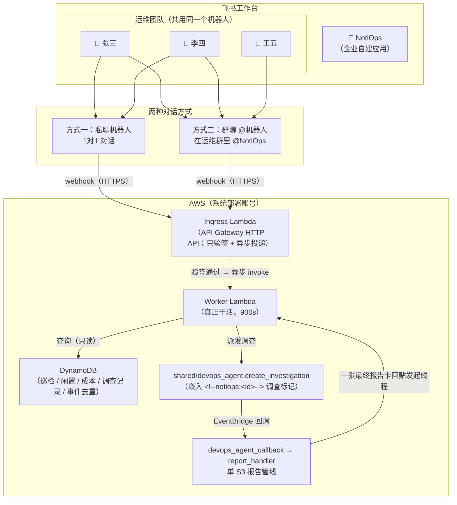
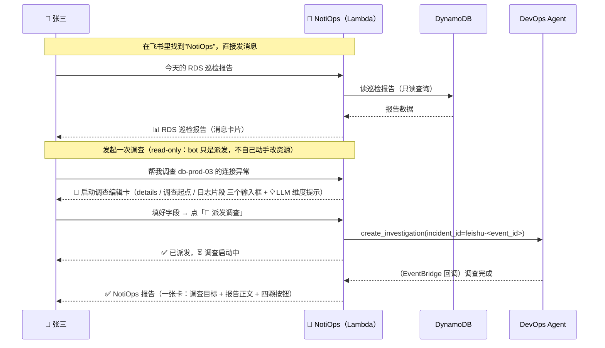
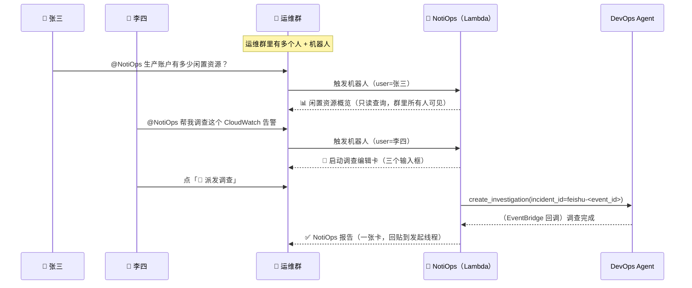
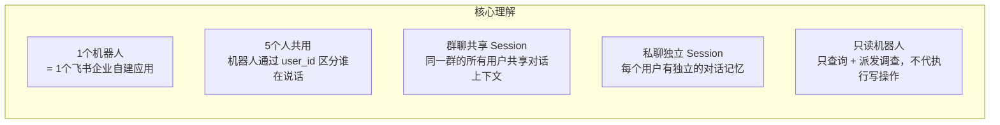
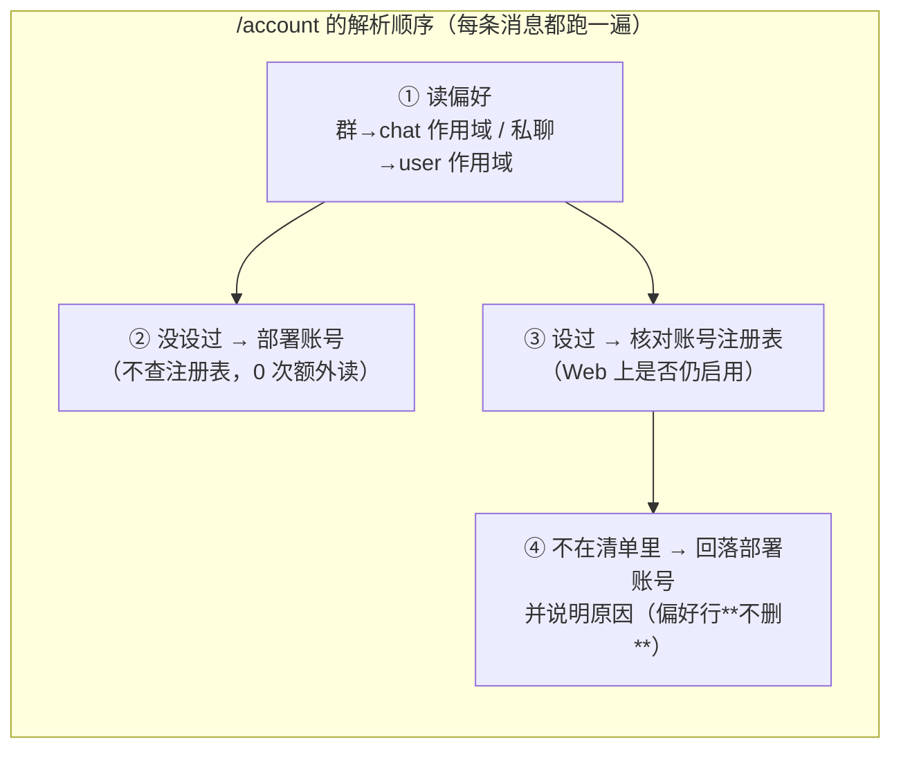
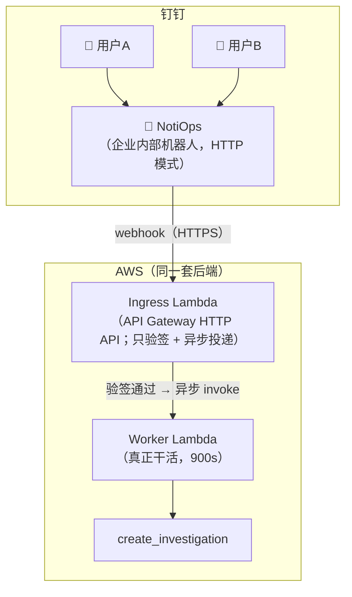
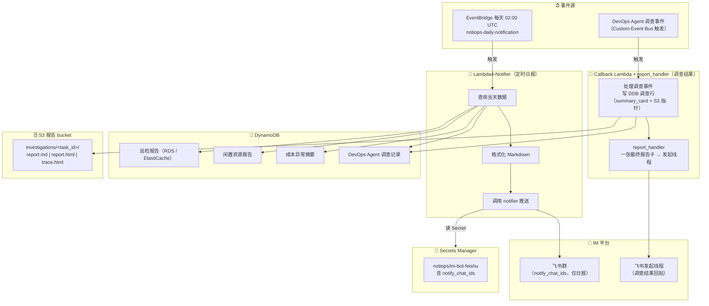

# IM 机器人交互方式说明

> ℹ️ **入口定位**:NotiOps 的**主入口是浏览器里的 Web Chat 网页控制台**(见 `USER_GUIDE.md` 第一部分);飞书 / Slack 等 IM 是必要但**次要的补充入口**。本文档只讲 **IM 补充入口**的交互方式与配置。

> ⚠️ **NotiOps bot 是只读机器人**:它只做**查询**(读 DynamoDB 报告)和**发起调查**(派发给 DevOps Agent),**绝不代用户执行任何变更 / 数据采集等写操作**。

## 飞书交互方式

只需要创建 1 个飞书企业自建应用（机器人），所有运维人员共用这一个机器人。

### 整体流程



### 方式一：私聊机器人



### 方式二：群聊 @机器人



### 关键点



### 偏好的作用范围：群 = 整群，私聊 = 每人（含 `/account` 问哪个账号）

三条开关命令（`/agent` 换 agent、`/web` 联网、`/account` 换问哪个账号）与 Session
**同一套作用范围**：**群里设一次对整群生效，私聊里只对你自己生效**。
存储都在 `core/im_prefs.py` 的同一张表、同一套 key（`impref#<feature>#<scope>#<平台>:<id>`），
30 天不用自动过期。



- **账号上车（新增 / 启用 / 停用）只在 Web 控制台**，IM 只**读**那份注册表
  （`shared/queries/accounts.py` 的 GSI1 Query，写入方只有 Web BFF 的
  `bff/web-chat/member_accounts.mjs`）。所以 Web 上一启用，IM **下一条消息**就能选到；
  Web 上一停用，IM 那侧的选择下一条消息就自动回落。
- **两侧各自选，互不影响** —— 共享的只有「哪些账号可选」这份清单。
- **开案例也跟着 `/account` 走**（2026-09-07 起，`caps.case` → `case_flow.start_*` →
  `core/support_logic.py` 全线透传 `account_id`，空串 = 部署账号）。跨账号凭证走
  `core/aws_session.py`：`role_arn` **只信 config 表那一行**、assume 前过
  `shared/account_scope.assert_role_belongs_to`、**拿不到就报错绝不回落到部署账号**。
  写操作要求目标账号的角色带 `support:CreateCase` / `AddCommunicationToCase` /
  `ResolveCase`（成员模板参数 `EnableSupportCaseWrite`，默认开）。
  卡片会写明工单开在哪个账号下（工单号跨账号可撞号，控制台链接不带账号参数）。
- **报告卡上的 🆘 升级开单 / 「📎 同步到 case」跟的是「这次调查查的那个账号」**，
  不是点按钮那一刻会话里选的账号 —— 卡可能几小时后才被点。账号来源按优先级：
  按钮 value 里的 `case_account_id`（发卡时盖的章）→ `support#<incident_id>` 行里的
  `account_id`（`report_handler._persist_support_context` 写的，也兜住改动前发出的旧卡）。
- 越权的拦截线**不在** IM 侧，而是随每一轮请求带给 agent 的账号闸门
  （`core/im_accounts.allowed_accounts()`：只含「部署账号 + 已启用账号」，
  **拿不到清单时返回拒绝用的哨兵值而不是放开**）。

## 钉钉交互方式

> ✅ **钉钉已上线（2026-09-08 起两条部署路径都开放）**：`./setup.sh` 里的选项 `3`、一键部署 `InstallOption=web+dingtalk`。钉钉与飞书 / Slack 是**同一个 Lambda webhook 形态**：自己的 API Gateway HTTP API + 一对 Lambda（`platforms/dingtalk/lambda_ingress.py` 验签去重 → `lambda_worker.py` 干活），CDK 输出 `DingtalkWebhookUrl`。对话 / 调查派发 / 报告回贴 / case 全流程 / Push 主动观察 / 定时日报都可用（服务端**主动推送**类的那几项要在 secret 里补一个可选的 `webhook_url`）。**ECS Fargate 长连接形态已于 2026-09-03 退役**，不再创建任何 ECS task。

钉钉的逻辑与飞书一致：创建 1 个钉钉企业内部机器人（**HTTP 模式**），所有人共用。



## 飞书 vs 钉钉 对比

| 项目 | 飞书 | 钉钉 |
|------|------|------|
| 机器人类型 | 企业自建应用 | 企业内部机器人 |
| 创建位置 | 飞书开放平台 | 钉钉开放平台 |
| 当前状态 | ✅ 已上线 | ✅ 已上线（2026-09-08 起两条部署路径都开放）|
| 连接方式 | API Gateway HTTP API + Lambda webhook（ingress 验签 + worker 干活）| 同上（同一个形态，各有一套自己的 API + 一对 Lambda）|
| 私聊 | ✅ 支持 | ✅ 支持 |
| 群聊 @ | ✅ 支持 | ✅ 支持 |
| 定时日报推送 | ✅ 支持（Lambda4，配置 `notify_chat_ids`）| ✅ 支持（需在 secret 里填可选的 `webhook_url`；且**只能配一个**推送目标）|
| 调查结果返回 | ✅ 回贴发起线程（一张最终报告卡 summary_card + 「查看完整报告」）| ✅ markdown 回贴（会话内回复走入站报文自带的 `sessionWebhook`，报告回贴走服务端 API + 派发时存下的路由）|
| 进度反馈 / Push / case 管理 | ✅ 20s 原地刷新的进度卡 + Push + case 全流程 | ✅ case 全流程；Push 同样需要 `webhook_url`；进度是**追加式**（消息不可编辑 → 进度作为新消息追加，不是原地刷新的卡）|
| 卡片按钮能否回传服务器 | ✅ 能（🆘 升级开单 / 📎 同步到 case 都是回传按钮）| ❌ **永久不能**（ActionCard 按钮只能跳 URL，没有按钮回调）→ 需要确认的动作（开案例 / 派发调查）改成**回复关键词**完成 |
| 后端 | `ImStack` 的一对 Lambda + `create_investigation` | 共用同一套后端 |

## 总结

- 飞书 / Slack / 钉钉**三家同一个形态、都已上线**（钉钉 2026-09-08 起，两条部署路径都开放）
- 所有用户共用机器人，通过 user_id 区分身份
- bot 是 **两个 Lambda**（`ImStack`）：ingress 由 API Gateway HTTP API 触发收 webhook、**只验签 + 异步投递**（`reservedConcurrentExecutions=10`），worker 真正干活；**read-only**，只做查询 + 派发调查。原来的 ECS Fargate 长连接容器**已于 2026-09-03 退役、不再创建**（`infra/lib/bot-stack.ts` 与三个 Dockerfile 还留在仓库里作长连接回滚路径的存档，但不被任何 app 引用，所以也不再需要 Docker / finch 构建 IM 镜像）
- **调查派发链路**：编辑卡 3 字段 `details / starting_point / log_snippet` → `core/dispatch_compose.compose_edited` → `shared/devops_agent.create_investigation(incident_id=...)`（在 description 末尾嵌入 `<!--notiops:<id>-->` 标记）→ EventBridge → `devops_agent_callback` → `report_handler` 单 S3 报告管线 → **一张最终报告卡回贴发起线程**（summary_card + 「📊 查看完整报告」按钮）
- 报告单一 S3 来源：`investigations/<task_id>/report.md|report.html|trace.html`；DDB 调查行 = summary_card + S3 指针（**不再内联 summary_raw**）
- **调查事件不推送 `notify_chat_ids`**（`_notify_im` 已从 `devops_agent_callback/handler.py` 删除）；`notify_chat_ids` 只用于 Lambda4 每日 02:00 UTC 日报（+ PHD）
- 系统每天 02:00 UTC 推送一份日报（巡检 + 闲置 + 成本异常 + 昨日调查）到配置了 `notify_chat_ids` 的群

## 飞书机器人配置步骤

飞书走 **API Gateway HTTP API + Lambda webhook**（`ImStack`），不再是长连接。完整的分步操作在
另外两篇里，这里只给顺序骨架，避免同一套步骤两处维护、走样：

| 阶段 | 干什么 | 在哪 |
|---|---|---|
| **部署前** | 建企业自建应用、开机器人能力、导入 11 条权限、拿 App ID / App Secret + Encrypt Key / Verification Token、发布版本 | [DEPLOYMENT.md](DEPLOYMENT.md) §3.1 |
| **部署** | `./setup.sh` 里选飞书 → 建出 `ImStack`，输出 `FeishuWebhookUrl` | [DEPLOYMENT.md](DEPLOYMENT.md) §5 |
| **部署后** | 把两把钥匙写进 Secret，再把 webhook 地址填进「事件配置」+「回调配置」两处 | [IM_WEBHOOK_SETUP.md](IM_WEBHOOK_SETUP.md) §1 |

⚠️ **顺序是硬的**：请求地址必须在「栈已部署」**且**「`encrypt_key` / `verification_token`
已写进 Secret」之后才填 —— 飞书保存地址时会立刻发一次校验请求，钥匙缺一个 ingress
就冷启动失败，控制台显示「校验失败」，看起来像地址填错了。

### 验证

在飞书中找到机器人，发送一条消息（如「今天的 RDS 巡检报告」），如果收到回复则配置成功。
没回复时按 [IM_WEBHOOK_SETUP.md](IM_WEBHOOK_SETUP.md) §1.5 那张症状表定位（两个 Lambda
的日志分别说明是「没发过来」「验签没过」还是「投递失败」）。

## 钉钉机器人配置步骤

> 钉钉现在可用（`./setup.sh` 选项 `3` / 一键部署 `web+dingtalk`）。完整的分步操作在
> [IM_WEBHOOK_SETUP.md](IM_WEBHOOK_SETUP.md) §3，这里只给顺序骨架。

1. 在 [钉钉开放平台](https://open-dev.dingtalk.com) 创建企业内部应用，获取 **AppKey** / **AppSecret**
2. 「应用能力 → 机器人」→ 启用 → 消息接收模式选 **HTTP 模式**，消息接收地址填 CDK 输出的 `DingtalkWebhookUrl`
   （钉钉只有这一处要填：消息事件和卡片回传走同一条 URL）
   > ⚠️ **默认值是 Stream 模式，必须手动改掉。** 留在 Stream 模式 = 钉钉永远不 POST =
   > 机器人一句话不回；而钉钉保存回调地址时**不做任何校验**（没有飞书那种当场校验），
   > 控制台上看不出任何异常。排错只能看 `/aws/lambda/notiops-im-ingress-dingtalk` 与
   > `/aws/lambda/notiops-im-worker-dingtalk` 两条日志。
3. 钉钉凭证 Secret `notiops/im-bot-dingtalk` **由 CDK 自动创建**（建出来是空的，部署后填），JSON 字段：
   - `app_key` / `app_secret` → **必填**，ingress 冷启动硬校验，缺一个入口就直接起不来
   - `webhook_url` → **可选**，自定义机器人地址，只给服务端主动推送（定时日报 / 巡检 / Push）用
4. 权限：**不用**像飞书那样逐条勾 —— 机器人收发消息走机器人能力自带的通道
5. 到「版本管理与发布」发布一个版本，并把机器人加进目标群

## 定时日报推送（主动通知）

除了用户主动发消息给机器人（被动响应），系统还有一种主动通知：**Lambda4 定时日报** —— 每天 UTC 02:00（北京时间 10:00）汇总前一天的巡检 / 闲置 / 成本异常 / 昨日调查，推送一条日报到配置了 `notify_chat_ids` 的群。

> ℹ️ **调查事件不在这里推送**。DevOps Agent 调查任务的结果通过 `report_handler` **回贴到发起调查的对话线程**（一张最终报告卡），**不会**广播到 `notify_chat_ids`。`_notify_im` 已从 `devops_agent_callback/handler.py` 删除；`notify_chat_ids` 现在只服务 Lambda4 日报（+ PHD）。

### 架构



### 执行时序（定时日报）

| 时间 (UTC) | 事件 | 说明 |
|------------|------|------|
| 00:00 | Lambda1-Collector | 资源采集 + 闲置判定（仅部署账号，跨账号已 locked） |
| 00:30 | Lambda3-HealthChecker (RDS) | RDS AI 智能巡检报告生成 |
| 01:00 | Lambda3-HealthChecker (ElastiCache) | ElastiCache AI 智能巡检报告生成 |
| 01:15 | Lambda5-CostAnalyzer | 成本异常分析 |
| 02:00 | Lambda4-Notifier | 查询当天数据 → 推送日报到飞书 `notify_chat_ids` |

### 调查结果返回（Callback Lambda + report_handler）

DevOps Agent 调查任务状态变更时，通过 EventBridge 跨账户转发到系统账号 Custom Event Bus，Callback Lambda 消费事件：

| Detail-Type | 处理 |
|-------------|------|
| `Investigation Created` | 🔵 新调查已创建（发起线程进度卡）|
| `Investigation Completed` | ✅ 拉报告 → 写 S3（report.md/html）+ DDB 调查行（summary_card + S3 指针）→ 一张最终报告卡回贴发起线程 |
| `Investigation Failed` | ❌ 不拉报告、不写 S3，以失败描述入库 + 失败卡 |
| `Investigation Timed Out` | ⏰ 同失败路径 |
| `Investigation Cancelled` | ⏹ 调查已取消 |
| `Investigation Linked` | 🔗 已关联到其他调查 |

> `report_handler` 通过从 journal 反向 grep `<!--notiops:<id>-->` 标记（双兼容正则同时识别旧的 `<!--notiops-devops:<id>-->`）拿到 incident_id，查 DDB `incident#` row 拿到 chat 上下文，把最终报告卡精准回贴到发起调查的那个线程。

> ⚠️ **从 IM 里发起的调查靠的是另一把键（`task#`）**。Webhook 路径（`platforms/*/caps.py::investigate`）
> 不写 journal 标记 —— `core.devops_agent.start_investigation()` 没有 `incident_id` 参数，
> 我们合成的 `feishu-<event_id>` / `slack-<event_id>` 到不了回调侧（现网日志里 `incident_id=`
> 就是空的）。所以发起时用 `ddb_state.link_im_investigation()` **同时**落 `incident#` 与
> `task#<task_id>` 两行，`_resolve_chat_target()` 靠后者命中。
>
> 这里有**两条互不相干的链路**，改一条不会自动修好另一条：
>
> | 链路 | 认的键 | 谁在刷 |
> |---|---|---|
> | 每分钟的**进度卡** | `imtask#<incident_id>` | EventBridge `rate(1 minute)` → `notiops-im-progress` |
> | 跑完那张**最终报告卡** | `incident#<id>` / `task#<task_id>` | DevOps Agent EventBridge → `notiops-devops-callback` → `report_handler` |
>
> 少了 `task#` 那一行的症状很难查：进度卡一路刷到「已完成」，报告安静地躺在 S3 里，
> **一个错都不报**（2026-09-02 现网实测形态）。报告链接是 **presigned S3 URL（7 天）**，
> 不是 CloudFront —— web 端的 `save_report` 才走 CDN，这是两条不同的链路。

### 通知内容（日报）

每日通知包含：

1. **RDS 巡检报告摘要** — 各账户的实例数、严重/警告/关注数量
2. **ElastiCache 巡检报告摘要** — 各账户的实例数、严重/警告/关注数量
3. **闲置资源概览** — 闲置资源总数、预估月度节省金额
4. **Top 5 高价值闲置资源** — 按月度节省金额降序排列
5. **成本异常检测** — 异常数量、预计额外成本

如果当天没有巡检报告（RDS 和 ElastiCache）、闲置资源数据和成本异常数据，则跳过通知。

### 配置方法（推荐走 Dashboard）

**推荐**：Dashboard 「设置 → 通知设置」页面（路径 `/settings/notifications`）：
- 填入飞书凭证 + `notify_chat_ids`
- 后端通过 `PUT /api/notification-config` 写回 `notiops/im-bot-feishu` Secret，带格式校验（`cli_xxx` / `oc_xxx`）
- 敏感字段（secret / token）在页面上以 `****` 遮罩展示
- `POST /api/notification-config/test` 可发送一条测试通知验证配置
- 这一页**飞书 / 钉钉都能配**（同一条 `notification-config` 路由按 `platform` 分发）。钉钉那一页填 AppKey / AppSecret + 可选的「自定义机器人推送地址」，见 [IM_WEBHOOK_SETUP.md](IM_WEBHOOK_SETUP.md) §3.3 / §3.7

**或直接改 Secret JSON**（绕过校验，仅建议运维排障时使用）：

飞书（`notiops/im-bot-feishu`）：

```json
{
  "app_id": "cli_xxxxxxxx",
  "app_secret": "xxxxxxxx",
  "verification_token": "xxxxxxxx",
  "encrypt_key": "xxxxxxxx",
  "notify_chat_ids": "oc_xxx,oc_yyy"
}
```

- ⚠️ **`verification_token` 和 `encrypt_key` 两个都必填**（webhook 模式下它们是唯一的请求鉴权手段）。改这个 JSON 时务必**先读出现有值再整体写回**，否则会把另外几个字段抹掉；缺任一把钥匙，ingress Lambda 会在冷启动时直接失败，飞书控制台表现为「校验失败」。取值与自检见 [IM_WEBHOOK_SETUP.md](IM_WEBHOOK_SETUP.md) §1.2
- `notify_chat_ids`：逗号分隔的群 ID 列表
- 飞书群 ID 格式：`oc_xxxxxxxx`（在飞书群设置中查看）
- 不填或留空则**日报跳过**（调查结果仍照常回贴到发起线程，不依赖 `notify_chat_ids`）

### 通知示例

```markdown
📋 **2026-03-20 每日巡检通知**

**🔍 RDS 巡检报告**

- [汇总] 共 15 实例 | 🔴 严重 1 | 🟡 警告 3 | 🔵 关注 5

**🔍 ElastiCache 巡检报告**

- [汇总] 共 8 实例 | 🔴 严重 0 | 🟡 警告 1 | 🔵 关注 2

**💰 闲置资源概览**

- 闲置资源总数: **8** 个
- 预估月度节省: **$1,234.56**

**Top 5 高价值闲置资源：**

1. `prod-rds-unused-01` (RDS) | 123456789012 | ap-northeast-1 | $456.78/月
2. `staging-cache-01` (ElastiCache) | 123456789012 | ap-northeast-1 | $234.56/月
...

---
💡 回复消息可直接与 NotiOps 对话，查看详细报告或发起调查。
```
